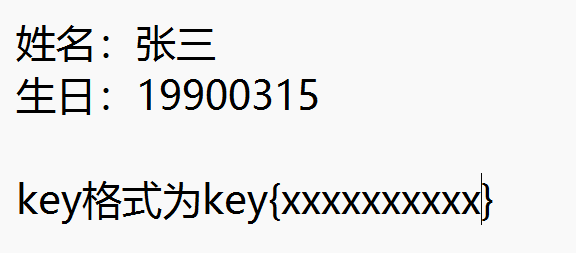
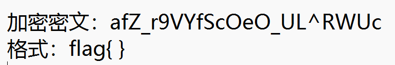
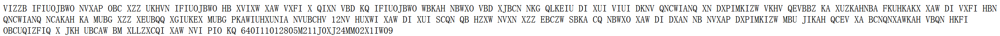
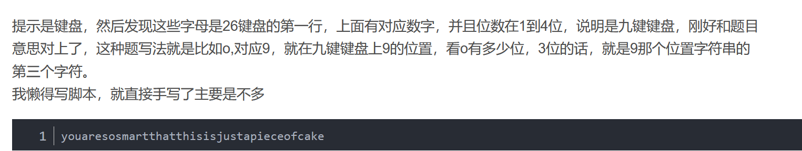
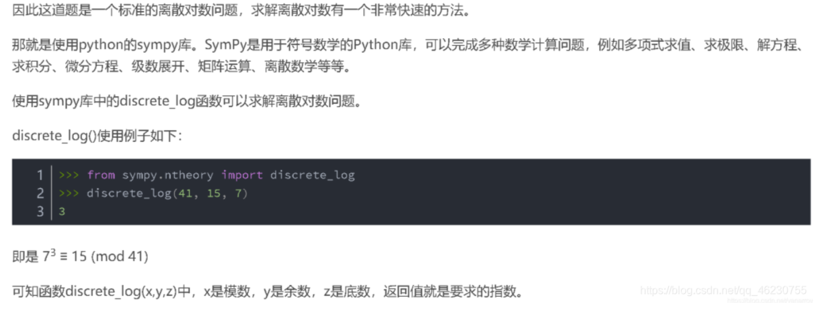

**1.password**


只给了一个这样的题目，不理解，看了别人的wp才知道是直接把姓名首字母加上去组成flag，就是zs19900315，用flag{}包裹就可以了
**2.变异凯撒**


把开始的四位和flag进行对比，发现第一个差5，第二个差6，依次类推，差的ASCII码值为n+1，就可以通过脚本解密，或者直接用随波逐流直接解
**3.丢失的md5**

```python
import hashlib   
for i in range(32,127):
    for j in range(32,127):
        for k in range(32,127):
            m=hashlib.md5()
            m.update('TASC'.encode('utf-8')+chr(i).encode('utf-8')+'O3RJMV'.encode('utf-8')+chr(j).encode('utf-8')+'WDJKX'.encode('utf8')+chr(k).encode('utf-8')+'ZM'.encode('utf-8'))
            des=m.hexdigest()
            if 'e9032' in des and 'da' in des and '911513' in des:
                print (des)
```
这里直接让ai帮我读代码，然后使用deepseek发现竟然直接得出了答案，确实厉害，
其实这里有个问题，在python3中，对字符进行md5加密时要先转成字节形式，不然会报错，而且那个变量也要用括号包裹起来，也就是在m.update的内容里加上encode('utf-8'),转成字节形式，在给des加个括号就可以跑代码得到结果e9032994dabac08080091151380478a2
**4.大帝的密码武器**
下载后发现是一个zip文件，然后出现一堆乱码，看了网上wp才知道要给文件添加zip后缀，然后打开后对密文进行解码，发现是rot13,在对给的明文加密就可以得到flag
**5.rsa1**
是rsa中的dp泄露
具体的看脚本，主要的就是求出d，然后p可以从1到e遍历得到，知道n，所以可以求出q，然后得到d，后面直接就是基础的rsa算法直接解
脚本：

```python
import gmpy2 as gp

e = 65537
n = 248254007851526241177721526698901802985832766176221609612258877371620580060433101538328030305219918697643619814200930679612109885533801335348445023751670478437073055544724280684733298051599167660303645183146161497485358633681492129668802402065797789905550489547645118787266601929429724133167768465309665906113
dp = 905074498052346904643025132879518330691925174573054004621877253318682675055421970943552016695528560364834446303196939207056642927148093290374440210503657

c = 140423670976252696807533673586209400575664282100684119784203527124521188996403826597436883766041879067494280957410201958935737360380801845453829293997433414188838725751796261702622028587211560353362847191060306578510511380965162133472698713063592621028959167072781482562673683090590521214218071160287665180751

for i in range(1, e):  # 在范围(1,e)之间进行遍历
    if (dp * e - 1) % i == 0:
        if n % (((dp * e - 1) // i) + 1) == 0:  # 存在p，使得n能被p整除
            p = ((dp * e - 1) // i) + 1
            q = n // (((dp * e - 1) // i) + 1)
            phi = (q - 1) * (p - 1)  # 欧拉定理
            d = gp.invert(e, phi)  # 求模逆
            m = pow(c, d, n)  # 快速求幂取模运算

print(m)  # 10进制明文
print('------------')
print(hex(m)[2:])  # 16进制明文
print('------------')
print(bytes.fromhex(hex(m)[2:]))  # 16进制转文本
```
**6.世上无难事**


给了一段看不懂的编码，看了wp才知道要爆破，直接去网站[https://quipqiup.com/](https://quipqiup.com/)爆破，让PIO=key,不知道为什么，猜测应该是因为key在最后面，英文应该是the key is ... 所以才PIO=key，爆破完就可以得到key
**7.还原大师**
一个简单md5爆破题目
我们得到了一串神秘字符串：TASC?O3RJMV?WDJKX?ZM,问号部分是未知大写字母，为了确定这个神秘字符串，我们通过了其他途径获得了这个字串的32位MD5码。但是我们获得它的32位MD5码也是残缺不全，E903???4DAB????08?????51?80??8A?,请猜出神秘字符串的原本模样，并且提交这个字串的32位MD5码作为答案。 注意：得到的 flag 请包上 flag{} 提交
脚本：

```python
# -*- coding: utf-8 -*-
#!/usr/bin/env python
import hashlib
#print hashlib.md5(s).hexdigest().upper()
k = 'TASC?O3RJMV?WDJKX?ZM'                    #要还原的明文
for i in range(26):
	temp1 = k.replace('?',str(chr(65+i)),1)
	for j in range(26):
		temp2 = temp1.replace('?',chr(65+j),1)
		for n in range(26):
			temp3 = temp2.replace('?',chr(65+n),1)
			s = hashlib.md5(temp3.encode('utf8')).hexdigest().upper()#注意大小写
			if s[:4] == 'E903':    #检查元素
				print (s)       #输出密文
```
**8.rsa**
打开文件发现是一份乱码和一个份公钥，看网上解析才知道有公钥解析这个东西，解析完发现是rsa算法，把n分解，得到q和p，然后求出d，想要解码却发现没有c，回去看wp发现他们这里使用了python的rsa库，通过n,d,q,p,e得到私钥，然后在通过rsa库的解密函数使用私钥对公钥加密的内容进行解密，通过文件读写读取文件内容得到flag

```python
import gmpy2
import rsa
p=  285960468890451637935629440372639283459
q = 304008741604601924494328155975272418463
n = 86934482296048119190666062003494800588905656017203025617216654058378322103517
e=65537
phi=(p-1)*(q-1)
d=gmpy2.invert(e,phi)
print(d)
key = rsa.PrivateKey(n,e,d,q,p)         #在pkcs标准中,pkcs#1规定,私钥包含(n,e,d,p,q)

with open("flagenc.txt","rb") as file:
    a=file.read()
print(rsa.decrypt(a,key))# f:公钥加密结果  key:私钥

```
**9.rsa roll**
这是一个多段密文组成明文的rsa算法
先把括号里的n拿去分解得到p，q，接着通过文件读写读取每一行的c，用strip去掉换行符（确实没怎么用过），得到每一行的c，然后计算每一行c所解出的明文，用append添加到一个列表里，最后在读取列表里的每一个元素，加起来就是flag

```python
import gmpy2
from Crypto.Util.number import *

p=18443
q=49891
e=19
n=p*q
phi=(p-1)*(q-1)
d=gmpy2.invert(e,phi)
b=[]
with open ("data.txt","r") as file:
    a=file.readlines()
    for i in a:
        i=i.strip("\n")
        b.append(chr(pow(int(i),d,n)))#这里的int i是必须的，虽然我觉得那个i已经是整数了
c=''
for i in range(len(b)):
    c+=b[i]
print(c)
```
**10.达芬奇密码**
斐波那契数列规则的替换
看题目啥也没看懂，去找wp发现是斐波那契数列的替换规则和flag的替换规则是一致的
达芬奇隐藏在蒙娜丽莎中的数字列:1 233 3 2584 1346269 144 5 196418 21 1597 610 377 10946 89 514229 987 8 55 6765 2178309 121393 317811 46368 4181 1 832040 2 28657 75025 34 13 17711 
记录在达芬奇窗台口的神秘数字串:36968853882116725547342176952286
233是斐波那契数列的第12位，所以下面字符串中的第二个6对应的就是flag的第十二位
直接上脚本，懒得看了

```python
a = "0 1 2 3 5 8 13 21 34 55 89 144 233 377 610 987 1597 2584 4181 6765 10946 17711 28657 46368 75025 121393 196418 317811 514229 832040 1346269 2178309"
b = "0 233 3 2584 1346269 144 5 196418 21 1597 610 377 10946 89 514229 987 8 55 6765 2178309 121393 317811 46368 4181 1 832040 2 28657 75025 34 13 17711"
a = a.split(" ")
b = b.split(" ")
flag = []
m = "36968853882116725547342176952286"
for i in range(len(a)):
    for j in range(len(a)):    
        if a[i] == b[j]:        #a[i]中的值在b中的索引为j
            #print(j)
            flag.append(m[j])   #将m[j]中的值添加到flag中
print(len(flag))
print(''.join(flag))
#37995588256861228614165223347687
```
11.古典知多少
开始以为是猪圈密码，后来发现有的对不上，看wp才知道还有猪圈密码的变种，就是标准银河字母加密和圣堂武士密码（猪圈变种），按照图片一一对应就能解出一串字符FGCPFLIRTUASYON，提示是fence，直接使用栅栏解密得到flag=FLAGISCRYPTOFUN
12.keyboard
根本想不到，看了wp
题目：
ooo yyy ii w uuu ee uuuu yyy uuuu y w uuu i i rr w i i rr rrr uuuu rrr uuuu t ii uuuu i w u rrr ee www ee yyy eee www w tt ee
​


**13.[网鼎杯 2020 青龙组]you_raise_me_up 1**

```plain
#!/usr/bin/env python
# -*- coding: utf-8 -*-
from Crypto.Util.number import *
import random

n = 2 ** 512
m = random.randint(2, n-1) | 1
c = pow(m, bytes_to_long(flag), n)
print 'm = ' + str(m)
print 'c = ' + str(c)

# m = 391190709124527428959489662565274039318305952172936859403855079581402770986890308469084735451207885386318986881041563704825943945069343345307381099559075
# c = 6665851394203214245856789450723658632520816791621796775909766895233000234023642878786025644953797995373211308485605397024123180085924117610802485972584499
```


**14.[NCTF2019]babyRSA**
开始时想到要求n只能通过欧拉函数求，但是没有像过能够根据位数进行爆破求phi，因为ed-1的二进制位数2066位，而p和q都是1024位，所以得到的欧拉函数的位数应该也是2048位，而多出来的16位就是k的位数，然后就是从2**15到2**16爆破或者说是遍历，然后就可以得到phi，对phi进行开方，然后求开方后的前一个和后一个素数就是p和q的值，然后这时候在拿去和phi比较验证就能确定是不是真正的p
和q，后面就是简单的rsa，得到flag

```plain
from Crypto.Util.number import long_to_bytes
import gmpy2
import sympy

d = 19275778946037899718035455438175509175723911466127462154506916564101519923603308900331427601983476886255849200332374081996442976307058597390881168155862238533018621944733299208108185814179466844504468163200369996564265921022888670062554504758512453217434777820468049494313818291727050400752551716550403647148197148884408264686846693842118387217753516963449753809860354047619256787869400297858568139700396567519469825398575103885487624463424429913017729585620877168171603444111464692841379661112075123399343270610272287865200880398193573260848268633461983435015031227070217852728240847398084414687146397303110709214913
c = 5382723168073828110696168558294206681757991149022777821127563301413483223874527233300721180839298617076705685041174247415826157096583055069337393987892262764211225227035880754417457056723909135525244957935906902665679777101130111392780237502928656225705262431431953003520093932924375902111280077255205118217436744112064069429678632923259898627997145803892753989255615273140300021040654505901442787810653626524305706316663169341797205752938755590056568986738227803487467274114398257187962140796551136220532809687606867385639367743705527511680719955380746377631156468689844150878381460560990755652899449340045313521804
e = 65537
p = 0
q = 0

# p*p<(p-1)*(q-1)<q*q,这使得对phi的开方所得到的两边的素数就是p和q
for i in range(pow(2, 15), pow(2, 16)):
    if (e * d - 1) % i == 0:
        phi = (e*d-1)//i
        p = sympy.prevprime(gmpy2.iroot(phi, 2)[0])
        q = sympy.nextprime(p)
        if (p - 1) * (q - 1) == phi:
            break
n = p * q
m = pow(c,d,n)
m1 = long_to_bytes(m)
print(m1)
```
15.yxx
跟异性相吸一样，都是进行异或处理，把密文的乱码放到01editor中就能显示出16进制，然后和love进行异或就能得到flag

```plain
a="lovelovelovelovelovelovelovelove"
b=[0x0A,0x03,0x17,0x02,0x56,0x01,0x15,0x11,0x0A,0x14,0x0E,0x0A,0x1E,0x30,0x0E,0x0A,0x1E,0x30,0x0E,0x0A,0x1E,0x30,0x14,0x0C,0x19,0x0D,0x1F,0x10,0x0E,0x06,0x03,0x18]

flag=""
for i in range(len(a)):
    flag+=chr(ord(a[i])^b[i])
print(flag)
```
16.[RoarCTF 2019]babyRSA
