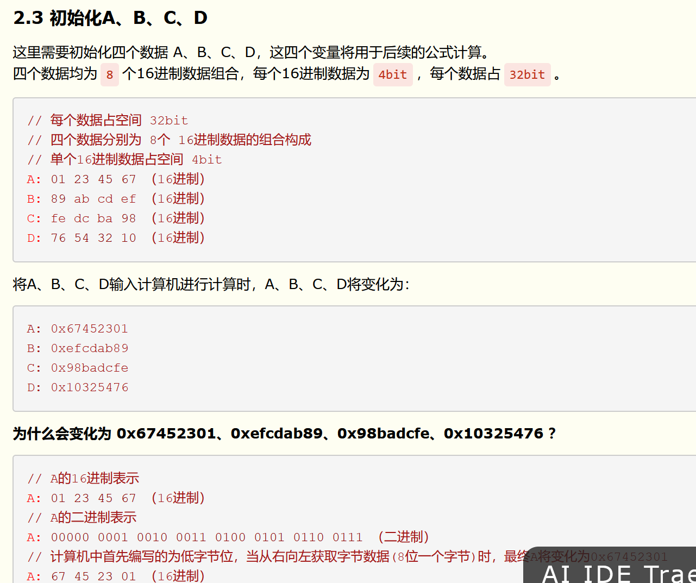
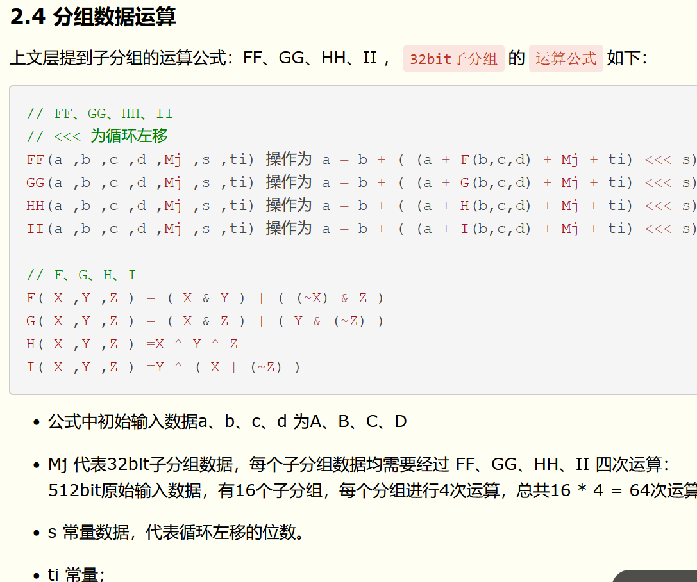
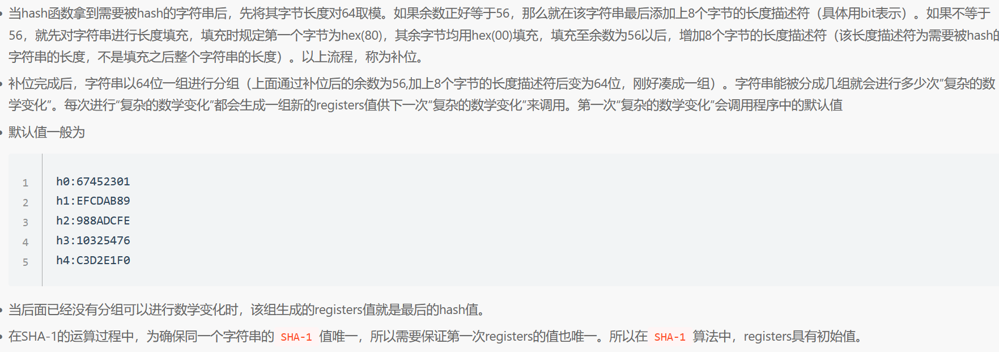

1.MD5
 一般由数字和小写字符组成
69f7906323b4f7d1e4e972acf4abfbfc
本质上是由128位固定长度的二进制数，转成32位的16进制数
 md5加密后是16位或者32位的字符，由字母和数字组成，字母大小写统一）可以尝试md5解密。https://www.cmd5.com/16位的字符是将 32 位 md5 去掉前八位，去掉后八位得到的
**MD5加密原理：**
** MD5不管怎么加密，每一块加密得到的密文作为下一次加密的初始向量  **
**1.填充数据** 
首先需要对 “输入信息” 进行填充，使其位长对`512求余`的`结果`为`448`（填充必须进行，即使其位长对512求余的结果等于448）。
填充数据的方式：`在 “输入信息” 的后面填充一个1和无数个0，直到满足上面的条件时才停止信息填充`。
填充后的 “输入信息” 其位长 (Bits Length) 将扩展到：`N*512+448` ( N>=0 )
**2.补充长度信息**
用`64bit`记录 “输入信息” 的位长 (Bits Length)，把64位长度二进制数据补在最后。
经过此步骤后，其位长 (Bits Length) 将扩展到：`N*512+448+64 = (N+1)*512` ( N>=0 )
3.初始化A,B,C,D


**3.分组数据运算**


**4. 结果累加**
若A、B、C、D为`变量`，并且A、B、C、D的初始化信息为 A: 0x67452301；B: 0xefcdab89；C: 0x98badcfe；D: 0x10325476 ，每一512bit分组的运算结果为`a、b、c、d`。则第N个512bit组的计算结果为：

```plain
// a、b、c、d 为每一512bit分组的运算结果； 
// A、B、C、D 是下一组计算的输入参数；
// 若无下一个512bit分组 A、B、C、D 则为最终计算结果；
A = a + A;  
B = b + B; 
C = c + C; 
D = d + D;
```
2.SHA-1加密


​
