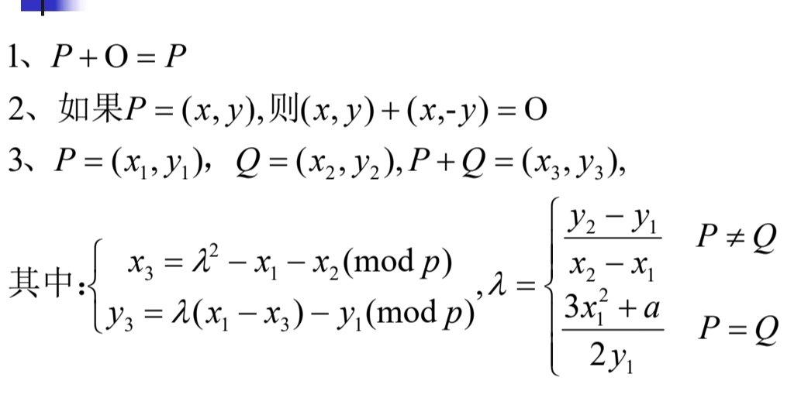
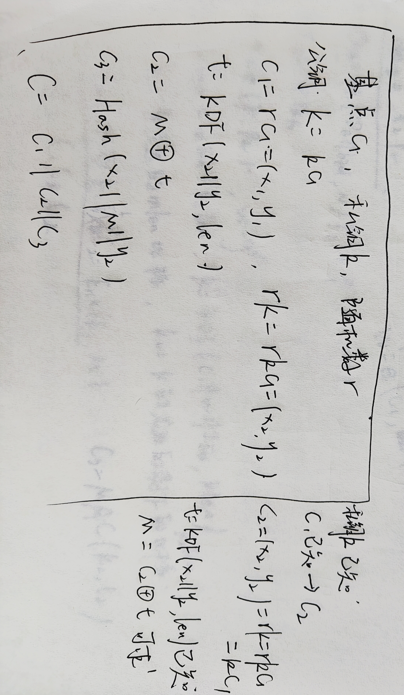
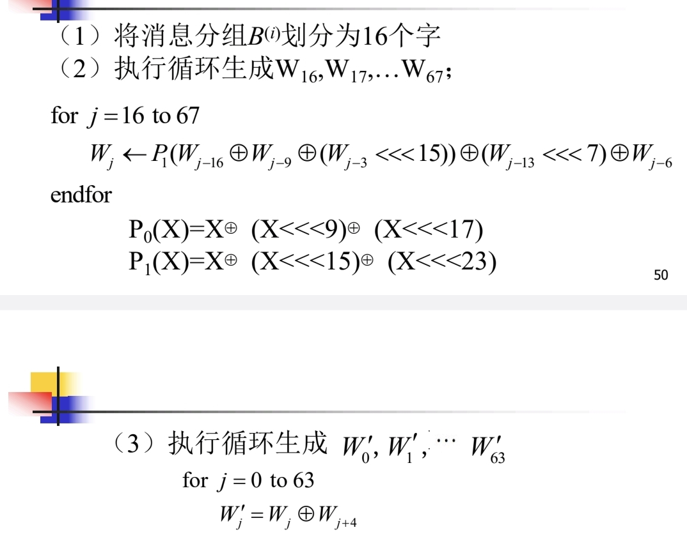
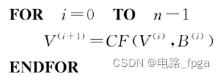
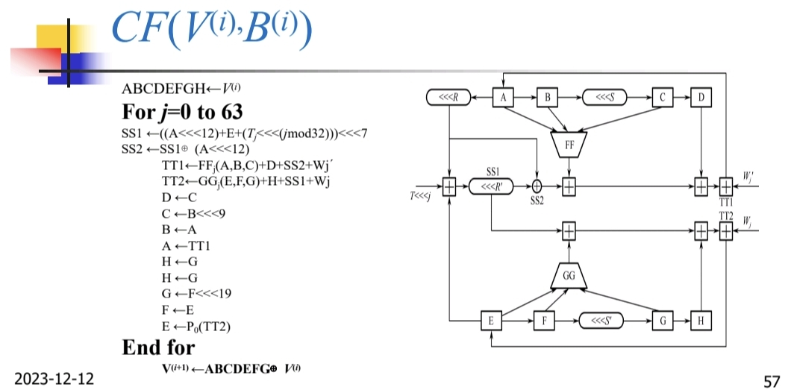
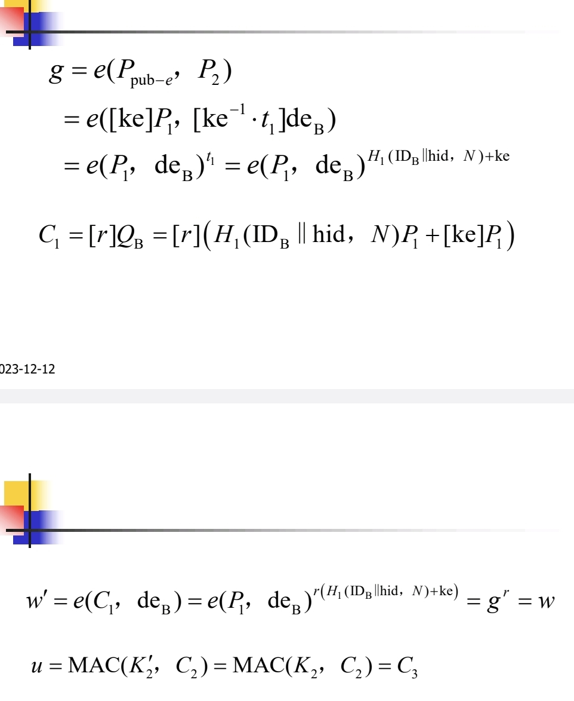
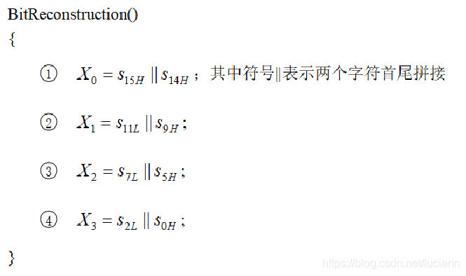
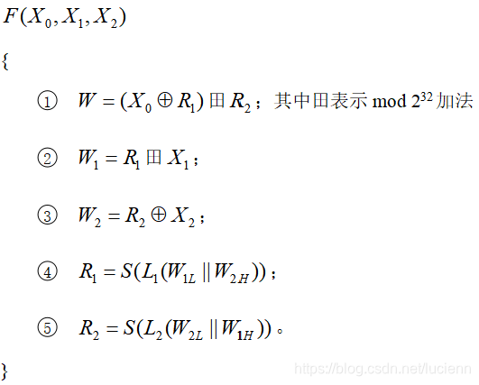
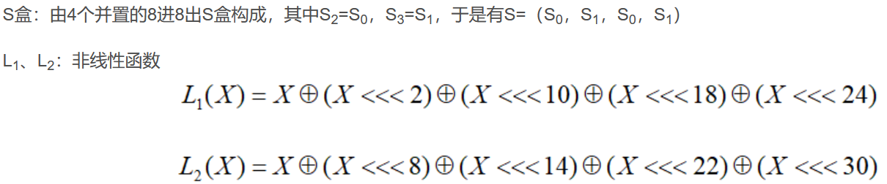
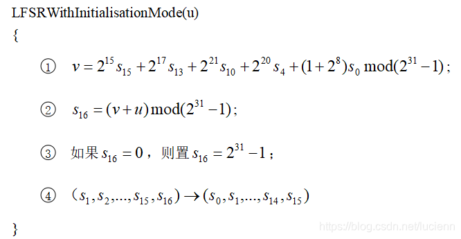

SM1,SM4,SM7,ZUC祖冲之密码是对称算法
SM2,SM9是非对称算法
SM3是哈希算法
SM1,SM7算法不公开
**1.SM1对称密码**
分组密码算法，分组长度和密钥比特都为128位  算法强度和AES相当
 采用该算法已经研制了系列芯片、智能IC卡、智能密码钥匙、加密卡、加密机等安全产品，广泛应用于电子政务、电子商务及国民经济的各个应用领域（包括国家政务通、警务通等重要领域）  
**2.SM2椭圆曲线公钥密码算法**
就是ECC椭圆曲线密码机制  和ECC基本一致，只是在签名，密钥交换等其他方面采取不同的标准  安全强度等同于密钥长度远高于RSA算法
ECC函数y**2＝x**3+ax+b
椭圆曲线上的加法

SM2密钥长度为256位
### SM2的密钥派生函数KDF
输入比特的x2和y2拼接成z，然后输出比特长度为v
初始化一个32位计数器ct，把z和ct拼接，然后一般使用sm3进行哈希算法，每进行一次哈希，ct加1，然后依照需要的密钥长度进行拼接(SM3输出也是256位)，KDF的输出的每次长度和使用的哈希算法有关

**3.SM3杂凑算法**
本质是一个哈希函数，对输入小于2的64次方的比特，经过一系列运算生成长度为256位的杂凑值
消息填充
比如消息m为l个比特，然后进行扩展，首先把比特1放到消息末尾，然后再添加k个0，让这个消息的比特数mod 512等于448，实际上一般来说就是扩展到448位，接着再在末尾填充消息长度l的二进制数，64个比特，，这样填充之后消息长度就是512的倍数。
消息扩展
然后就是要把消息分组，每组512位，也就是16个字，一个字等于4字节，接着在这个过程要把每个分组扩展成132个字，具体就是下面这个：

迭代压缩

这是简化的操作流程，但是实际的压缩函数还是比较复杂的

然后就是根据这个对于每一分组的132个字进行压缩，输出的是256位的数据，然后再把这个数据和iv向量进行异或就行了，初始的iv向量实际上就是分成8个4字节的字符串，放在A到H寄存器里面，然后输出的压缩后的256位的字符也分成A到H，然后和前面初始IV向量异或，生成第二个IV向量，接着依次重复前面步骤，直到最后一个输出一个256位的结果。
​
**4.SM4对称算法**
 此算法是一个分组算法，用于无线局域网产品。该算法的分组长度为128比特，密钥长度为128比特。加密算法与密钥扩展算法都采用32轮非线性迭代结构。解密算法与加密算法的结构相同，只是轮密钥的使用顺序相反，解密轮密钥是加密轮密钥的逆序。  
基本流程和AES是一致的，AES的加密轮次是10轮，但是SM4密钥长度固定128位，分组长度也是128为，
轮函数固定32轮
首先先把初始的128个密钥扩展到32个128位密钥，用于32次的轮函数，实际就是把初始128位密钥分成4个字，然后把4个字分别和系统提供的4个参数进行异或得到k0-k3，然后利用这四个参数不断生成后续的轮密钥，k4=rk0 k5=rk1 依次产生每一轮的轮密钥。
**轮函数**
假设输入是x0-x3，先把x1，x2，x3和rk0一起进行异或，然后再经过一个合成置换的T函数，然后输出后再和x0进行异或后，输出作为下一轮的x4 其他的不变，所以输入此时变成x1x2,x3,x4,然后再进入下一轮的轮函数。
轮函数的合成置换的T函数
分成非线性变换和线性变换
非线性变换就是查s盒，四个输入，对于每个输入查s盒，实际只有一个8x8的s盒，只是查询4次，比如0x84，第八行第四列，得到4个输出。
线性变换L
输入输出均为32位，公式为 L(B) = B ⊕ (B <<< 2) ⊕ (B <<< 10) ⊕ (B <<< 18) ⊕ (B <<< 24) ，其中 <<<n 代表32位循环左移n位。
然后最后还有一个反序变换，就是x32，x33,x34,x35变成x35,x34,x33,x32输出后再依次拼接就能得到最终的密文
解密过程和加密过程是一致的，只是轮密钥反过来使用即可

**5.SM7分组密码算法**
 分组长度为128比特，密钥长度为128比特。SM7适用于非接触式IC卡，应用包括身份识别类应用(门禁卡、工作证、参赛证)，票务类应用(大型赛事门票、展会门票)，支付与通卡类应用（积分消费卡、校园一卡通、企业一卡通等）  
**6.SM9标识密码算法**
标识密码：用户的标识比如邮件地址，手机号，qq号等为公钥 省略了交换数字证书和公钥过程，使得安全系统变得易于部署和管理，非常适合端对端离线安全通讯、云端数据加密、基于属性加密、基于策略加密的各种场合  
双线性对
​

**7.ZUC祖冲之算法**
祖冲之序列密码算法是中国自主研究的流密码算法,是运用于移动通信4G网络中的国际标准密码算法,该算法包括祖冲之算法(ZUC)、加密算法(128-EEA3)和完整性算法(128-EIA3)三个部分。目前已有对ZUC算法的优化实现，有专门针对128-EEA3和128-EIA3的硬件实现与优化。
ZUC算法流程
输入128位密钥和128位初始化向量
输出32位的密钥序列。
初始化阶段和工作阶段
初始化阶段只对密钥和初始化向量进行初始化，不产生输出，工作阶段每次产生一个32位的输出（一个字）
**1.初始化阶段**
首先把原始的128位密钥key和128位iv和240位比特的常量D分别分成16份，然后把这三者分别结合在一起k0,iv0,d0,然后把非线性函数F中的r2和r1都置0，接着重复比特重组，运行F函数，lfsr初始化模式这三个过程32次
**比特重组**

**非线性函数**

4个8*8的s盒

lfsr初始化模式

2.工作模式
先执行一次比特重组，F函数，和lfsr初始化，然后把F函数的输出W丢弃，
然后在执行一遍这个完整过程，每轮输出一个密钥字，按照所需密钥的长度进行轮次选择
