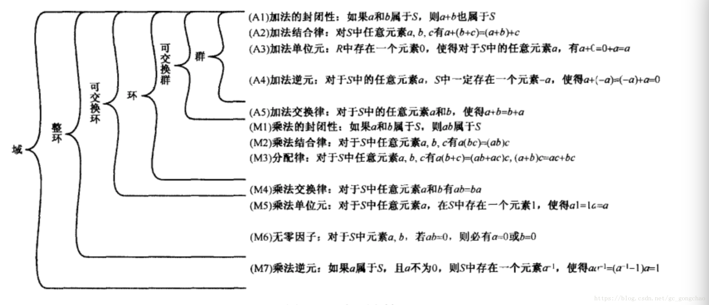

**一、群（Group）**

1. 定义：群是一个非空集合G，在其上定义了一个二元运算“·”（通常称为乘法，有时也用“+”表示，称为加法），满足以下条件：  • 封闭性：对于G中任意元素a，b，有a·b∈G。
  • 结合律：对于G中任意元素a，b，c，有a·(b·c)=(a·b)·c。
  • 单位元：存在e∈G，使得对任意a∈G，都有e·a=a·e=a。
  • 逆元：对于任意a∈G，都存在b∈G，使得a·b=b·a=e。

1. 特点：群仅涉及一个二元运算，且该运算满足结合律。群中的元素关于这个运算可以构成一种对称结构。**二、环（Ring）**

1. 定义：环是一个非空集合R，在其上定义了两个二元运算：加法“+”和乘法“·”，满足以下条件：  • 加法群：(R,+)是一个交换群，即加法满足封闭性、结合律、交换律，且存在加法单位元0和加法逆元。
  • 乘法半群：(R,·)是一个半群，即乘法满足封闭性和结合律（但不一定满足交换律）。
  • 分配律：对于R中任意元素a，b，c，有a·(b+c)=a·b+a·c和(b+c)·a=b·a+c·a。

1. 特点：环涉及两个二元运算，且这两个运算之间满足分配律。环中的加法运算构成了一个交换群，而乘法运算则构成了一个半群。**三、域（Field）**

1. 定义：域是一个非空集合F，在其上定义了两个二元运算：加法“+”和乘法“·”，满足以下条件：  • 加法交换群：(F,+)是一个交换群，即加法满足封闭性、结合律、交换律，存在加法单位元0，且每个元素都有加法逆元。
  • 乘法交换群：F中非零元素关于乘法构成一个交换群，即乘法满足封闭性（在非零元素间）、结合律、交换律，存在乘法单位元1（通常不等于0），且每个非零元素都有乘法逆元。
  • 分配律：对于F中任意元素a，b，c，有a·(b+c)=a·b+a·c和(b+c)·a=b·a+c·a。

1. 特点：域是环的一种特殊情况，其中乘法运算也满足交换律，并且每个非零元素都有乘法逆元。这使得域成为了一个可以进行加减乘除（除数不为零）运算的代数结构**4.异或运算 **
同为0，异为1 **符号⊕**
 0⊕0=0  ，0⊕1=1
性质：满足交换律，结合律，a异或0=a,a异或a=0
**5.析取和合取**

- **|** ，有1则1，全0才0 （析取）0|1=1
- **&** ，有0则0，全1才1（合取）1&1=1,1&0=0**6.奇偶校验**
 奇偶校验是一种校验代码传输正确性的方法。根据被传输的一组二进制代码的数位中“1”的个数是奇数或偶数来进行校验。  
采用奇数的称为奇校验，反之，称为偶校验。采用何种校验是**事先规定好**的。通常专门设置一个奇偶校验位，用它使这组代码中“1”的个数为奇数或偶数。
用奇校验，则当接收端收到这组代码时，校验“1”的个数是否为奇数，从而确定传输代码的正确性。
**7.有限域   GF(p**^**n****)    p**^**n  **
其中p的n次方为有限域的阶数，即有限域的元素个数
有限域的阶必为素数的幂，即表示为p的n次方，其中p为素数，n为正​整数
当n=1时，有限域GF(p^n)  也称素数域，n>1的域称为扩展域
 有限域是包括有限个元素、能进行加减乘除运算的集合  
有限域上多项式：
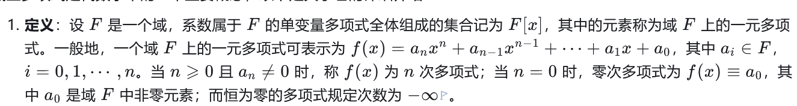

 系数运算是模p运算的多项式运算，即系数在有限域GF(p)的集合中
  跟在实数域中的运算差不多，不过结果要模有限域的阶数p 
 既约多项式（不可约多项式、素多项式）：若域F中多项式 f ( x )不能表示域F上任两个多  项式 g 1 ( x ) 和 g2(x)的乘积，（ g 1 ( x ) 和 g 2 ( x )在域F中，且次数都小于 f ( x )的   次 数），那么称多项式 f ( x ) 为既约多项式，也称不可约多项式、素多项式

- 系数在有限域GF(p)中，且多项式被定义为模一个n次多项式的多项式运算这里的模一个n次多项式既要模素数p，还要模对应的n次多项式
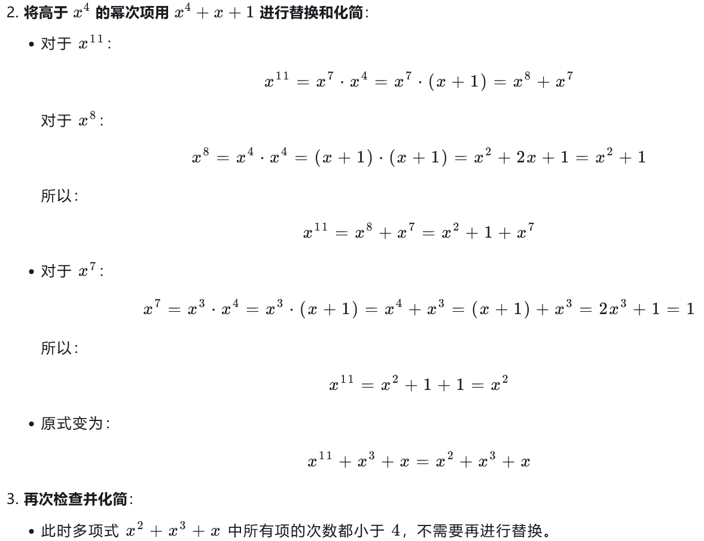

**8.中国剩余定理 低加密指数广播攻击**
设正整数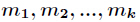
两两互素，则同余方程组
​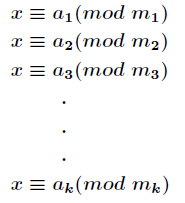

有整数解。并且在模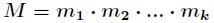
下的解是唯一的，解为
​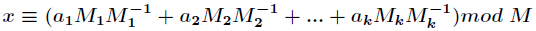

其中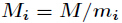
，而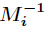
为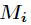
模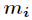
的逆元。
一个可以直接使用的函数
```plain
def extended_crt(remainders, moduli):
    N = 1
    for m in moduli:
        N *= m
    x = 0
    for i in range(len(moduli)):
        ai = remainders[i]
        ni = moduli[i]
        Ni = N // ni
        inv = invert(Ni, ni)
        x += ai * Ni * inv
        x %= N
    return x
```
**9.欧拉函数**
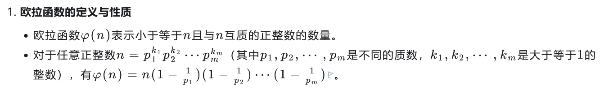

特别的，当n等于p的k次方时，
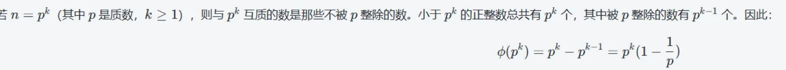

**10.文件读写**
不推荐
```python
# 以只读模式打开文件
file = open('example.txt', 'r') 
# 以写入模式打开文件（如果文件不存在则创建） 
file = open('example.txt', 'w') 
# 以追加模式打开文件（如果文件不存在则创建） 
file = open('example.txt', 'a') 
# 以二进制模式打开文件 
file = open('example.jpg', 'rb')
```
读取文件  推荐
```python
with open('example.txt', 'r') as file: 
    content = file.read() 
    print(content)
```
单行多行读写
```python
with open('example.txt', 'r') as file: 
    line = file.readline() 
    while line: 
        print(line) 
        line = file.readline()
#readline()逐行读取 readlines()把所有行读取到一个列表中 
lines = ['Line 1\n', 'Line 2\n', 'Line 3\n'] 
with open('example.txt', 'w') as file: 
    file.writelines(lines) 
#writeline()写单行
#writelines()写多行    
```
**11.威尔逊定理**
** **威尔逊定理指出，当p是素数时，(p-1)! ≡ -1 mod p  ,推导出(p−2)!≡1(mod p)
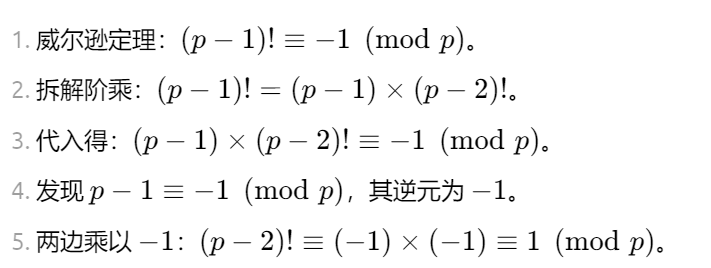

**12、向量的基础知识**
**线性无关和线性相关**
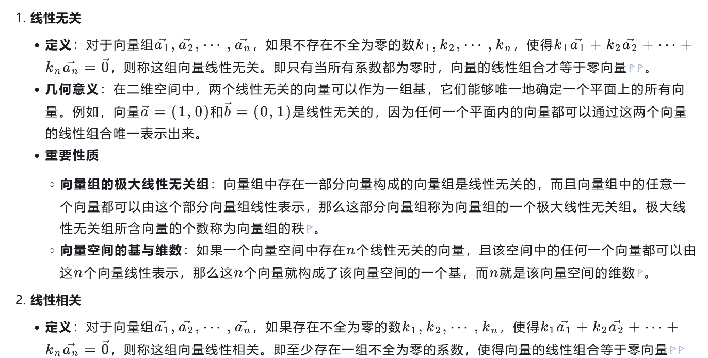

**线性无关组**
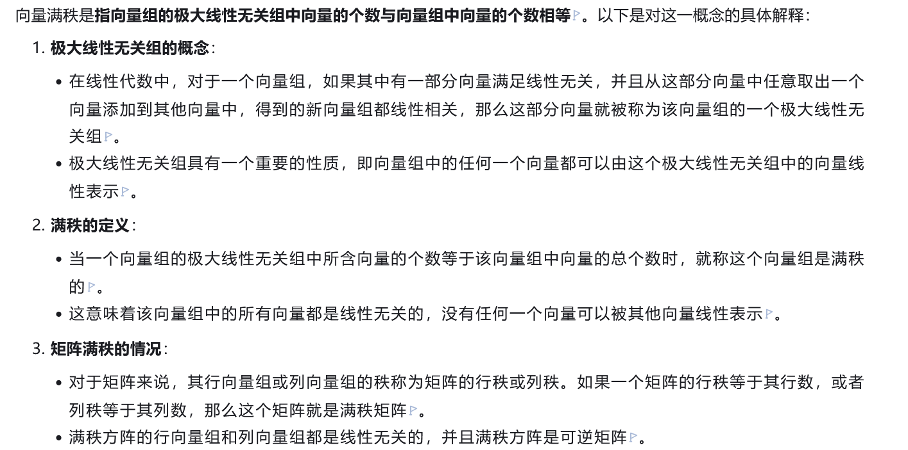
13.

**14.群的阶和元素的阶**
有限群的阶等于群所拥有的元素个数，元素的阶是满足g**m=e的最小正整数m，其中e是单位元，
循环群生成元的阶等于群的阶，且元素的阶<=群的阶，元素的阶必须整除群的阶（拉格朗日定理）
15.二次剩余
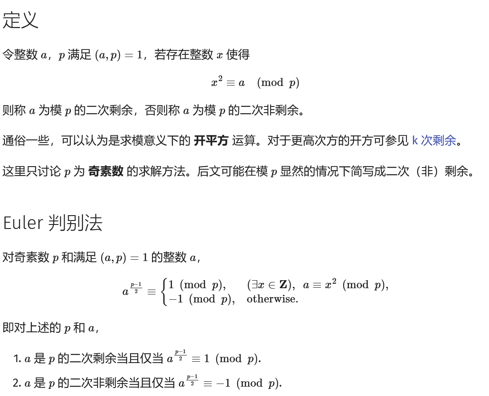

