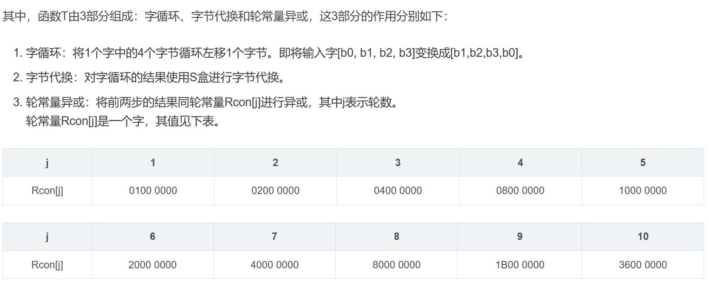
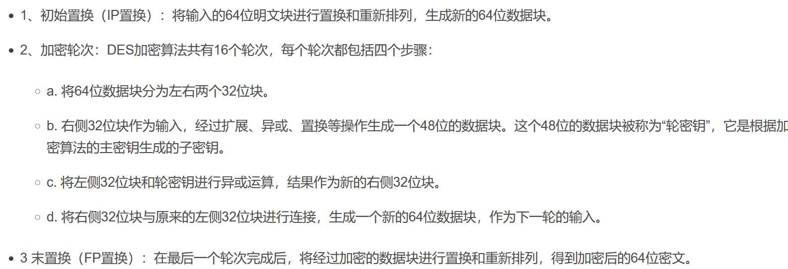
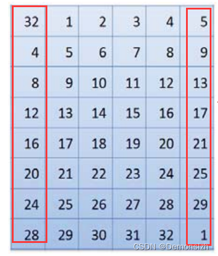
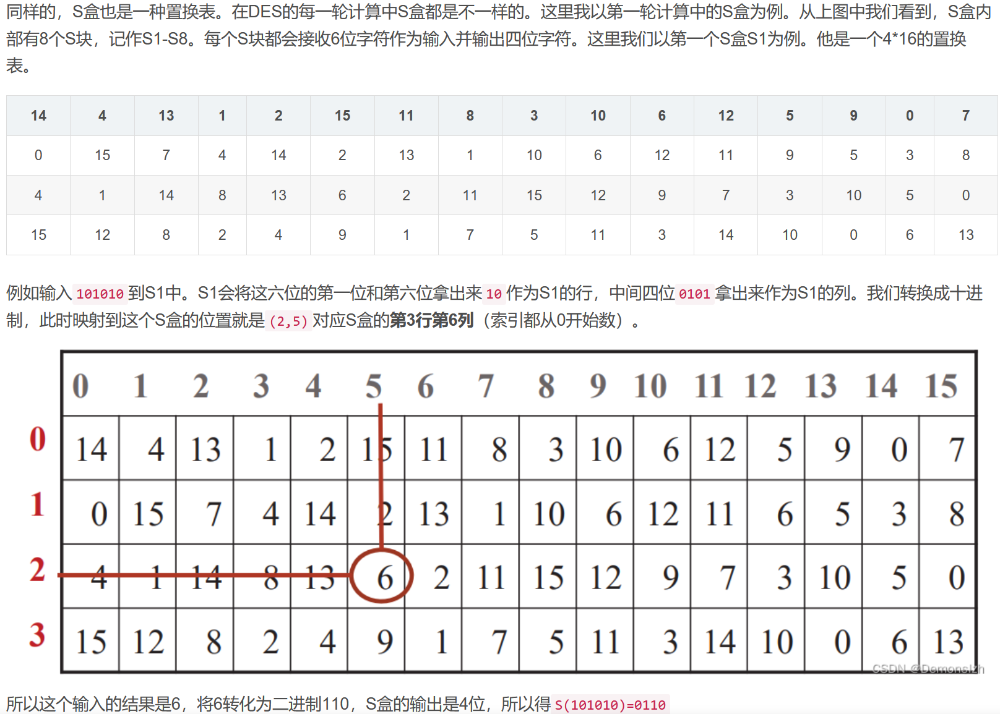
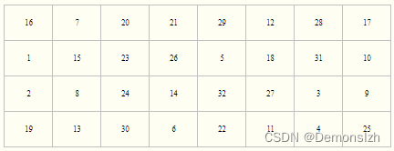
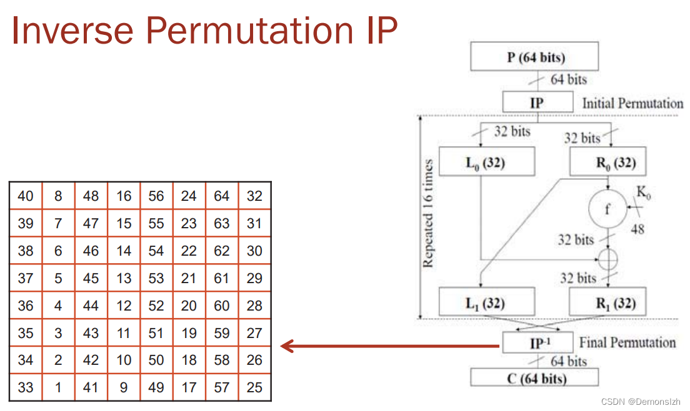

**1.RC4**
首先是初始化算法(KSA)
首先生成一个key，也就是密钥，相当于一个盒子，有256个元素，如果key是678，那么就把678扩展到256位，也就是'678678.....'长度为256，
然后生成一个s盒，也有256个元素，分别为0,1,2，....，255
然后用key初始化s盒

```python
j = 0
key_length = len(key)
for i in range(256):
    j = (j + S[i] + key[i % key_length]) % 256
    S[i], S[j] = S[j], S[i]  # 交换S[i]和S[j]
```
  由于未初始化的S盒都是确定的，所以j可以看作只受key的值的影响   打乱后的s盒称为初始化后的s盒
接下来就是**伪随机子密码生成算法（PRGA)、加密阶段**
这个阶段的目标就是生成与明文等长的密钥流，用于异或加密  

```python
i=j=0
for i in range(256)
i = (i + 1) % 256
j = (j + S[i]) % 256
S[i], S[j] = S[j], S[i]  # 交换
t = (S[i] + S[j]) % 256
key_byte = S[t]
```
然后就是使用这个密钥流​和明文进行异或得到密文
2.**分组密码 （块加密）**
1.ECB (Electronic Code Book，电子密码本) 是分组加密最简单的一种模式，即明文的每个块都独立地加密成密文的每个块。
2.在[CBC](https://so.csdn.net/so/search?q=CBC&spm=1001.2101.3001.7020) (Cipher Block Chaining，密码分组链接)模式中，每个明文块先与前一个密文块进行异或(XOR)后再进行加密。在这种方法中，每个密文块都依赖于它前面的所有明文块；同时，为了保证每条消息的唯一性，在第1个块中需要使用初始化向量 
第一个密文块由初始化向量和明文块进行异或后再使用密钥加密得到，第二个密文块由第一个密文块和第二个明文块进行异或后在加密得到
3.OFB (Output FeedBack，输出反馈模式)可以将块密码变成同步的流密码，将之前一次的加密结果使用密钥再次进行加密(第1次对IV进行加密)，产生的块作为密钥流，然后将其与明文块进行异或，得到密文。由于异或(XOR)操作的对称性，加密和解密操作是完全相同的。
第一次对初始化向量进行加密，加密完与第一个明文块进行异或得到第一组密文，然后把第一次加密完的初始化向量在进行一次加密，然后和第二个明文进行异或得到第二个密文块，然后一直重复操作
4.CFB (Cipher FeedBack，密文反馈)类似OFB，只不过将上一组的密文作为下一组的输入来加密进行反馈，而OFB反馈的是每一组的输出再次经过加密算法后的输出。
先对初始化向量进行加密，然后和第一个明文块进行异或得到第一个密文块，然后把第一个密文块在进行加密，然后和第二个明文块进行异或得到第二个密文块，然后把第二个密文块在加密与第三个密文块进行异或得到.....
5. CTR模式 (Counter Mode，CM) 也被称为ICM模式 (Integer Counter Mode，整数计数模式)、SIC模式(Segmented nteger Counter) 
是OFB的变种，用序列号（即计数器）作为输入，在加密每个块后，再使用下一个计数器值填充寄存器。通常使用一个常数作为计数器初始值，并且每次迭代后递增。计数器块的大小等于明文块的大小。CTR模式可以多个文本块并行处理。
**3.明文填充方式**
1.**ISO 10126：** 规定应在最后一个块的末尾用随机字节进行填充，填充边界应由最后一个字节指定。这种填充方式中，填充字符串的最后一个字节为填充字节的长度，其他为随机节
例如：现在有3bytes，块大小为8bytes，需要填充5bytes，则最后一个为 05，其他全部为 00
原数据：66 6F 72
填充后的数据：66 6F 72 81 A3 00 23 05
2.**PKCS7 **填充的字节值为需要填充的字节数**，**
例  假设块大小为8字节，
明文为`FF FF FF FF FF`（5字节），需要填充3个字节。填充后的数据为：
`FF FF FF FF FF 03 03 03`
**3.PKCS7**
 和PKCS7的区别在于，5的填充块大小为8bytes，而7的填充块大小在1-255bytes之间。 ** 4.ISO/IEC 7816-4****：** 第一个字节是值为 '80' （十六进制） 的强制字节，如果需要，后跟 0 到 *N* − 1 个设置为 '00' 的字节，直到到达块的末尾
例如：66 6F 72 80 00 00 00 00
5.**Zero padding****：** 所有需要填充的字节都用零填充。比如66 6F 72 00 00 00 00 00。它通常应用于二进制编码的字符串(以null 结尾的字符串)，因为null字符通常可以作为空格被剥离。 
**4.AES算法**
       明文分组用字节为单位的正方形矩阵描述，称为状态矩阵，分组长度只能是每组128位，即16个字节,一个字节含有8位，密钥可以是128位，192位，256位。 明文分组用字节为单位的正方形矩阵描述，称为状态矩阵，对于128位密钥，明文和密钥都分成4X4的矩阵，开始先进行一次异或，得到初始密文矩阵，然后初始密文矩阵通过轮函数进行加密，加密10轮。
        128位密钥也是用字节为单位的矩阵表示，矩阵的每一列被称为1个32位比特字。通过密钥编排函数该密钥矩阵被扩展成一个44个字组成的序列W[0],W[1], … ,W[43],该序列的前4个元素W[0],W[1],W[2],W[3]是原始密钥，用于加密运算中的初始密钥加（下面介绍）;后面40个字分为10组，每组4个字（128比特）分别用于10轮加密运算中的轮密钥加。
         AES的整体结构如下图所示，其中的W[0,3]是指W[0]、W[1]、W[2]和W[3]串联组成的128位密钥。加密的第1轮到第9轮的轮函数一样，包括4个操作：字节代换、行位移、列混合和轮密钥加。最后一轮迭代不执行列混合。另外，在第一轮迭代之前，先将明文和原始密钥进行一次异或加密操作
**密钥扩展**
128位的密钥共16位，组成一个4x4的矩阵，然后由4列扩展到44列，扩展方式为
对由密钥K生成的数组W[0-3]扩充40个新列，构成总共44列的扩展密钥数组。新列W[i]产生方式：

1. 如果i不是4的倍数，那么：W[i]=W[i-4]⨁W[i-1]
2. 如果i是4的倍数,那么：W[i]=W[i-4]⨁T(W[i-1])

**字节代换**
 AES的字节代换其实就是一个简单的查表操作。AES定义了一个S盒和一个逆S盒 。矩阵的每一位是一个字节，8位，取高4位作为行号，低四位作为列号，查s盒得到新的状态矩阵。 二进制的前四位作为行号，后四位作为列号进行查表，得到新的状态矩阵
**行移位操作**
 行移位是一个简单的左循环移位操作。当密钥长度为128比特时，状态矩阵的第0行左移0字节，第1行左移1字节，第2行左移2字节，第3行左移3字节  ，逆变换就是左移变右移
**列混合操作**
 列混合变换是通过矩阵相乘来实现的，经行移位后的状态矩阵与固定的矩阵相乘，这里的相乘实际上也是多项式的乘法运算，也要模不可约多项式，得到混淆后的状态矩阵  
**轮密钥加**
 轮密钥加是将128位轮密钥Ki同状态矩阵中的数据进行逐位异或操作
这里可以看成是状态矩阵和密钥矩阵的每一列进行异或，因为密钥矩阵的每一列可以看出是一个字，包含4个字节，32个比特
**AES完整流程：**

1. 密钥扩展（W[4-43]的生成）
2. 轮密钥加（W[0-3]）
3. 轮函数（一轮到九轮重复）：1.字节代换2.行位移3.列混合4.轮密钥加(W[4i-4i+3])
4. 轮函数(十轮)1.字节代换2.行位移3.轮密钥加(W[40-43])求出初始化向量iv和密钥key就可以直接求解
**5. DES算法（Data Encryption Standard）  **
主要过程：


**初始置换**：也称ip置换，根据一个固定的表进行置换排列
**轮结构**，右半边的32个明文比特扩展到48位，密钥长度通过一系列置换和运算由56位减少到48位，密钥和明文右边48位进行异或得到仍得到48个比特，通过s盒减少到32个比特，在通过一个p置换得到新的32个比特，然后和左半边的明文L0进行异或得到下一轮的右边的32个比特r1，原来的r0作为下一轮L1输入。
**F轮函数**
**r0进行的扩展运算**
首先是进行一个扩展置换，使用一个扩展置换表把r0扩展到48位

红色部分就是要补充的数据，这里完成后就得到48位数据，然后就和**每一轮生成的48位密钥**进行异或，异或后还是得到48位数据，分成8组，分别对应8个不同的s盒，每组6位数据，例如010101，取首尾作为行号，中间四位作为列号，对应找出那个数，转成二进制就是四位，8x4=32位作为s盒的输出


**F轮函数**
**这里是子密钥k0的生成**


pc-1和pc-2都是根据一个固定的表进行置换，在进行完pc-2后就得到了每一轮所使用的字密钥k，des算法中会生成16个48位数据块的子密钥k。
这里的**循环左移**16轮加起来刚好循环1圈，防止子密钥重复，提高安全性。
当前轮次的子密钥k和扩展的r0进行异或运算，作为s盒替换的输入
**p盒替换**


P盒替换将S盒替换的32位输出作为输入，经过上述**固定的替换表**进行替换后即为这一轮F轮函数的结果。
**该结果F(R0,K0)与L0进行异或运算得到下一轮的右半部分R1**
**逆置换**


16轮加密完成后，des对最后的输出进行一次置换得到密文，也是根据固定表进行置换
**5.3DES**
即使用DES算法进行加密3次，降低被暴力破解的风险
**6.tea加密**

```plain
void Encrypt(long* EntryData, long* Key)
{
    //分别加密数组中的前四个字节与后4个字节,4个字节为一组每次加密两组
    unsigned long x = EntryData[0];
    unsigned long y = EntryData[1];
 
    unsigned long sum = 0;
    unsigned long delta = 0x9E3779B9;
    //总共加密32轮
    for (int i = 0; i < 32; i++)
    {
        sum += delta;
        x += ((y << 4) + Key[0]) ^ (y + sum) ^ ((y >> 5) + Key[1]);
        y += ((x << 4) + Key[2]) ^ (x + sum) ^ ((x >> 5) + Key[3]);
    }
    //最后加密的结果重新写入到数组中
    EntryData[0] = x;
    EntryData[1] = y;
}
```
这里的delta是 δ=「(√5 - 1)231」，一个固定的常量，其中这个数组是整个明文，x和y分别是明文的左右两个部分，然后就是根据这个算法对x和y进行加密，解密算法也很简单

```plain
void Decrypt(long* EntryData, long* Key)
{
    //分别加密数组中的前四个字节与后4个字节,4个字节为一组每次加密两组
    unsigned long x = EntryData[0];
    unsigned long y = EntryData[1];
 
    unsigned long sum = 0;
    unsigned long delta = 0x9E3779B9;
    sum = delta << 5;   //注意这里,sum = 32轮之后的黄金分割值. 因为我们要反序解密.
    //总共加密32轮 那么反序也解密32轮
    for (int i = 0; i < 32; i++)
    {
 
// 先将y解开 然后参与运算在解x
        y -= ((x << 4) + Key[2]) ^ (x + sum) ^ ((x >> 5) + Key[3]);
        x -= ((y << 4) + Key[0]) ^ (y + sum) ^ ((y >> 5) + Key[1]);
        sum -= delta;
    }
    //最后加密的结果重新写入到数组中
    EntryData[0] = x;
    EntryData[1] = y;
}
```
这里的sum = delta << 5;就是把delta*32，左移5位相当于乘以32，然后得到加密32轮的结果在进行循环遍历得到原始的x和y
​
