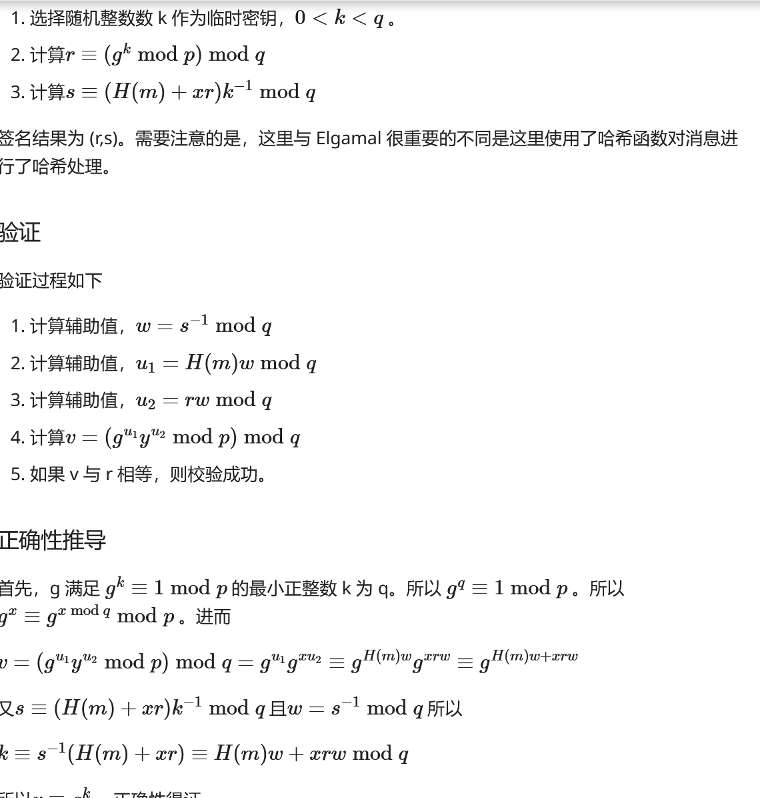
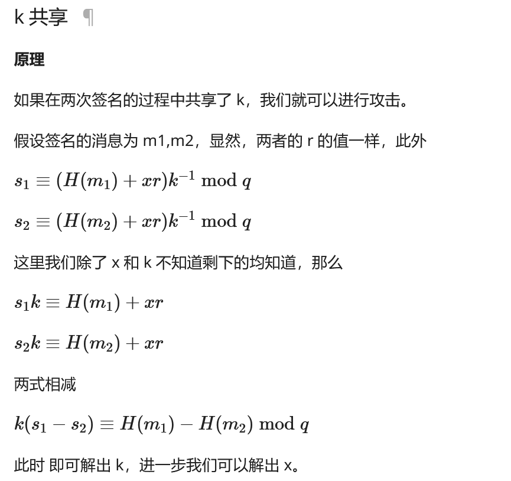

**1.DSA数字签名**

- p：一个素模数，其值满足：2^(L-1) < p < 2^L，其中L是64的倍数，且满足512≤ L ≤ 1024
- q：(p-1)的素因子，其值满足2^159 < q < 2^160，即q长度为160位。
- g：g = pow(h,(p-1)/q,p)。h为满足1 < h < p-1 的任意整数，从而有pow(h,(p-1)/q,p) > 1
- x：私钥。x为一个随机或伪随机生成的整数，其值满足 0 < x < q。
- y：公钥。y = pow(g,x,p)### DSA 签名过程：

1. 产生一个随机数k，其值满足 0 < k < q
2. 计算r = pow(g,k,p) mod q，其值满足 r > 0
3. 计算 s = (k^(-1)(SHA(M) + x * r)) mod q，其值满足 s > 0

