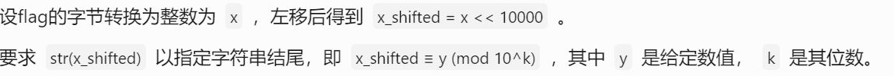
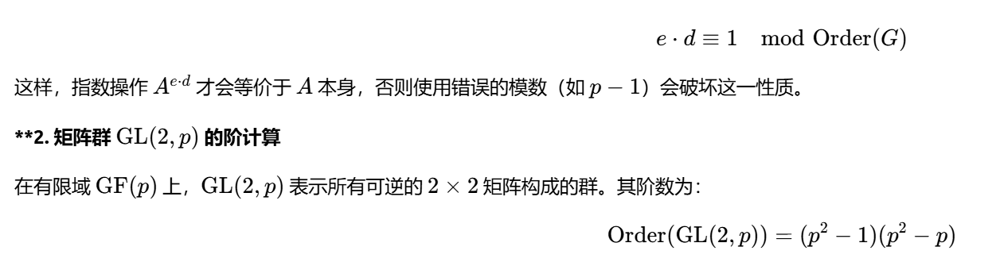

1.int函数只能把字符串转成对应的进制整数，无法对整数进行转换
int（'123',8）把8进制整数123转成10进制整数
2.sagemath中使用factor对因式进行简化运算

```plain
a,b=var('a b')
f=(a**2 + 1)*(b**2 + 1) - 2*(a - b)*(a*b - 1)-4*a*b
f.factor()
```
3.yafu因子分解
 yafu-x64.exe factor(12)  
4.当把一个数左移若干位数并要求其以某个字符串结尾时，


**x左移n位相当于乘以2的n次方**
**x右移n位相当于整除2的n次方**
5.使用^异或运算符进行时只能遍历到255的整数，大整数无法使用，
strxor 函数是对字节进行异或且必须要求字节等长
因此只能使用pwn库里面的xor函数来进行
6.base解码
python basecrack.py -f base文件/1.txt
7.zip函数，对两个并行遍历多个对象，以最短的为准

```python
names = ["Alice", "Bob", "Charlie"]
ages = [25, 30, 28]

for name, age in zip(names, ages):
    print(f"{name} is {age} years old")

# 输出：
# Alice is 25 years old
# Bob is 30 years old
# Charlie is 28 years old
```
### `enumerate`函数，使用这个函数时，返回一个索引值和元素值

```python
fruits = ["apple", "banana", "cherry"]

for idx, fruit in enumerate(fruits):
    print(f"Index {idx}: {fruit}")

# 输出：
# Index 0: apple
# Index 1: banana
# Index 2: cherry
```
8.矩阵的求模逆运算中，要使用的是矩阵群的阶，而对与一个2x2的矩阵来说，

9.费马小定理
如果p是一个 质数，而 整数 a不是p的倍数，则有a^（p-1）≡1（mod p）
