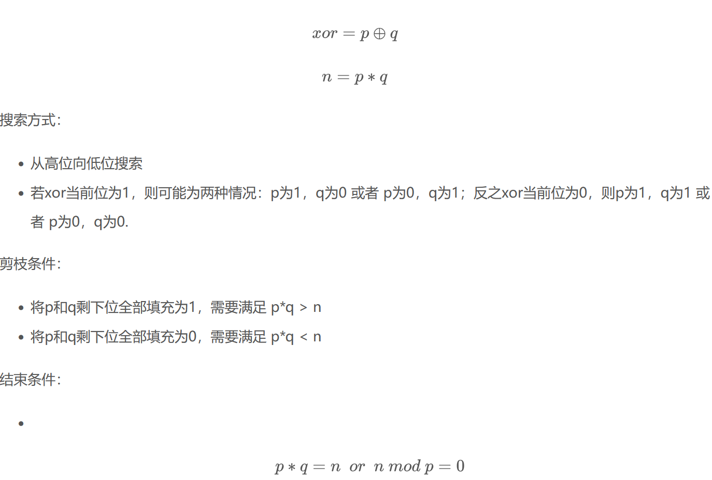

1.p和q剪枝
p和q异或
```plain
from Crypto.Util.number import *
p = getPrime(128)
q = getPrime(128)
n = p*q
xor = p^q
print(f"n = {n}")
print(f"xor = {xor}")

#n = 81273634095521392491945168120330007101677085824054016784875224305683560308213
#xor = 55012774068906519160740720236510369652
```
原理：



```plain
import sys
sys.setrecursionlimit(1<<25)

n = 81273634095521392491945168120330007101677085824054016784875224305683560308213
xor = 55012774068906519160740720236510369652
pbits = 128
ph = ''
qh = ''
xor = str(bin(xor)[2:]).zfill(pbits)

def find(ph,qh):
    l0 = len(ph)
    l1 = len(qh)
    tmp0 = ph + '0' * (pbits-l0)
    tmp1 = ph + '1' * (pbits-l0)
    tmq0 = qh + '0' * (pbits-l1)
    tmq1 = qh + '1' * (pbits-l1)
    if int(tmp0,2) * int(tmq0,2) > n:#剪枝条件1
        return
    if int(tmp1,2) * int(tmq1,2) < n:#剪枝条件2
        return
    
    if l0 == pbits:#结束条件
        if int(ph,2) * int(qh,2) == n:
            print(f'p = {int(ph,2)}')
            print(f'q = {int(qh,2)}')
            return
    
    else:
        if xor[l1] == '1':
            find(ph+'0',qh+'1')
            find(ph + '1',qh+'0') 
        else:
            find(ph+'1',qh+'1')
            find(ph + '0',qh+'0')    

find(ph,qh)


#运行结果
'''
p = 270451921611135557038833183249275131423
q = 300510470073047693263940829088190906731
p = 300510470073047693263940829088190906731
q = 270451921611135557038833183249275131423
'''
```
这里的pbits是p的位数，也可根据n的位数来判断
2.p和q高位异或 高位已知

```plain
from Crypto.Util.number import *
p = getPrime(128)
q = getPrime(128)
n = p*q
kbits = 16
_q = q>>kbits
xor = p^_q
print(f"n = {n}")
print(f"xor = {xor}")

#n = 64562232639256893416069755621246602817297999377249269503641314167726888737493
#xor = 309280967555048700343199196922406211930
```
 已知条件： 
搜索方式：

- 从高位向低位搜索
- 这种情况，p的高kbits位已知，与xor的高kbits位相同。那搜索就从xor的kbits位开始，即p的第kbits位，q的第1位。
- 若xor当前位为1，则可能为两种情况：p为1，q为0 或者 p为0，q为1；反之xor当前位为0，则p为1，q为1 或者 p为0，q为0.（这里的p或者q为1指的都是xor当前位对应的p和q的位置）剪枝条件：

- 将p和q剩下位全部填充为1，需要满足 p*q > n
- 将p和q剩下位全部填充为0，需要满足 p*q < n
- 这里要注意把p的已知的高kbits位加上结束条件：n mod p=0

```plain
n = 63643664048526756484794345795699229288597054138478072698289292748237001669839
xor = 188681898001072579822021026951939419279
kbits = 16
pbits = 128
xor = str(bin(xor)[2:])
ph = xor[:kbits]
qh = ''
xor = xor[kbits:]
qh = ''
def find(ph,qh):
    l0 = len(ph)
    l1 = len(qh)
    tmp0 = ph + '0' * (pbits-l0)
    tmp1 = ph + '1' * (pbits-l0)
    tmq0 = qh + '0' * (pbits-l1)
    tmq1 = qh + '1' * (pbits-l1)
    if int(tmp0,2) * int(tmq0,2) > n:#剪枝条件1
        return
    if int(tmp1,2) * int(tmq1,2) < n:#剪枝条件2
        return
    
    if l0 == pbits:#结束条件
        if n % int(ph,2) == 0:
            print(f'p = {int(ph,2)}')
            return
    
    else:
        if xor[l1] == '1':
            find(ph+'0',qh+'1')
            find(ph + '1',qh+'0') 
        else:
            find(ph+'1',qh+'1')
            find(ph + '0',qh+'0')    
find(ph,qh)


#运行结果
'''
p = 188678698133681304596906537936293804297
'''

#高位未知的话可以直接爆破求高位
for i in  range(2**kbits):
    ph = bin(i)[2:].zfill(kbits)
    qh = ''            
    find(ph,qh)

```
3.p和q取反的值进行异或
首尾剪枝
```plain
from Crypto.Util.number import *
from secret import flag

m = bytes_to_long(flag)
p = getPrime(256)
q = getPrime(256)
n = p * q
e = 65537
_q = int(bin(q)[2:][::-1] , 2)
c = pow(m,e,n)

print(p ^ _q)
print(n)
print(c)

'''
47761879279815109356923025519387920397647575481870870315845640832106405230526
10310021142875344535823132048350287610122830618624222175188882916320750885684668357543070611134424902255744858233485983896082731376191044874283981089774677
999963120986258459742830847940927620860107164857685447047839375819380831715400110131705491405902374029088041611909274341590559275004502111124764419485191
'''
```

```plain
from Crypto.Util.number import *
import sys
sys.setrecursionlimit(1500)

pxorq = 47761879279815109356923025519387920397647575481870870315845640832106405230526
n = 10310021142875344535823132048350287610122830618624222175188882916320750885684668357543070611134424902255744858233485983896082731376191044874283981089774677
c = 999963120986258459742830847940927620860107164857685447047839375819380831715400110131705491405902374029088041611909274341590559275004502111124764419485191
e = 65537
pxorq = str(bin(pxorq)[2:]).zfill(256)
 
def find(ph,qh,pl,ql):
    l = len(ph)
    tmp0 = ph + (256-2*l)*"0" + pl
    tmp1 = ph + (256-2*l)*"1" + pl
    tmq0 = qh + (256-2*l)*"0" + ql
    tmq1 = qh + (256-2*l)*"1" + ql
    if(int(tmp0,2)*int(tmq0,2) > n):
        return 
    if(int(tmp1,2)*int(tmq1,2) < n):
        return
    if(int(pl,2)*int(ql,2) % (2**(l-1)) != n % (2**(l-1))):
        return

    if(l == 128):
        pp0 = int(tmp0,2)
        if(n % pp0 == 0):
            pf = pp0
            qf = n//pp0
            phi = (pf-1)*(qf-1)
            d = inverse(e,phi)
            m1 = pow(c,d,n)
            print(long_to_bytes(m1))
            exit()

    else:
        if(pxorq[l] == "1" and pxorq[255-l] == "1"):
            find(ph+"1",qh+"0","1"+pl,"0"+ql)
            find(ph+"0",qh+"0","1"+pl,"1"+ql)
            find(ph+"1",qh+"1","0"+pl,"0"+ql)
            find(ph+"0",qh+"1","0"+pl,"1"+ql)
        elif(pxorq[l] == "1" and pxorq[255-l] == "0"):
            find(ph+"1",qh+"0","0"+pl,"0"+ql)
            find(ph+"0",qh+"0","0"+pl,"1"+ql)
            find(ph+"1",qh+"1","1"+pl,"0"+ql)
            find(ph+"0",qh+"1","1"+pl,"1"+ql)
        elif(pxorq[l] == "0" and pxorq[255-l] == "1"):
            find(ph+"0",qh+"0","1"+pl,"0"+ql)
            find(ph+"0",qh+"1","0"+pl,"0"+ql)
            find(ph+"1",qh+"0","1"+pl,"1"+ql)
            find(ph+"1",qh+"1","0"+pl,"1"+ql)
        elif(pxorq[l] == "0" and pxorq[255-l] == "0"):
            find(ph+"0",qh+"0","0"+pl,"0"+ql)
            find(ph+"1",qh+"0","0"+pl,"1"+ql)
            find(ph+"0",qh+"1","1"+pl,"0"+ql)
            find(ph+"1",qh+"1","1"+pl,"1"+ql)

find("1","1","1","1")

#flag{f55a2740-c15d-af88-1815-a1b4aab19ccf}
```
