**1.rsa算法**

```python
from Crypto.Util.number import *#是导入语句具体来说，这行代码会导入 number 子模块中的所有函数和类，使其在当前代码中可用。
import gmpy2 #高精度算法
p = int(input()) #素数
q = int(input())
e = int(input())#这是RSA公钥中的公钥指数。通常情况下，它是一个较小的整数，通常是65537。它用于加密消息。
c = int(input())#这是RSA加密的结果，也就是密文，通过执行 c = pow(m, e, n)=m的e次方mod n
n=p*q #模数n
L = (p-1)*(q-1)#这是欧拉函数 (φ) 的值，计算方法为 (p-1) * (q-1)。在RSA中，它在私钥的计算中用到。
d =gmpy2.invert(e,L)#这行代码使用gmpy2库中的 invert 函数来计算私钥指数 d。它找到了满足 d * e ≡ 1 (mod L) 的 d 值。
#print(d)#求d的值
m = pow(c,d,n) #m是明文 pow用于计算一个数的幂，如pow(2, 3, 5)  # 计算 2 的 3 次方，然后对 5 取模，结果为 3
print(long_to_bytes(m))#将大整数转换为字节数组 //基本上大部分的RSA解密都需要进行转换
# 将大整数 m 进行二进制编码。
# 将编码后的二进制数据按字节进行分割。
# 最终的结果是一个字节数组，每个元素代表一个字节。
# 这个函数在密码学中经常用于将加密后的消息转换为可传输的字节序列，或者将计算得到的哈希值转换为二进制数据，以便进行后续的处理或者存储。
```
私钥解密原理证明见[https://blog.csdn.net/qq_44750892/article/details/120075922](https://blog.csdn.net/qq_44750892/article/details/120075922)
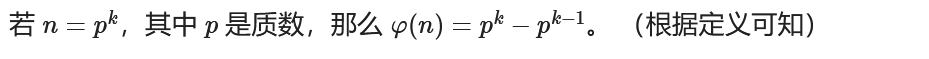

rsa算法中求n的欧拉函数也就是求小于n的与n互素的数的个数，n=p*q时，phi=(p-1)*(q-1)，也就是p和q的欧拉函数的乘积，那么当n可以被分解成许多个素数的乘积时，那么phi也就变成每一个素数的欧拉函数的乘积
当p和q相同时，欧拉函数不能使用（p-1）*（q-1） 要用p**2-p
欧拉函数本质上还是对n进行求解，所以主要还是看n的式子等于什么，具体定义在基础知识那里
**2.共模攻击**
原理：
已知有密文：
c1 = pow(m, e1, n)
c2 = pow(m, e2, n)
条件：
当e1，e2互质，则有gcd(e1,e2)=1
根据扩展欧几里德算法，对于不完全为 0 的整数 a，b，gcd（a，b）表示 a，b 的最大公约数。那么一定存在整数 x，y 使得 gcd（a，b）=ax+by
所以得到：
e1*s1+e2*s2 = s0/1
当两个e1，e2不互素的情况下其实也可以用共模攻击，只是后面要对m0进行开s0次方根
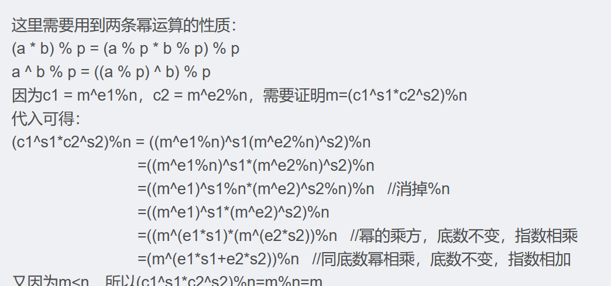


```python
import gmpy2
from Crypto.Util.number import *

e1= 3247473589
e2= 3698409173
c1 = 100156221476910922393504870369139942732039899485715044553913743347065883159136513788649486841774544271396690778274591792200052614669235485675534653358596366535073802301361391007325520975043321423979924560272762579823233787671688669418622502663507796640233829689484044539829008058686075845762979657345727814280
c2 = 86203582128388484129915298832227259690596162850520078142152482846864345432564143608324463705492416009896246993950991615005717737886323630334871790740288140033046061512799892371429864110237909925611745163785768204802056985016447086450491884472899152778839120484475953828199840871689380584162839244393022471075
n = 103606706829811720151309965777670519601112877713318435398103278099344725459597221064867089950867125892545997503531556048610968847926307322033117328614701432100084574953706259773711412853364463950703468142791390129671097834871371125741564434710151190962389213898270025272913761067078391308880995594218009110313

g,x,y = gmpy2.gcdext(e1, e2)            #步骤一：xe1 + ye2 = 1 解出x , y
print(x,y)
m = pow(c1, x , n) * pow(c2, y, n) % n #步骤二：由扩展欧几里得算法可得
print(long_to_bytes(m))
```
**3.rsa共素数攻击  ** 共素数攻击（common prime RSA）  
是在做羊城杯2021里面遇到的easy rsa题目的内容
这里面p-1=2ga，q-1=2gb，拥有共同的素数g，就可以使用 Pollard’s rho  算法解决
这里对a进行取不同的素数就是为了获取不同的初始值？
构造这个f函数使得结果会进入一个循环中
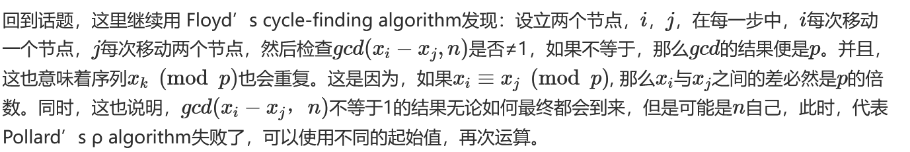

**​**


这里的f函数好像是固定的？不太清除，论文上好像就是固定的

```plain
from Crypto.Util.number import *
import gmpy2

def f(x, n):
    return (pow(x, n - 1, n) + 3) % n

def rho(n):
    i = 1
    while True:
        a = getRandomRange(2, n)
        b = f(a, n)
        j = 1
        while True:
            p = GCD(abs(a - b), n)
            print('{} in {} circle'.format(j, i))
            if p == n:
                break
            elif p > 1:
                return (p, n // p)
            else:
                a = f(a, n)
                b = f(f(b, n), n)
            j += 1
        i += 1

n = 84236796025318186855187782611491334781897277899439717384242559751095347166978304126358295609924321812851255222430530001043539925782811895605398187299748256080526691975084042025794113521587064616352833904856626744098904922117855866813505228134381046907659080078950018430266048447119221001098505107823645953039
e = 58337
c = 13646200911032594651110040891135783560995665642049282201695300382255436792102048169200570930229947213493204600006876822744757042959653203573780257603577712302687497959686258542388622714078571068849217323703865310256200818493894194213812410547780002879351619924848073893321472704218227047519748394961963394668

p, q = rho(n)
d = gmpy2.invert(e, (p-1)*(q-1))
m = pow(c, d, n)
print(bytes.fromhex(hex(m)[2:]))
#b'SangFor{0a8c2220-4c1b-32c8-e8c1-adf92ec7678b}'
```
**4.中国剩余定理加速rsa  dp,dq泄露**
**已知**
**d=dp mod(p−1) **
**d=dq mod(q−1)，假设**
**cd≡m1(modp)(m1为特定数值，使该式成立)**
** cd≡m2(modq)(m2为特定数值，使该式成立），**
**证明**
**m1≡c**dpmodp**
**m2≡c**dqmodq，这里一定要满足p<q******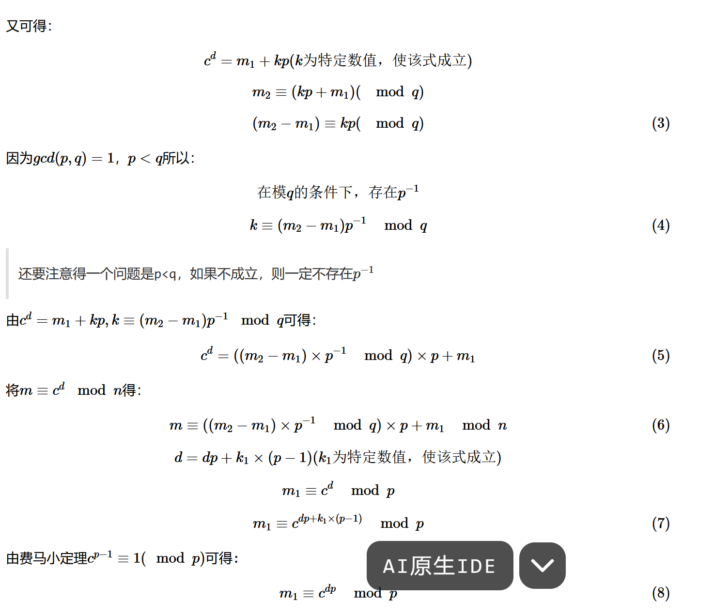


然后这里就是去遍历1到e这个范围内，找到x，使得满足（p-1）*x+1=dp*e，然后求出p-1，进而求出p
**rsa中国剩余定理**
给了多组n和c，但没给e或者e很小，是中国剩余定理的内容，e可以爆破实现
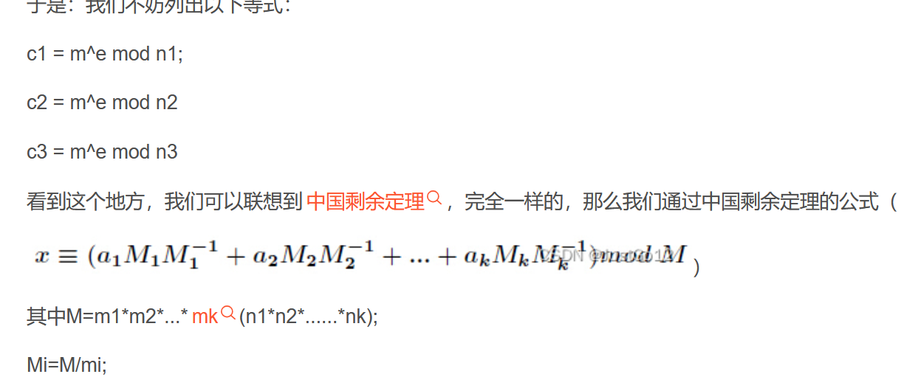

这里也就是知道多组c和n，然后通过中国剩余定理求出m的e次方，然后根据情况没给e在对me次方进行开方就可以求出m得到明文
**rsa多个n和c，正常的e是求最大公约数的内容**
**rsa低解密指数攻击（d很小时，e很大, e过大或过小  ）也就是维纳攻击，维纳攻击也算是连分数攻击的一种**
d<1/3 N**0.25
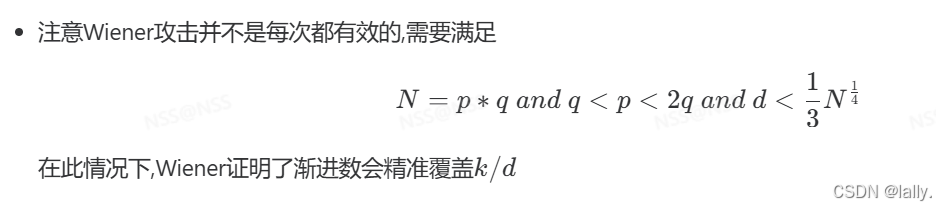

**5.rsa连分数攻击**
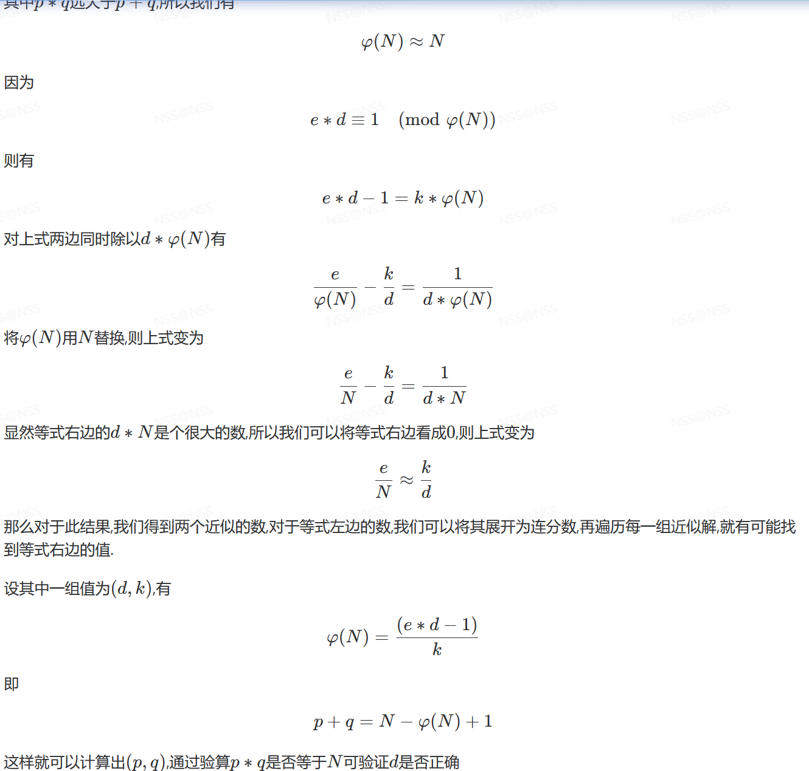

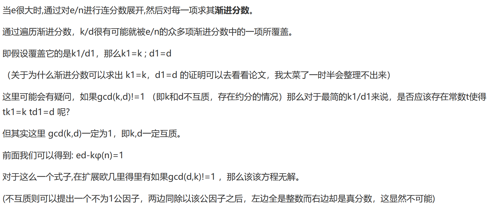

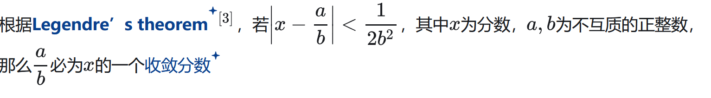

求解连分数
```python
def continued_fraction(dn,n):
	res = []
	while dn % n:
		res.append(dn//n)
		dn, n = n, dn % n
	res.append(dn//n)
	print(res)

print(continued_fraction(5,3))
#这里就是使用一个循环求出来一个分数的连分数，直到他的余数为0时停止,
#其中dn和n赋值的是先把n赋值给dn，然后这时候在把原来的dn%n的值赋值给n，
#相当于使用的是初始的dn和n的值

```
求解渐进分数
```python
def Convergence_function(continued):
	res =[]
	for i in range(1,len(continued)+1):
		tmp = 1
		conver = continued[:i][::-1]
		tmp = conver[0]
		for j in conver[1:]:
			tmp = j + 1/tmp
		res.append(tmp)
	return res

print(Convergence_function(continued_fraction(1234,32)))
#就是求一个连分数的渐进分数，简单来说就是从小到大逐渐遍历，增加他的分母的个数
```
这里还是要满足e很大而使得d很小的条件
具体来说就是针对每一组e/N，去验证d是否是e的逆元
** ****Boneh Durfee攻击**要求私钥指数d小于模数N的0.292次方根  ,一般是d较小

```python
from Crypto.Util.number import *

"""
Setting debug to true will display more informations
about the lattice, the bounds, the vectors...
"""
debug = False

"""
Setting strict to true will stop the algorithm (and
return (-1, -1)) if we don't have a correct
upperbound on the determinant. Note that this
doesn't necesseraly mean that no solutions
will be found since the theoretical upperbound is
usualy far away from actual results. That is why
you should probably use `strict = False`
"""
strict = False

"""
This is experimental, but has provided remarkable results
so far. It tries to reduce the lattice as much as it can
while keeping its efficiency. I see no reason not to use
this option, but if things don't work, you should try
disabling it
"""
helpful_only = True
dimension_min = 7  # stop removing if lattice reaches that dimension


############################################
# Functions
##########################################

# display stats on helpful vectors
def helpful_vectors(BB, modulus):
    nothelpful = 0
    for ii in range(BB.dimensions()[0]):
        if BB[ii, ii] >= modulus:
            nothelpful += 1

    print(nothelpful, "/", BB.dimensions()[0], " vectors are not helpful")


# display matrix picture with 0 and X
def matrix_overview(BB, bound):
    for ii in range(BB.dimensions()[0]):
        a = ('%02d ' % ii)
        for jj in range(BB.dimensions()[1]):
            a += '0' if BB[ii, jj] == 0 else 'X'
            if BB.dimensions()[0] < 60:
                a += ' '
        if BB[ii, ii] >= bound:
            a += '~'
        print(a)


# tries to remove unhelpful vectors
# we start at current = n-1 (last vector)
def remove_unhelpful(BB, monomials, bound, current):
    # end of our recursive function
    if current == -1 or BB.dimensions()[0] <= dimension_min:
        return BB

    # we start by checking from the end
    for ii in range(current, -1, -1):
        # if it is unhelpful:
        if BB[ii, ii] >= bound:
            affected_vectors = 0
            affected_vector_index = 0
            # let's check if it affects other vectors
            for jj in range(ii + 1, BB.dimensions()[0]):
                # if another vector is affected:
                # we increase the count
                if BB[jj, ii] != 0:
                    affected_vectors += 1
                    affected_vector_index = jj

            # level:0
            # if no other vectors end up affected
            # we remove it
            if affected_vectors == 0:
                # print("* removing unhelpful vector", ii)
                BB = BB.delete_columns([ii])
                BB = BB.delete_rows([ii])
                monomials.pop(ii)
                BB = remove_unhelpful(BB, monomials, bound, ii - 1)
                return BB

            # level:1
            # if just one was affected we check
            # if it is affecting someone else
            elif affected_vectors == 1:
                affected_deeper = True
                for kk in range(affected_vector_index + 1, BB.dimensions()[0]):
                    # if it is affecting even one vector
                    # we give up on this one
                    if BB[kk, affected_vector_index] != 0:
                        affected_deeper = False
                # remove both it if no other vector was affected and
                # this helpful vector is not helpful enough
                # compared to our unhelpful one
                if affected_deeper and abs(bound - BB[affected_vector_index, affected_vector_index]) < abs(
                        bound - BB[ii, ii]):
                    # print("* removing unhelpful vectors", ii, "and", affected_vector_index)
                    BB = BB.delete_columns([affected_vector_index, ii])
                    BB = BB.delete_rows([affected_vector_index, ii])
                    monomials.pop(affected_vector_index)
                    monomials.pop(ii)
                    BB = remove_unhelpful(BB, monomials, bound, ii - 1)
                    return BB
    # nothing happened
    return BB


""" 
Returns:
* 0,0   if it fails
* -1,-1 if `strict=true`, and determinant doesn't bound
* x0,y0 the solutions of `pol`
"""


def boneh_durfee(pol, modulus, mm, tt, XX, YY):
    """
    Boneh and Durfee revisited by Herrmann and May
    finds a solution if:
    * d < N^delta
    * |x| < e^delta
    * |y| < e^0.5
    whenever delta < 1 - sqrt(2)/2 ~ 0.292
    """

    # substitution (Herrman and May)
    PR.<u,x,y> = PolynomialRing(ZZ)
    Q = PR.quotient(x * y + 1 - u)  # u = xy + 1
    polZ = Q(pol).lift()

    UU = XX * YY + 1

    # x-shifts
    gg = []
    for kk in range(mm + 1):
        for ii in range(mm - kk + 1):
            xshift = x ^ ii * modulus ^ (mm - kk) * polZ(u, x, y) ^ kk
            gg.append(xshift)
    gg.sort()

    # x-shifts list of monomials
    monomials = []
    for polynomial in gg:
        for monomial in polynomial.monomials():
            if monomial not in monomials:
                monomials.append(monomial)
    monomials.sort()

    # y-shifts (selected by Herrman and May)
    for jj in range(1, tt + 1):
        for kk in range(floor(mm / tt) * jj, mm + 1):
            yshift = y ^ jj * polZ(u, x, y) ^ kk * modulus ^ (mm - kk)
            yshift = Q(yshift).lift()
            gg.append(yshift)  # substitution

    # y-shifts list of monomials
    for jj in range(1, tt + 1):
        for kk in range(floor(mm / tt) * jj, mm + 1):
            monomials.append(u ^ kk * y ^ jj)

    # construct lattice B
    nn = len(monomials)
    BB = Matrix(ZZ, nn)
    for ii in range(nn):
        BB[ii, 0] = gg[ii](0, 0, 0)
        for jj in range(1, ii + 1):
            if monomials[jj] in gg[ii].monomials():
                BB[ii, jj] = gg[ii].monomial_coefficient(monomials[jj]) * monomials[jj](UU, XX, YY)

    # Prototype to reduce the lattice
    if helpful_only:
        # automatically remove
        BB = remove_unhelpful(BB, monomials, modulus ^ mm, nn - 1)
        # reset dimension
        nn = BB.dimensions()[0]
        if nn == 0:
            print("failure")
            return 0, 0

    # check if vectors are helpful
    if debug:
        helpful_vectors(BB, modulus ^ mm)

    # check if determinant is correctly bounded
    det = BB.det()
    bound = modulus ^ (mm * nn)
    if det >= bound:
        # print("We do not have det < bound. Solutions might not be found.")
        # print("Try with highers m and t.")
        if debug:
            diff = (log(det) - log(bound)) / log(2)
            # print("size det(L) - size e^(m*n) = ", floor(diff))
        if strict:
            return -1, -1
    else:
        print("det(L) < e^(m*n) (good! If a solution exists < N^delta, it will be found)")

    # display the lattice basis
    if debug:
        matrix_overview(BB, modulus ^ mm)

    # LLL
    if debug:
        print("optimizing basis of the lattice via LLL, this can take a long time")

    BB = BB.LLL()

    if debug:
        print("LLL is done!")

    # transform vector i & j -> polynomials 1 & 2
    if debug:
        print("looking for independent vectors in the lattice")
    found_polynomials = False

    for pol1_idx in range(nn - 1):
        for pol2_idx in range(pol1_idx + 1, nn):
            # for i and j, create the two polynomials
            PR.<w,z> = PolynomialRing(ZZ)
            pol1 = pol2 = 0
            for jj in range(nn):
                pol1 += monomials[jj](w * z + 1, w, z) * BB[pol1_idx, jj] / monomials[jj](UU, XX, YY)
                pol2 += monomials[jj](w * z + 1, w, z) * BB[pol2_idx, jj] / monomials[jj](UU, XX, YY)

            # resultant
            PR.<q> = PolynomialRing(ZZ)
            rr = pol1.resultant(pol2)

            # are these good polynomials?
            if rr.is_zero() or rr.monomials() == [1]:
                continue
            else:
                # print("found them, using vectors", pol1_idx, "and", pol2_idx)
                found_polynomials = True
                break
        if found_polynomials:
            break

    if not found_polynomials:
        # print("no independant vectors could be found. This should very rarely happen...")
        return 0, 0

    rr = rr(q, q)

    # solutions
    soly = rr.roots()

    if len(soly) == 0:
        # print("Your prediction (delta) is too small")
        return 0, 0

    soly = soly[0][0]
    ss = pol1(q, soly)
    solx = ss.roots()[0][0]

    #
    return solx, soly


def attack(N, e, factor_bit_length, factors, delta=0.25, m=1):
    x, y = ZZ["x", "y"].gens()
    A = N + 1
    f = x * (A + y) + 1
    X = int(RR(e) ** delta)
    Y = int(2 ** ((factors - 1) * factor_bit_length + 1))
    t = int((1 - 2 * delta) * m)
    x0, y0 = boneh_durfee(f, e, m, t, X, Y)
    return f(x0, y0) // e


N = 160114502501162084436964583573537478796032975208003641998245321466054315024090626426576990670846673676284220472762005347545857048805279326218401844652650972020279579076862422448095751869541093396088035262462766840652498826036642824370917665518133929602675230369722990871966227199496065637730328810028624771799
e = 45345940569506069958442629331605385637541863502889625766318025882612322508079296362452308633027956256763871699363730475762179734871820426435674201573024637206928394192742633431788159554008858191365192772486379417021387095234660386008405855409257903024187126197769938866986740500855322639995703897171982472409
c = 54804574756729863920967159846060185937697266820658443964397350756668642051647933464063713653569896152539760694973280490768379727191709149635944250514794939902138783777815040318178431874892245462786377699958110644049375757179588739287406833915772871299296750059138805811112990483420256564588150314150915692126

d = attack(N, e, 512, 2, .271, 6)
m = pow(c, d, N)
print(long_to_bytes(int(m)))
#这里的512是p和q的位数，一般位n的一半，2是素因子个数n = p*q,2个素因子,
#0.271是d的大小，d=0.27*n,所以小于0.271,6是构造的格的维度，平衡效率和时间
```
​
**利用Crypto.PublicKey的RSA模块从文件中获取公钥信息n,e**

```plain
with open("public.txt","r") as f:
    key = RSA.import_key(f.read())
e = key.e
n = key.n
print(e,n)
```
## 已知e,d的值和p,q的位数，求p,q的值，例题就是nctf2019 babyrsa，在buuctf刷题记录里

相关消息攻击
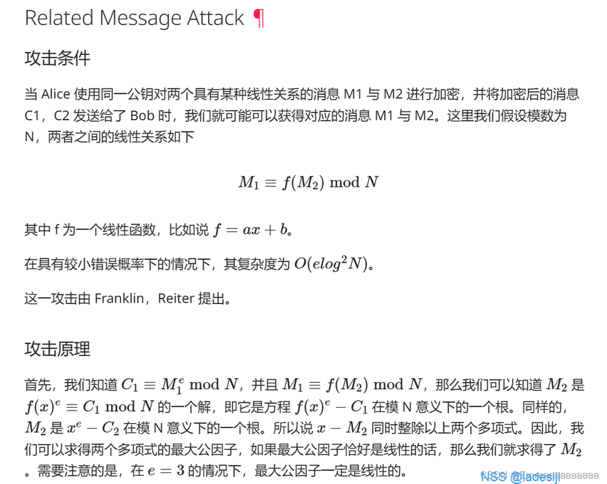


```python
from Crypto.Util.number import *

n = 100458074154921630841467009716211081004496986067171453439200150708921645946139163766441611050743248698408002732330100522747315912617782265320913313460939731072047224701193946357341685422329349168512101723657005099845122860786073559690394636750367940135874243034107367507957642817011696553619030089913082650051
a = 235598638113466821523819951671842238817
b = 183046284622289531351267591814278208143
c1 = 59213026759461784288811267183372841532509333531605324857784387344377914885661521950844577998650904368265218037805476510488318417561718106578315758637105422183211905379616339980270327392640886739452625323181466064322246845738001714864060399808732460864513032069624364554351131806580712989439398464697132652674
c2 = 3451970836023636992808694960720139231990590529637727188690993996140273782744393239397467373679391223914185297028545706156586953463105320180151843119949047044046733716896796505869700601788410522957973779842899158545218190431782013633486273807312128458720848868027747769057989052968304813931468091592761421857
e = 3

def franklinReiter(n,e,c1,c2,a,b):
    PR.<x> = PolynomialRing(Zmod(n))
    g1 = (x)^e - c1
    g2 = (a*x+b)^e - c2

    def gcd(g1, g2):
        while g2:
            g1, g2 = g2, g1 % g2
        return g1.monic() #
    return -gcd(g1, g2)[0]

m=franklinReiter(n,e,c1,c2,a,b)
print(long_to_bytes(int(m)))
```
**rsa签名验签**
就是在发送信息的基础上对消息摘要使用私钥进行加密，接收方通过公钥解密出发送方的签名s，然后在根据相同的方法对明文的消息摘要进行提取s0,判断s和s0是否相等来确定是否是由发出者所发出的消息
**2.高位或低位攻击**
知道一个变量的高位或低位，在位移的变量较小的情况下，可以用循环遍历的形式求出低位或高位的大小，求出完整的变量
**Copperswith攻击 （例题是hnu新生赛的ctl）**

```python
P.<t> = PolynomialRing(Zmod(n), implementation='NTL')
f = t + (key_high - 11451419)
#这里The_key=key_high+t
# 使用Coppersmith方法寻找小根t
t_find = f.small_roots(X=2^150, beta=0.48, epsilon=0.02)
#以列表形式储存 
#在模p下找到满足多项式的小根

PolynomialRing：SageMath中用于定义多项式环的函数。
Zmod(n)：表示系数在模n下的整数环。也就是说，所有系数都在0到n-1之间。
implementation='NTL'：指定使用NTL库来实现多项式运算。NTL（Number Theory Library）是一个高效的数学库，特别适用于大整数和多项式的计算。
P.<t>;：定义一个变量t作为多项式环中的变量。
x是搜索上限，beta是参数，常去0.4-0.5，epsilon控制算法精度
```
**3.rabin算法**
 Rabin算法是RSA的算法一个特例，e取固定值2  
其中，取两个大素数p，q，满足 p≡q≡3mod4  ，n=p*q，n为公钥，p，q为私钥
加密 c≡m**2mod n，也就是m^2

≡c mod n
根据中国剩余定理又可以得到
m^2

≡c mod p
m^2

≡c mod q  
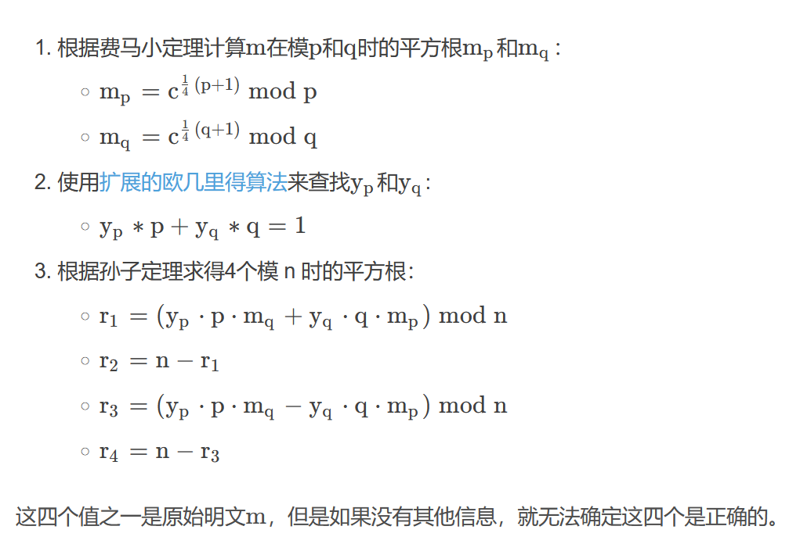

具体脚本：

```python
import gmpy2
import libnum
 
p = 13934102561950901579
q = 14450452739004884887
n = 201354090531918389422241515534761536573
c = 20442989381348880630046435751193745753
e = 2
inv_p = gmpy2.invert(p, q)#p在模q下的逆元
inv_q = gmpy2.invert(q, p)#q在模p下的逆元
mp = pow(c, (p + 1) // 4, p)
mq = pow(c, (q + 1) // 4, q)
a = (inv_p * p * mq + inv_q * q * mp) % n
b = n - int(a)
c = (inv_p * p * mq - inv_q * q * mp) % n
d = n - int(c)#中国剩余定理
# 因为rabin 加密有四种结果，全部列出。
aa = [a, b, c, d]
 
for i in aa:
    print(i)
    print(libnum.n2s(int(i)))
```
**4.rsa中e和phi不互素**
rsa中e和phi不互素导致无法找到e模phi，也就是其欧拉函数的逆元d，无法得到私钥
1.e和phi不互素，但和p-1或q-1互素，可以转换到模p或模q下求解

```python
from Crypto.Util.number import *
p=
q=
e=
c = 
n = p*q
# _gcd = gcd(e,(p-1)*(q-1)) # 65537
gcd_q = gcd(e,q-1)   # 1
 
d = inverse(e,q-1)
m = pow(c,d,q)
print(long_to_bytes(int(m)))
```
2.**_gcd=gcd(e,phi)=2比较小，直接iroot开e//_gcd次根，太大无法开根**
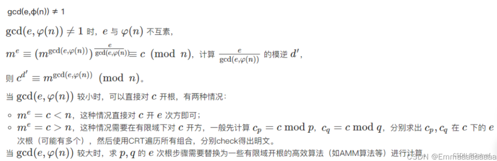


```python
import gmpy2
import libnum
p = 139221606892711163311861502165720779685040991146236819771077311473266519931947605782571900027963055886773086091452724527664738159398782494677824268515616754695749805253260616352348311702497776259344985568675527862394653437170150947836869132073518219409311180128931469597871185033476336585646820347139844842399
q = 155547822796260230301163493572328276759754179923840369685187766807125087369928975444183346813644731672051277851645460274588975060909127179689654378234675963719955065971621191295992778117297548246126322013897580863954772277036417493420548297592968260640347856809237210752134250598888189729496548294692404268851
c = 2615722342860373905833491925692465899705229373785773622118746270300793647098821993550686581418882518204094299812033719020077509270290007615866572202192731169538843513634106977827187688709725198643481375562114294032637211892276591506759075653224150064709644522873824736707734614347484224826380423111005274801291329132431269949575630918992520949095837680436317128676927389692790957195674310219740918585437793016218702207192925330821165126647260859644876583452851011163136097317885847756944279214149072452930036614703451352331567857453770020626414948005358547089607480508274005888648569717750523094342973767148059329557
e =377312346502536339265
n = p * q
phi = (p-1)*(q-1)
_gcd = gmpy2.gcd(e, phi)
d = gmpy2.invert(e//_gcd, phi)
m_gcd = gmpy2.powmod(c, d, n)
m = gmpy2.iroot(m_gcd1, _gcd)    
flag = libnum.n2s(int(m[0]))
print(flag)
```
相当于m2的e2次方=c (mod n),这样使e2能和n互素，进而能找到私钥d解决问题，m等于m2开t次方根，这个原理在上面的图片里面
3.**gcd(e,phi)=16也比较小，但尝试iroot开根跑不出来，这时考虑有限域内开方来求解**

```python
#(SageMath)
from Crypto.Util.number import *
p = 
q = 
c = 
e = 
n = p*q
 
P.<a>=PolynomialRing(Zmod(p),implementation='NTL')
f=a^e-c
mps=f.monic().roots()
 
P.<a>=PolynomialRing(Zmod(q),implementation='NTL')
g=a^e-c
mqs=g.monic().roots()
 
#定义了一个名为P的多项式环，a是这个环里面的变量，Zmod(p)是在模p下定义了一个整数环。多项式的每一个#系数都是p的倍数，这样才能确保在模p下进行运算时不会出现浮点数。
#参数implementation='NTL'指示SageMath使用NTL（Number Theory Library）作为该环的实现。
#f=a^e-c定义了一个多项式，monic()是将多项式首一化
#f.roots()得到方程的一个根的列表，该列表包含f(x)=a^e-c在模p意义下的所有根。
#列表中的每个元素的格式为 (a,1)，在此二元组表示中，1表示多重根，即该解在方程中的出现次数。
 
flag=[]
for mpp in mps:
    x=mpp[0]
    for mqq in mqs:
        y=mqq[0]
        solution = CRT_list([int(x), int(y)], [p, q])
        flag.append(solution)
for i in flag:
    m=long_to_bytes(i)
    if b'flag'in m:
        print(m)
```
**这个的原理就是通过求出模p和模q下的所有根，然后找到同时满足这两个同余式的m，并不是要通过中国剩余定理来求出m，只是进行筛选，m在求根时已经求出来了，这****里的时间好像要花费比较久**
**4.AMM算法 **
只有当e|p-1时才生效，即当p-1时e的倍数时生效，否则的话就可以直接用标准的rsa加解密方式进行求解，因为这是e和p-1互素，存在逆元d

```python
import random
import math
import libnum
import time
from Crypto.Util.number import bytes_to_long,long_to_bytes
p = 0
#设置模数
def GF(a):
    global p
    p = a
#乘法取模
def g(a,b):
    global p
    return pow(a,b,p)


def AMM(x,e,p):
    GF(p)
    y = random.randint(1, p-1)
    while g(y, (p-1)//e) == 1:
        y = random.randint(1, p-1)
        print(y)
    print("find")
    #p-1 = e^t*s
    t = 1
    s = 0
    while p % e == 0:
        t += 1
        print(t)
    s = p // (e**t)
    print('e',e)
    print('p',p)
    print('s',s)
    print('t',t)
    # s|ralpha-1
    k = 1    
    while((s * k + 1) % e != 0):
        k += 1
    alpha = (s * k + 1) // e
    #计算a = y^s b = x^s h =1
    #h为e次非剩余部分的积
    a = g(y, (e ** (t - 1) ) * s)
    b = g(x, e * alpha - 1)
    c = g(y, s)
    h = 1
    #
    for i in range(1, t-1):
        d = g(b,e**(t-1-i))
        if d == 1:
            j = 0
        else:
            j = (-math.log(d,a) % e)
        b = b * (g(g(c, e), j))
        h = h * g(c, j)
        c = g(c,e)
    return (g(x,alpha * h)) % p
print(AMM(4,2,7))
#AMM(c,e,p)
```
找所有根的函数
```python
def findAllPRoot(p, e):
    print("Start to find all the Primitive {:#x}th root of 1 modulo {}.".format(e, p))
    start = time.time()
    proot = set()
    while len(proot) < e:
        proot.add(pow(random.randint(2, p-1), (p-1)//e, p))
    end = time.time()
    print("Finished in {} seconds.".format(end - start))
    return proot
```
**5.rsa维纳攻击 渐进分数**
在e的值过大或者过小时可以使用维纳攻击python中的 RSAWienerHacker库  ，里面的内置hack_RSA函数在已知n和e时可以直接进行攻击求出d
6.背包加密
## Merkle–Hellman[¶](https://ctf-wiki.org/crypto/asymmetric/knapsack/knapsack/#merklehellman)
### 公私钥生成 [¶](https://ctf-wiki.org/crypto/asymmetric/knapsack/knapsack/#_3)
#### 生成私钥 [¶](https://ctf-wiki.org/crypto/asymmetric/knapsack/knapsack/#_4)
私钥就是我们的初始的背包集，这里我们使用超递增序列，怎么生成呢？我们可以假设 a1=1，那么 a2大于 1 即可，类似的可以依次生成后面的值。
#### 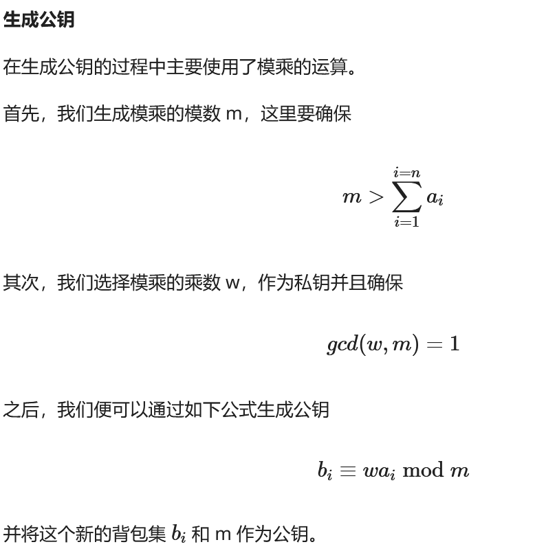

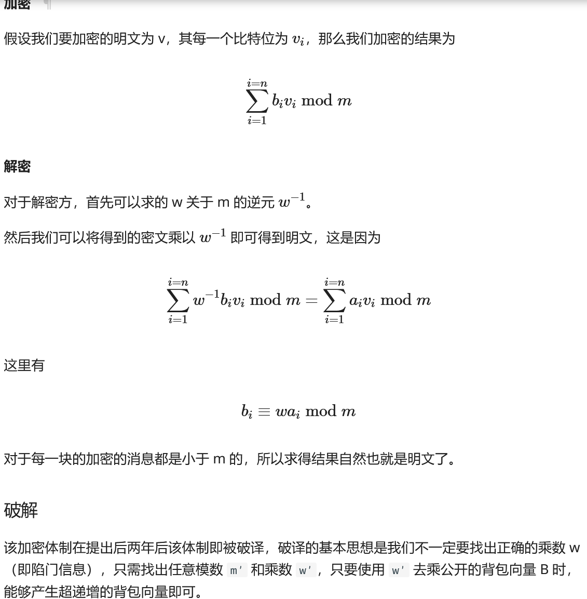

7.Schemidt-Samoa非对称密码
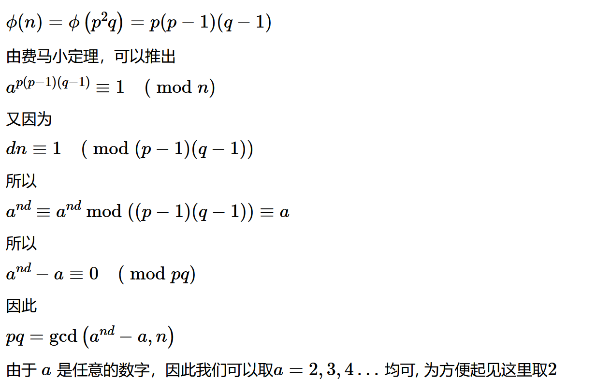


```python
from Crypto.Util.number import *
import gmpy2

n = 539403894871945779827202174061302970341082455928364137444962844359039924160163196863639732747261316352083923762760392277536591121706270680734175544093484423564223679628430671167864783270170316881238613070741410367403388936640139281272357761773388084534717028640788227350254140821128908338938211038299089224967666902522698905762169859839320277939509727532793553875254243396522340305880944219886874086251872580220405893975158782585205038779055706441633392356197489
d = 58169755386408729394668831947856757060407423126014928705447058468355548861569452522734305188388017764321018770435192767746145932739423507387500606563617116764196418533748380893094448060562081543927295828007016873588530479985728135015510171217414380395169021607415979109815455365309760152218352878885075237009
c = 192900246089028524753714085947506209686933390275949638288635203069117504901164350538204619142802436833736532680210208373707687461486601253665313637541968852691434282584934523173439632554783111037594035333325446559685553119339191110056283203940511701992217372405369575376549738295022767068810511670144120539082403063406787770958515441813335548550876818218065412869322721395317537328975187612606437225577060414403223288106406471061759010085578263501971809720648827
k = pow(2,n*d,n)-2
print(k)
pq = gmpy2.gcd(k,n)
m = pow(c,d,pq)
print(long_to_bytes(m))
```
7.Diffie-hellman密钥交换协议
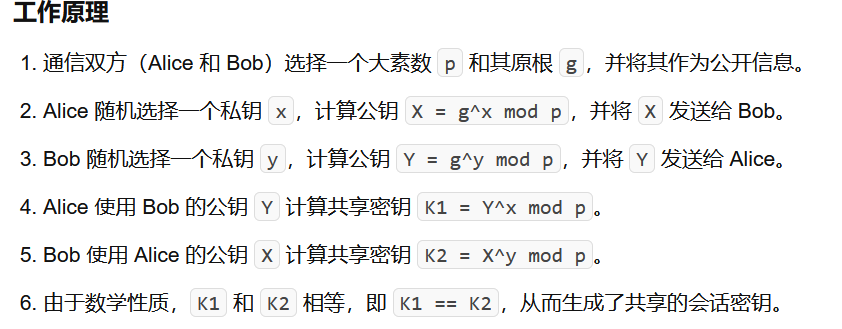

8.Elgamal加密
选取一个大素数p，找到这个素数p的一个原根，同时找到一个整数x作为私钥，2<=x<=p-2,  y=g**x mod p,这里y也是作为公钥， 加密过程，随机选择一个整数k，2<=k<=p-2,计算c1=g**k mod p, c2 = m*(y**k) mod  p , 密文就是(c1,c2)，明文m= c2*(c1**x)^-1 mod p
​
