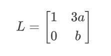

1.茶里茶气
一个简单的茶算法加密，首先遍历32轮得到遍历最终结果的v2，然后在逆序求出初始的v0和v1，然后a就可以求出来，接着在遍历a，步长为2就可以求出flag

```plain

l = 199
p = 446302455051275584229157195942211
v0 = 190997821330413928409069858571234
v1 = 137340509740671759939138452113480
v2 = 0
delta = 462861781278454071588539315363
v3 = 489552116384728571199414424951
v4 = 469728069391226765421086670817
v5 = 564098252372959621721124077407
v6 = 335640247620454039831329381071

for i in range(32):
    v2 += delta
    v2 %= p
for i in range(32):
    v2 -= delta
    v0 -= (v1+v2) ^ (8*v1 + v5) ^ ((v1>>7) + v6)
    v0 %= p
    v1 -= (v0+v2) ^ (8*v0 + v3) ^ ((v0>>7) + v4)
    v1 %= p
a = hex(v1 + (v0 << (l//2)))[2:]
flag = ""
for i in range(0, len(a), 2):
    flag += chr(int(a[i]+a[i+1], 16))
print(flag)

```
2.不用谢喵
 AES_CBC格式加密的密文和AES_ECB直接解的明文，[CBC](https://so.csdn.net/so/search?q=CBC&spm=1001.2101.3001.7020)格式只是加了前反馈，也就是把前一块的密文当作IV与明文异或后再ECB加密，所以ECB解密后的数据再与前一块的密文异或一下就行。 那么就是把ecb得到的16到32位和iv即初始化向量进行异或就得到第一组明文，然后就是32位到48位和，
也就是第一个块（未使用ke进行加密）已知，iv已知，可以求出第一个明文块，第一个块（未使用key进行加密）已知，第二个密文块也已知，那么可以求出第二个明文块，以此类推

```plain
from Crypto.Util.number import long_to_bytes as l2b , bytes_to_long as b2l

c = 0xf2040fe3063a5b6c65f66e1d2bf47b4cddb206e4ddcf7524932d25e92d57d3468398730b59df851cbac6d65073f9e138
d = 0xf9899749fec184d81afecd35da430bc394686e847d72141b3a955a4f6e920e7d91cb599d92ba2a6ba51860bb5b32f23b

part1=l2b( b2l(l2b(c)[0:16]) ^ b2l(l2b(d)[16:32]))
part2=l2b( b2l(l2b(c)[16:32]) ^ b2l(l2b(d)[32:48]))

print(part1+part2)
```
3.rsamd5
看着挺复杂，其实很简单，就是使用md5对rsa进行签名，这里主要是要知道s=m1**d mod n,那么m1 = s**e mod n ,这样就可以求出m1，也就是m的md5值，然后去cmd5网站破解就能得到m，然后在加密一下就得到flag

```plain
import gmpy2
from Crypto.Util.number import *

c = 119084320846787611587774426118526847905825678869032529318497425064970463356147909835330423466179802531093233559613714033492951177656433798856482195873924140269461792479008703758436687940228268475598134411304167494814557384094637387369282900460926092035234233538644197114822992825439656673482850515654334379332
s = 5461514893126669960233658468203682813465911805334274462134892270260355037191167357098405392972668890146716863374229152116784218921275571185229135409696720018765930919309887205786492284716906060670649040459662723215737124829497658722113929054827469554157634284671989682162929417551313954916635460603628116503
[n,e] = [139458221347981983099030378716991183653410063401398496859351212711302933950230621243347114295539950275542983665063430931475751013491128583801570410029527087462464558398730501041018349125941967135719526654701663270142483830687281477000567117071676521061576952568958398421029292366101543468414270793284704549051, 65537]

def get_flag(m0):  # 请用这个函数来转m得到flag
    import hashlib
    flag = 'flag{th1s_1s_my_k3y:' + m0 + '0x' + hashlib.sha256(m0.encode()).hexdigest() + '}'
    print(flag)
m1 = pow(s,e,n)
print(m1)
print(long_to_bytes(m1))
m = 'adm0n12'
get_flag(m)

```
4.两个黄鹂鸣翠柳
这里涉及到一个half-gcd算法的内容，具体实现原理我没有去详细了解，但基本思路是这样的

```plain
m1 = m + t1 * delta
m2 = m + t2 * delta
m2 = m1 + t3*delta
```
那么这个时候就可以用构造两个多项式函数，f(x)=x**e-c1,g(x)=(x+k)**e-c2,因为x都满足f(x)和g(x)，那么x就是两个的公共根，那么这个时候两个多项式的公约项来说，x就肯定是它的根，那么这个时候就可以求出x，也就是m1，然后在遍历t1求出m，这里不知道为什么t1只遍历到256，其他的就是half-gcd算法的具体实现，后面在学吧，现在看起来一头雾水

```plain
from Crypto.Util.number import *

def HGCD(a, b):
    if 2 * b.degree() <= a.degree() or a.degree() == 1:
        return 1, 0, 0, 1
    m = a.degree() // 2
    a_top, a_bot = a.quo_rem(x ^ m)
    b_top, b_bot = b.quo_rem(x ^ m)
    R00, R01, R10, R11 = HGCD(a_top, b_top)
    c = R00 * a + R01 * b
    d = R10 * a + R11 * b
    q, e = c.quo_rem(d)
    d_top, d_bot = d.quo_rem(x ^ (m // 2))
    e_top, e_bot = e.quo_rem(x ^ (m // 2))
    S00, S01, S10, S11 = HGCD(d_top, e_top)
    RET00 = S01 * R00 + (S00 - q * S01) * R10
    RET01 = S01 * R01 + (S00 - q * S01) * R11
    RET10 = S11 * R00 + (S10 - q * S11) * R10
    RET11 = S11 * R01 + (S10 - q * S11) * R11
    return RET00, RET01, RET10, RET11

def related_message_attack(a, b):
    q, r = a.quo_rem(b)
    if r == 0:
        return b
    R00, R01, R10, R11 = HGCD(a, b)
    c = R00 * a + R01 * b
    d = R10 * a + R11 * b
    if d == 0:
        return c.monic()
    q, r = c.quo_rem(d)
    if r == 0:
        return d
    return related_message_attack(d, r)

e =  683
c1 =  56853945083742777151835031127085909289912817644412648006229138906930565421892378967519263900695394136817683446007470305162870097813202468748688129362479266925957012681301414819970269973650684451738803658589294058625694805490606063729675884839653992735321514315629212636876171499519363523608999887425726764249
c2 =  89525609620932397106566856236086132400485172135214174799072934348236088959961943962724231813882442035846313820099772671290019212756417758068415966039157070499263567121772463544541730483766001321510822285099385342314147217002453558227066228845624286511538065701168003387942898754314450759220468473833228762416
N =  147146340154745985154200417058618375509429599847435251644724920667387711123859666574574555771448231548273485628643446732044692508506300681049465249342648733075298434604272203349484744618070620447136333438842371753842299030085718481197229655334445095544366125552367692411589662686093931538970765914004878579967
delta =  93400488537789082145777768934799642730988732687780405889371778084733689728835104694467426911976028935748405411688535952655119354582508139665395171450775071909328192306339433470956958987928467659858731316115874663323404280639312245482055741486933758398266423824044429533774224701791874211606968507262504865993

is_flag = False

for delt in range(-255, 255, 8):

    PR.<x> = PolynomialRing(Zmod(N))
    f = x ^ e - c1
    g1 = ((x + (delt + 0) * delta) ^ e - c2) * ((x + (delt + 1) * delta) ^ e - c2)
    g2 = ((x + (delt + 2) * delta) ^ e - c2) * ((x + (delt + 3) * delta) ^ e - c2)
    g3 = ((x + (delt + 4) * delta) ^ e - c2) * ((x + (delt + 5) * delta) ^ e - c2)
    g4 = ((x + (delt + 6) * delta) ^ e - c2) * ((x + (delt + 7) * delta) ^ e - c2)
    if delt == -7:
        g4 = ((x + (delt + 6) * delta) ^ e - c2)
    g = g1 * g2 * g3 * g4
    res = related_message_attack(f, g)
    m1 = int(-res.monic().coefficients()[0])
    for t1 in range(256):
        m = (m1 % N - t1 * delta) % N
        if m > 0:
            flag = long_to_bytes(m)
            if flag[:4] ==b'flag':
                print(flag)
                is_flag = True
                break

    if is_flag:
        break
```
5.俱以我之名
这里用到rsa连分数攻击的内容，gold可以等价于n**4,而xy=1mod gold，那么就可以等价于xy=k*gold，这里y是已知的，等同于e/N=k/d,与就等价余e，也就是y/gold=k/x,然后对于左边的每一个数，展开其为连分数，找到每一组近似解，进行验证，看x是否满足条件，然后求出满足条件的x，这里因为x使用了gift进行填充，那么肯定含有b'end',根据这个就可以输出x和k，然后就可以求出gold，gold求出来再根据原来的方程和n=p*q的方程就可以求出q和p，然后就能得到flag

```plain
from Crypto.Util.number import *
from gmpy2 import *
import random

n = 141425071303405369267688583480971314815032581405819618511016190023245950842423565456025578726768996255928405749476366742320062773129810617755239412667111588691998380868379955660483185372558973059599254495581547016729479937763213364591413126146102483671385285672028642742654014426993054793378204517214486744679
c = 104575090683421063990494118954150936075812576661759942057772865980855195301985579098801745928083817885393369435101522784385677092942324668770336932487623099755265641877712097977929937088259347596039326198580193524065645826424819334664869152049049342316256537440449958526473368110002271943046726966122355888321
y = 217574365691698773158073738993996550494156171844278669077189161825491226238745356969468902038533922854535578070710976002278064001201980326028443347187697136216041235312192490502479015081704814370278142850634739391445817028960623318683701439854891399013393469200033510113406165952272497324443526299141544564964545937461632903355647411273477731555390580525472533399606416576667193890128726061970653201509841276177937053500663438053151477018183074107182442711656306515049473061426018576304621373895497210927151796054531814746265988174146635716820986208719319296233956243559891444122410388128465897348458862921336261068868678669349968117097659195490792407141240846445006330031546721426459458395606505793093432806236790060342049066284307119546018491926250151057087562126580602631912562103705681810139118673506298916800665912859765635644796622382867334481599049728329203920912683317422430015635091565073203588723830512169316991557606976424732212785533550238950903858852917097354055547392337744369560947616517041907362337902584102983344969307971888314998036201926257375424706901999793914432814775462333942995267009264203787170147555384279151485485660683109778282239772043598128219664150933315760352868905799949049880756509591090387073778041
e = 65537

class ContinuedFraction():
    def __init__(self, numerator, denumerator):
        self.numberlist = []
        self.fractionlist = []
        self.GenerateNumberList(numerator, denumerator)
        self.GenerateFractionList()

    def GenerateNumberList(self, numerator, denumerator):
        while numerator != 1:
            quotient = numerator // denumerator
            remainder = numerator % denumerator
            self.numberlist.append(quotient)
            numerator = denumerator
            denumerator = remainder

    def GenerateFractionList(self):
        self.fractionlist.append([self.numberlist[0], 1])
        for i in range(1, len(self.numberlist)):
            numerator = self.numberlist[i]
            denumerator = 1
            for j in range(i):
                temp = numerator
                numerator = denumerator + numerator * self.numberlist[i - j - 1]
                denumerator = temp
            self.fractionlist.append([numerator, denumerator])

n = pow(n,4)
a = ContinuedFraction(y, n)
for k, x in a.fractionlist:
    # 判断哪一个是我们所需的 x
    if b'end' in long_to_bytes(x):
        print(x)
        print(k)
        break

print(long_to_bytes(x))
Golden_Oath = (x*y-1)//k
print(Golden_Oath)

'''
103697213497220650500739251621743955651854455782387759691953279488676501281257640431561
56398712132783063027132828918468670442692437484816382768162819797891220782528221182512
b'5`\xf4\xf6t\xa3\x00end1n9_A_G2@nd_Ov3RTu2e\x1c\x13"H\x0f\xc9'
#400042032831098007958224589201074030167511216235146696966889080122265111949126155016295896501799032251334875101500882585261911204171467951139573150807043239564581043145433814155757093989016940205116328236031283789686099217459678429270939065783626769903068201144816933538226628329294355184200590029028565011348654002192085571172863125467318356642528249715812871925525776008917314884490518613080652875623759460663908309369135829140204137773254011408135516737187092812588388209697036416805176286184831779945910125467423823737934475944632379524991238593952097013985394648562259886597816452815669024660257170465154297959999722533255899489096196292778430386116108069053440749172609798098777046509743030019115282253351905670418760503352277616008654327326851761671410084489662135479597061419403235762755010286075975241013273964842915146756571330207605591193457296347769260777032489271278979332616929093357929916558230665466587125254822846466292980360420737307459205352964255972268278992730637939153686420457279334894980200862788513296786385507282999530973028293157179873999483225505784146175328159014143540959190522315340971608002638786511995717564457749873410017343184395040614025573440462522210939180555090227730875845671821586191943346000
'''
Golden_Oath = 400042032831098007958224589201074030167511216235146696966889080122265111949126155016295896501799032251334875101500882585261911204171467951139573150807043239564581043145433814155757093989016940205116328236031283789686099217459678429270939065783626769903068201144816933538226628329294355184200590029028565011348654002192085571172863125467318356642528249715812871925525776008917314884490518613080652875623759460663908309369135829140204137773254011408135516737187092812588388209697036416805176286184831779945910125467423823737934475944632379524991238593952097013985394648562259886597816452815669024660257170465154297959999722533255899489096196292778430386116108069053440749172609798098777046509743030019115282253351905670418760503352277616008654327326851761671410084489662135479597061419403235762755010286075975241013273964842915146756571330207605591193457296347769260777032489271278979332616929093357929916558230665466587125254822846466292980360420737307459205352964255972268278992730637939153686420457279334894980200862788513296786385507282999530973028293157179873999483225505784146175328159014143540959190522315340971608002638786511995717564457749873410017343184395040614025573440462522210939180555090227730875845671821586191943346000
n = 141425071303405369267688583480971314815032581405819618511016190023245950842423565456025578726768996255928405749476366742320062773129810617755239412667111588691998380868379955660483185372558973059599254495581547016729479937763213364591413126146102483671385285672028642742654014426993054793378204517214486744679

from sympy import symbols, Eq, solve

p, q = symbols('p q')
equation1 = Eq(p * q, n)
equation2 = Eq((p-114)*(p-514)*(p+114)*(p+514)*(q-1919)*(q-810)*(q+1919)*(q+810), Golden_Oath)
solutions = solve((equation1, equation2), (p, q))
solutions
```
6.学以致用
这里开始想用iroot直接开方去求flag，但是后面发现根本不行，因为flag**3远大于n，取模后就不是原来的flag值本身了，这里学到了一个叫groebner基知识，它可以通过交叉约束条件求出方程的唯一解，具体原理网上也没有说清楚

```plain
from sage.all import *
from Crypto.Util.number import long_to_bytes, bytes_to_long

n = 17072342544150714171879132077494975311237876365187751353863158074020024719122755004761547735987417065592254800869192615807192722193500063611855839293567948232939959753821265552288663615847715716482887552271575844394350597695771100384136647573934496089812758071894172682439278191678102960768874456521879228612030147515967603129172838399997929502420254427798644285909855414606857035622716853274887875327854429218889083561315575947852542496274004905526475639809955792541187225767181054156589100604740904889686749740630242668885218256352895323426975708439512538106136364251265896292820030381364013059573189847777297569447
c1 = 8101607280875746172766350224846108949565038929638360896232937975003150339090901182469578468557951846695946788093600030667125114278821199071782965501023811374181199570231982146140558093531414276709503788909827053368206185816004954186722115752214445121933300663507795347827581212475501366473409732970429363451582182754416452300394502623461416323078625518733218381660019606631159370121924340238446442870526675388637840247597153414432589505667533462640554984002009801576552636432097311654946821118444391557368410974979376926427631136361612166670672126393485023374083079458502529640435635667010258110833498681992307452573
c2 = 14065316670254822235992102489645154264346717769174145550276846121970418622727279704820311564029018067692096462028836081822787148419633716320984336571241963063899868344606864544582504200779938815500203097282542495029462627888080005688408399148971228321637101593575245562307799087481654331283466914448740771421597528473762480363235531826325289856465115044393153437766069365345615753845871983173987642746989559569021189014927911398163825342784515926151087560415374622389991673648463353143338452444851518310480115818005343166067775633021475978188567581820594153290828348099804042221601767330439504722881619147742710013878
c3 = 8094336015065392504689373372598739049074197380146388624166244791783464194652108498071001125262374720857829973449322589841225625661419126346483855290185428811872962549590383450801103516360026351074061702370835578483728260907424050069246549733800397741622131857548326468990903316013060783020272342924805005685309618377803255796096301560780471163963183261626005358125719453918037250566140850975432188309997670739064455030447411193814358481031511873409200036846039285091561677264719855466015739963580639810265153141785946270781617266125399412714450669028767459800001425248072586059267446605354915948603996477113109045600
gift = b'GoOd_byE_nEw_5t@r'

x, y = PolynomialRing(Zmod(n), 'x, y').gens()
f1 = x**3 - c1
f2 = y**3 - c2
f3 = (x + y + bytes_to_long(gift))**3 - c3

gb = Ideal(f1, f2, f3).groebner_basis()
f1, f2 = gb
flag1 = int(-f1.coefficients()[1])
flag2 = int(-f2.coefficients()[1])
# 出题的时候加了给pad，大家得注意一下，flag在一堆trash中间，别做出了却没看见flag
print((long_to_bytes(flag1)).split(b'*')[2]+(long_to_bytes(flag2).split(b'*')[1]))
# b'flag{W1Sh_you_Bec0me_an_excelL3nt_crypt0G2@pher}'
```
7.格格你好棒
是格密码的内容，这里有一个断言assert ((p+2r) * 3a + q) % b < 70，其实就相当于h=((p+2r)3a+q)%b,再化简，得(p+2r)3a=q-h+kb，我们对比公钥得生成公式：
hf=g+kp
那么其实f就相当于（p+2r），同样,h=3a,g=q-h,p=b,所以构造矩阵，这里的使用Hermite定理去验证的内容不是很懂，但是好像没有什么影响，回头再看，接着就是构造一个格了
，然后就得到私钥（f，g），题解中是把最短向量赋值给了p和q，就相当于私钥f和g，那么p和q就等于f-2r，g+h，然后就可以求出flag，这里不知道为什么不用p=b这个式子

```plain
# sagemath

from Crypto.Util.number import *

c = 75671328500214475056134178451562126288749723392201857886683373274067151096013132141603734799638338446362190819013087028001291030248155587072037662295281180020447012070607162188511029753418358484745755426924178896079516327814868477319474776976247356213687362358286132623490797882893844885783660230132191533753
a = 99829685822966835958276444400403912618712610766908190376329921929407293564120124118477505585269077089315008380226830398574538050051718929826764449053677947419802792746249036134153510802052121734874555372027104653797402194532536147269634489642315951326590902954822775489385580372064589623985262480894316345817
b = 2384473327543107262477269141248562917518395867365960655318142892515553817531439357316940290934095375085624218120779709239118821966188906173260307431682367028597612973683887401344727494920856592020970209197406324257478251502340099862501536622889923455273016634520507179507645734423860654584092233709560055803703801064153206431244982586989154685048854436858839309457140702847482240801158808592615931654823643778920270174913454238149949865979522520566288822366419746
L = Matrix(ZZ,[[1,3*a],
               [0,b]])
f,g = L.LLL()[0] # 这里的 [0] 是取其中的最小向量
f,g = abs(f),abs(g)
# 爆破 r 和 h
for r in range(2**8,2**9):
    for h in range(70):
        pp = f - 2*r
        qq = g + h
        phi = (pp-1)*(qq-1)
        if gcd(phi,65537) != 1:
            continue
        m = power_mod(c,inverse_mod(65537,phi),pp*qq)
        if b'flag' in long_to_bytes(m):
            print(r,h)
            print(pp,qq)
            print(long_to_bytes(m))
            break

```

