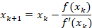
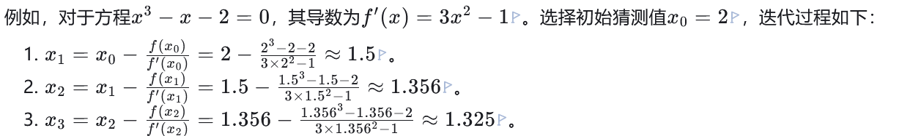
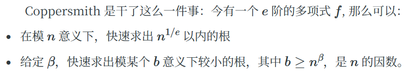
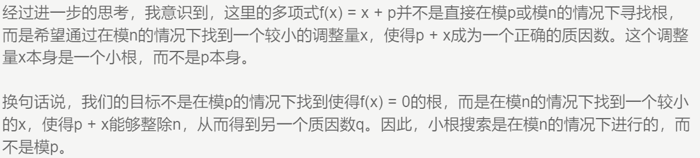

**20233001361 张丁峰**
**1.EzRSA**
读完代码发现p，q都未知，要求出flag就要先求p和q，因为n=p**2*q，sum=p+q，所以可以得到一个一元三次方程，使用牛顿迭代法求一元三次方程的解就可以求出p，然后q=sum-p，这里简单讲一下牛顿迭代法
首先确定一个初始值x0，然后根据迭代公式
不断进行迭代，知道找到那个符合要求的值，例如：


求出p和q后就可以求出n的欧拉函数p*(p-1)*(q-1),进而求出私钥d，然后求出异或后的密文m，也就是flag，然后这里的function函数就是求阶乘的意思，这让我想到了威尔逊定理，当p是素数时，(p-1)! ≡ -1 mod p  ，这里猜测x应该就是素数，所有x=hint-1，然后把x和flag进行异或得到异或之前的flag，然后再把flag转为字节形式，再用utf-8解码还原就能得到flag了
完整脚本：

```python
import gmpy2
from Crypto.Util.number import long_to_bytes

e = 65537
hint= 10275264279764340541893167771336473874338863520177851256937607457124614469128799489889638117212784065086437659005450441662124929483113510104126043421755279
n= 1529109181909466307724100696168872146441851781213108319514980724692438550277883094570145389886179237293634213670883613805671373652620304991765907353717598337048316350765430522912340402534903729846601750133366021975603413307000819208169735741242877998494869867733542149615428794264835514979453395175184943679644935969529440920828819455715820263992050263363047259598871654056708644757629110334777309902337139156801881271734562847635665369235088110489349344256773341
sum= 21942804609350238477775981678357095387770487318435527533239911736105453905343871558065702015433195070708577230413613173690003650605152758030499265636620692
c= 1180397024599964428807899162266062296214841518825975738190775131709766339968929200939352835410270547089851872572956843756601890828579123500675554894491503327622044693724842549796745403910205262758771046114164681901722164384970900769606971710237615409385190965358859023802429494374952805416069373312053713540498547800609258383889646035938649266158984181714478950865028846292797681238754350642480439901898592678171618853423062185854237321303488717869700564901162668

def solve_p(s, n):
    p = s // 2  # 初始猜测
    max = 1000
    for _ in range(max):
        f = p**3 - s * p**2 + n
        if f == 0:
            return p
        df = 3 * p**2 - 2 * s * p
        if df == 0:
            p += 1
            continue
        p_new = p - f // df  #进行迭代
        if p_new == p:
            break
        p = p_new
# 求解p
p = solve_p(sum, n)
if p is None:
    print('no find p')
q = sum - p

# 计算欧拉函数
phi = p * (p - 1) * (q - 1)
# 计算d
d = gmpy2.invert(e, phi)
m = pow(c, d, n)

x = hint - 1 #威尔逊定理
flag = m ^ x
flag_bytes = long_to_bytes(flag)
print(flag_bytes.decode('utf-8'))
```
这里也可以直接用sympy库的solve函数来解
solve函数可以用来求解方程
具体代码：

```python
from sympy import symbols, Eq, solve

# 定义符号变量 p 和 q
var('p')
var('q')

# 定义第一个方程：p^2 * q == n
eq1 = p**2*q==n

# 定义第二个方程：p + q == sum
eq2 = p+q == sum

# 使用 sympy 的 solve 函数来求解这两个方程
solution = solve([eq1, eq2], p, q)

# 输出解
solution
```
**2.签签又到到**
打开文件发现是二进制编码，使用进制转换器转成各个进制的数值，看了下8,10,16进制的数，感觉用处不大，然后看转成的ascii码
00111 01100 10011 10001 00100 00010 00011 01101 10110 01101 10011 01010 01000 01001 00100 10010 01101 00100 00000 10010 00001 00000 00010 01101 01100，这个看起来也像2进制，拿去解码也没发现什么，提示是古典密码，那就可能是凯撒，维吉尼亚，摩斯，培根之类的，这里首先想到的是培根，因为培根密码就是五个类似于二进制表示的方式来表示字母，AAAAA=A,....,根据给定的二进制一一对照，A就等价于0，B等价于1，然后就得到一段字母：HNUSECDOYOULIKETOEATBACON,用{}包裹HUNSEC{DOYOULIKETOEATBACON}就是flag
**3.简单的AES**
读完代码发现是AES和rc4混合加密，而flag的密文是由aes算法进行加密的，要解密就要知道iv和key，现在知道的iv和key的异或结果，而且知道一个rc4加密后的密文和明文，那么把这个密文也就是c1和明文16个a进行异或，就能得到这个rc4的密钥流，知道密钥流后根据另一个对iv向量进行rc4加密的密文c0，把密钥流和c0进行异或就能得到iv向量，然后在把这个和iv与key的异或结果进行异或就能求出key了
那么现在key，iv均已知，就能直接使用aes进行解密，最后在用unpad函数把填充的字节去除，还原就可以了
完整脚本：

```python
from Crypto.Cipher import AES
from Crypto.Util.strxor import strxor
from Crypto.Util.Padding import unpad
from Crypto.Util.number import *

a = 139060397088332583234018210741968674735
enc_flag = b'\x9e\x1eOc\xf3\xe1O}ow\x9e\x93\x16\x83\xdb\tr\rg;L\x1f\x1b\xbc+\xea:\x97\xb4\x95\xb7\x80'
c0 = bytes.fromhex('fda9e9b80d755ea8700ed4bd7c3f2644')
c1 = bytes.fromhex('d4a6fdaa097744a0651ceaba5d352258')
d = b'a'*16
# 计算key和iv异或
b = a ^ 1
b1 = long_to_bytes(b,16)

# 计算rc4密钥
rc4_key=strxor(d,c1)

# 计算iv
iv = strxor(rc4_key,c0)

# 计算密钥
key = strxor(iv,b1)

# AES解密
cipher = AES.new(key,AES.MODE_CBC,iv)
decrypted = cipher.decrypt(enc_flag)
flag = unpad(decrypted, 16).decode()
print(flag)
```
4**.简单的LCG**
看见题目就知道是lcg的内容了，要得到flag首先要知道x，而x又是由进行了128次lcg循环取每个seed高位的最后一位的二进制构成的，因此就要知道它原始的seed，又因为lcg在output函数中进行了两次输出，并且更新了seed，所以128次循环的原始的seed就是s2，要求s2又要知道s1，现在已知s1的高位，低位未知，我们可以通过循环来求低位，让s1=state1+i，i遍历2**16，就可以求出s1，进而得到s2，然后再把s2的低位和state2比较，判断是否相等就能确定求出的i是否正确，求出s2后就直接进行128次循环取seed高位的每一个最后一位二进制构成x，然后对x进行取整x=int(x,2),在把c和x进行异或，转成字节的形式，就是flag，有两个值。
完整脚本：

```python
from Crypto.Util.number import *
a = 3083396249
b = 2296624558
m = 2281164461
state1 = 28390
state2 = 21642
c = 105858726112203532832010436254432371260108241465052
for i in range(2**16):
    s1 = (state1 << 16) + i
    if ((s1 * a + b) % m) >> 16 == state2:
        s2 = (s1 * a + b) % m
        x = ''
        for _ in range(128):
            s2 = (s2 * a + b) % m
            x += '1' if (s2>>16)% 2 else '0'
        x = int(x, 2)
        print(long_to_bytes(c^x))
```
**5.CTL**
开始看到p和q，c就知道肯定会涉及到rsa，想得到flag要知道m，想知道m又要求出c，而要求c要知道The_key，The_key的高位已知，要想办法求出低位，设The_key=key_high+low开始我是想通过key_high +low=11451419+x*p+1919810*n这个式子来求出low(低位)，设key_high -11451419-1919810*n=G
，因为low=G-x*p,两边模x得low=(-G)%x,那么就可以求出low，也就是The_key的低位，进而求出p和q，但是发现求不出来，开始我还以为是x的问题，后面看了提示明白x的确定值是3223，还是解不出来，然后就知道是这个解法有问题，后来我想到了让ai帮我读代码时提到的Coppersmith方法，去了解了一下，发现好像可以用
简单讲一下Coppersmith




这题刚好符合第二个

```python
P.<t> = PolynomialRing(Zmod(n), implementation='NTL')
f = t + (key_high - 11451419)
#这里The_key=key_high+t
# 使用Coppersmith方法寻找小根t
t_find = f.small_roots(X=2^150, beta=0.48, epsilon=0.02)
#以列表形式储存 
#在模p下找到满足多项式的小根
```
这里使用 NTL实现的多项式环来表示多项式  
多项式为f = t + (key_high - 11451419),
 构造多项式 f(t)=t+(key_high - 11451419)，需满足 f(t)=0mod p，找到t之后就能求出f(t),因为f(t)modp=0,所以f(t)是p的倍数，因为n=p*q，因此求gcd(f(t),n)就能求出p，然后求出q和The_key，
e=next_prime(The_key)，然后就是简单的rsa算法求出m，在把m转换成字节就是flag，
完整sage脚本：
sage脚本
```python
from sage.all import *

n = 103161573380879601277198880132619725650717530092289429485184146380381776169937364565093749146920832223710923630522573512836218559522055323678491546715773006173958283364913561752843912302568016017716085745219038049280530742358599754383215949964520660316809413344456133983704122607837751937924286455212445193217
c = 97049184924174651730100399236761014971183455823575707753349910310915479458140056483707676433238871128909047962592124180850803317141858191568376430139767157610355332902859491979286199408665520388111348303886872055804902440837538242681821758490447619723700610900234546030274868442310245302904489845344672221491
key_high = 198050620192346467327979182067404675501504021446478169619951376062520737708807451865712630549750082911402468295113541855678100752756037030951204856300408175021285736286220880072109634001045587893736343124895111284751615241242895033024123935043887777873036556966284212900988381896466524377645272956814679047757889536

#key=11451419+x*p+1919810*n
#key_high + t =11451419+x*p+1919810*n
#key_high + t - 11451419 ≡ 0 mod p
P.<t> = PolynomialRing(Zmod(n), implementation='NTL')
f = t + (key_high - 11451419)

# 使用Coppersmith方法寻找小根t
t_find = f.small_roots(X=2^150, beta=0.48, epsilon=0.02)
#以列表形式储存

if t_find:
    t =int(t_find[0])
    pb =key_high + t - 11451419
    p = gcd(pb, n)
    if p > 1 and n % p == 0:
        q= n // p
        The_key= key_high + t
        e=next_prime(The_key)
        phi = (p-1)*(q-1)
        d =inverse_mod(e, phi)
        m = pow(c, d, n)
        print(m)
    else:
        print("错误的p")
```
第二种解法：
还是构造那个多项式，但是这时把x赋值成p，两边在同乘x，全部移到一边去，构造一个多项式，使用f.roots求出x，这里也可以直接使用python求出p，也就是p的高位，然后再用copper求出p的低位，然后就是简单rsa求解

```python
n = 103161573380879601277198880132619725650717530092289429485184146380381776169937364565093749146920832223710923630522573512836218559522055323678491546715773006173958283364913561752843912302568016017716085745219038049280530742358599754383215949964520660316809413344456133983704122607837751937924286455212445193217
c = 97049184924174651730100399236761014971183455823575707753349910310915479458140056483707676433238871128909047962592124180850803317141858191568376430139767157610355332902859491979286199408665520388111348303886872055804902440837538242681821758490447619723700610900234546030274868442310245302904489845344672221491
key = 198050620192346467327979182067404675501504021446478169619951376062520737708807451865712630549750082911402468295113541855678100752756037030951204856300408175021285736286220880072109634001045587893736343124895111284751615241242895033024123935043887777873036556966284212900988381896466524377645272956814679047757889536
PR.<x> = PolynomialRing(RealField(1000))
f=1919810*n*x+11451419*x+3223*x**2-key*x
a=f.roots()
print(a)
#p = key-11451419-1919810*n
print(p//3223)
P.<x> = PolynomialRing(Zmod(n), implementation='NTL')
p_high=int(a[1][0])
print(p_high)
f=p_high+x
f=f.monic()
x0=f.small_roots(X=2^(150 + 10), beta=0.4)
print(x0[0])
print('p=',x0[0]+p_high)
```
