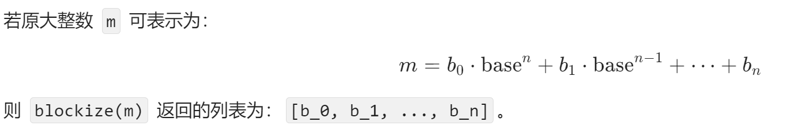

1.ez_chain
这题主要是要想到明文的moectf{}是已知的，然后后面就简单了，把明文填充成72位，然后可以根据已知的部分求出blocks的第一位数据，然后就可以根据这个求出key，然后就可以还原出完整的blocks列表，在把它还原成m就可以得到flag，这个把m变成flag的本质上就是根据这个


还原成m就是把每一个base乘回去然后加上去就可以

```plain
from Crypto.Util.number import *

base = bytes_to_long(b"koito")
iv = 3735927943
flag = b'moectf{hello;;;;;;;;;;;;;;;;;;;;;;;;;;;;;;;;;;;;;;;;;;;;;;;;;;;;;;;;;;;}'
m = bytes_to_long(flag)
def blockize(long):
    out = []
    while long > 0:
        out.append(long % base)
        long //= base
    return list(reversed(out))

blocks = blockize(m)
key = 5329712293 ^ 8490961288 ^ iv
enc_list = [8490961288, 122685644196, 349851982069, 319462619019, 74697733110, 43107579733, 465430019828, 178715374673, 425695308534, 164022852989, 435966065649, 222907886694, 420391941825, 173833246025, 329708930734]
k = [5329712293]
for i in range(1,len(enc_list)):
    k.append(key ^ enc_list[i] ^ enc_list[i-1])
print(k)
k = k[::-1]
def deblockize(blocks, base):
    m = 0
    for i in range(len(blocks)):
        m += blocks[i] * (base ** i)
    return m

print(long_to_bytes(deblockize(k,base)))


```
