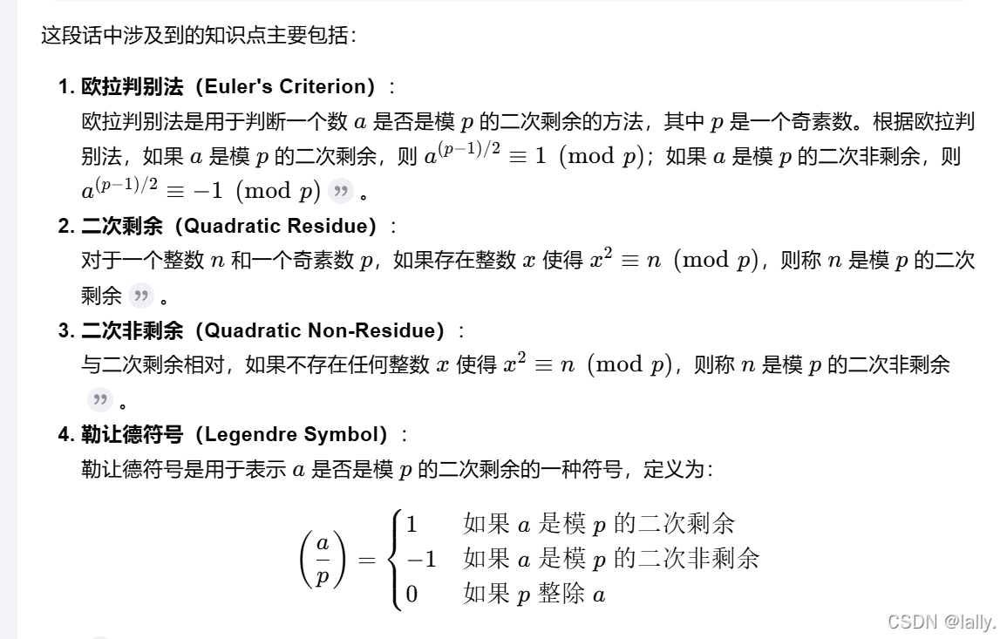
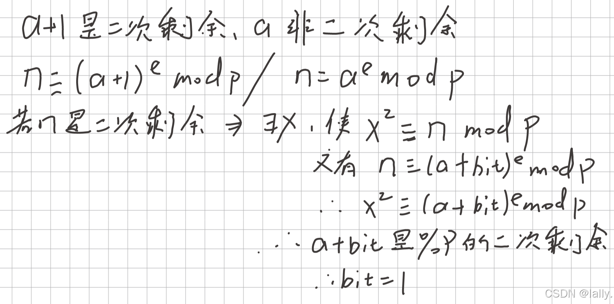
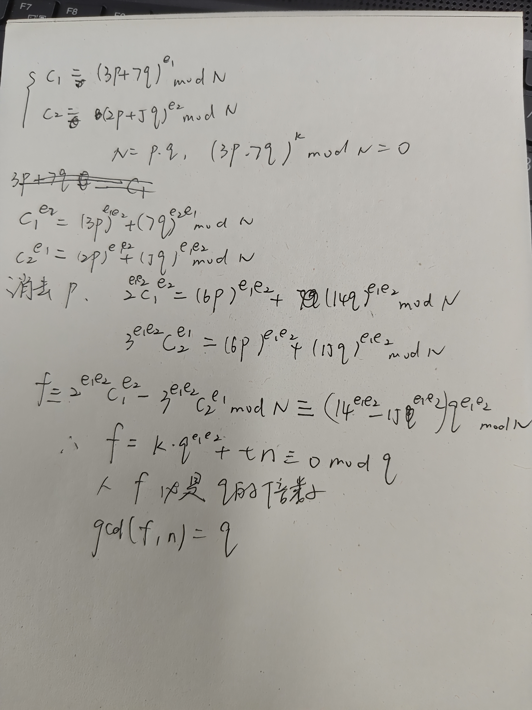
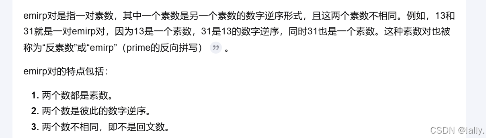
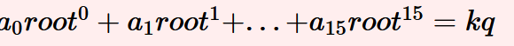

1.ezlegendre
看到这个题目就想到了勒让德符号，但我看完题目却还是不知道怎么会使用到这个符号，还是去网上看了wp才知道，这里涉及到一些知识点



这里最关键的一个点就是知道n是p的二次剩余对与a+bit的e次方的影响，因为a+1模p是二次剩余，a模p是二次非剩余，根据图片上的推理可以知道，当你n是二次剩余时，a+bit是二次剩余，而a+1是二次剩余，a不是，所以当n是二次剩余时，那么bit=1，然后就可以根据这个逻辑去反推出flag

```plain
import gmpy2
from Crypto.Util.number import *

p = 303597842163255391032954159827039706827
a = 34032839867482535877794289018590990371
k = [278121435714344315140568219459348432240, 122382422611852957172920716982592319058, 191849618185577692976529819600455462899, 94093446512724714011050732403953711672, 201558180013426239467911190374373975458, 68492033218601874497788216187574770779, 126947642955989000352009944664122898350, 219437945679126072290321638679586528971, 10408701004947909240690738287845627083, 219535988722666848383982192122753961, 173567637131203826362373646044183699942, 80338874032631996985988465309690317981, 61648326003245372053550369002454592176, 277054378705807456129952597025123788853, 17470857904503332214835106820566514388, 107319431827283329450772973114594535432, 238441423134995169136195506348909981918, 99883768658373018345315220015462465736, 188411315575174906660227928060309276647, 295943321241733900048293164549062087749, 262338278682686249081320491433984960912, 22801563060010960126532333242621361398, 36078000835066266368898887303720772866, 247425961449456125528957438120145449797, 843438089399946244829648514213686381, 134335534828960937622820717215822744145, 74167533116771086420478022805099354924, 249545124784428362766858349552876226287, 37282715721530125580150140869828301122, 196898478251078084893324399909636605522, 238696815190757698227115893728186526132, 299823696269712032566096751491934189084, 36767842703053676220422513310147909442, 281632109692842887259013724387076511623, 205224361514529735350420756653899454354, 129596988754151892987950536398173236050, 97446545236373291551224026108880226180, 14756086145599449889630210375543256004, 286168982698537894139229515711563677530, 100213185917356165383902831965625948491, 268158998117979449824644211372962370753, 264445941122079798432485452672458533870, 87798213581165493463875527911737074678, 131092115794704283915645135973964447801, 164706020771920540681638256590936188046, 178911145710348095185845690896985420147, 154776411353263771717768237918437437524, 260700611701259748940616668959555019434, 222035631087536380654643071679210307962, 281292430628313502184158157303993732703, 24585161817233257375093541076165757776, 269816384363209013058085915818661743171, 39975571110634682056180877801094873602, 125235869385356820424712474803526156473, 218090799597950517977618266111343968738, 144927096680470512196610409630841999788, 213811208492716237073777701143156745108, 64650890972496600196147221913475681291, 302694535366090904732833802133573214043, 214939649183312746702067838266793720455, 219122905927283854730628133811860801459, 224882607595640234803004206355378578645, 260797062521664439666117613111279885285, 279805661574982797810336125346375782066, 147173814739967617543091047462951522968, 23908277835281045050455945166237585493, 186338363482466926309454195056482648936, 295140548360506354817984847059061185817, 151948366859968493761034274719548683660, 96829048650546562162402357888582895187, 61129603762762161772506800496463804206, 83474322431616849774020088719454672415, 25094865151197136947956010155927090038, 86284568910378075382309315924388555908, 269311313874077441782483719283243368999, 293865655623484061732669067594899514872, 42618744258317592068586041005421369378, 54330626035773013687614797098120791595, 147903584483139198945881545544727290390, 290219451327796902155034830296135328101, 147951591390019765447087623264411247959, 176721307425594106045985172455880551666, 10617017342351249793850566048327751981, 166002147246002788729535202156354835048, 43653265786517886972591512103899543742, 191250321143079662898769478274249620839, 142288830015965036385306900781029447609, 231943053864301712428957240550789860578, 259705854206260213018172677443232515015, 42547692646223561211915772930251024103, 210863755365631055277867177762462471179, 140297326776889591830655052829600610449, 136970598261461830690726521708413303997, 93221970399798040564077738881047391445, 192314170920206027886439562261321846026, 95904582457122325051140875987053990027, 158334009503860664724416914265160737388, 134039922705083767606698907224295596883, 7789601161004867293103537392246577269, 261069289329878459425835380641261840913, 123743427894205417735664872035238090896, 20126583572929979071576315733108811761, 5317214299018099740195727361345674110, 68965882674411789667953455991785095270, 235934145208367401015357242228361016868, 250709310980093244562698210062174570956, 167048130489822745377277729681835553856, 122439593796334321806299678109589886368, 117953800124952553873241816859976377866, 226311466875372429157352019491582796620, 301401080214561977683439914412806833619, 255816105091394723475431389696875064495, 73243049441397892506665249226961409560, 226985189100195407227032930008331832009, 164462051705780513134747720427967016844, 97905180778488273557095248936896399883, 40737879120410802220891174679005117779, 180413920169781019749877067396006212488, 171309368917976988181007951396904157090, 215065878665354148046787050342635722874, 54225964222741166664978354789209176721, 179980445108969868669560591527220171967, 39118880593034932654127449293138635964, 170210538859699997092506207353260760212, 62152643864232748107111075535730424573, 28285579676042878568229909932560645217, 69823876778445954036922428013285910904, 170371231064701443428318684885998283021, 211884923965526285445904695039560930451, 2912793651373467597058997684762696593, 220544861190999177045275484705781090327, 142755270297166955179253470066788794096, 264271123927382232040584192781810655563, 214901195876112453126242978678182365781, 252916600207311996808457367909175218824, 176399700725319294248909617737135018444, 230677646264271256129104604724615560658, 1568101696521094800575010545520002520, 276644650735844694794889591823343917140, 185355461344975191330786362319126511681, 248497269558037476989199286642120676823, 27426372552503547932146407600438894266, 99885839446999373024614710052031031159, 238693364649026611386487480573211208980, 27047849084544903200283111147329657123, 261687609401872239323715016608713989139, 34926503987070847956303036393611830590, 252495954285655595492775877967398282722, 249358827602419141539353237669905281246, 42551212101869966935955269842854722856, 286527336123436427709115043975536071462, 158097411156207320921055042509886995091, 40982984899524424348979403377331335675, 87268254405858939730919659372073314983, 142920872841164853694746048293715385493, 280344634952903421792629929689092857993, 203584314487374069738101729666435007339, 76747904284507590577908045394001414841, 18608573158088521401404614102481693137, 104158289118605398449367221892619783009, 182616719368573751169836443225324741716, 272025723760783252166092979911587562064, 24194069309604403496494752448487752613, 71973842397785917741048132725314885345, 281558046604363121112749722271741416764, 66965324704079734796576428718112513855, 105222756356650324548621319241035836840, 331654051401420900830576011369146182, 131087815164777263900650262777429797113, 76104729920151139813274463849368737612, 163253554841934325278065946152769269296, 35973933431510942249046321254376084104, 223355354158871484030430212060934655984, 181704973473887713398031933516341967465, 131391458395622565487686089688656869743, 153029062510158353978320224242258979076, 75598349867958834632866616947240059419, 107656133091853571710502064573530657194, 261653899003034450454605322537555204702, 102387069931966536076616272953425585051, 174654548539988861301269811985320013260, 30731762585661721683653192240732246059, 265493340795853624586170054917042208660, 174818040730242275465453007894471517233, 99514915046145707535310601810631334278, 133978892607644700903700803642408771370, 216019770199630171637325931783378096100, 76687884966028369399497157007109898467, 262185741950606001987209986574269562289, 101935410844521914696784339882721918198, 85956270718878931834010975962772401589, 117578315837774870077915813512746446219, 209811226703488479967593762805568394383, 85782228978690599612110880989543246041, 234993402267259336147096170367513324439, 158487299348452041021565296682698871789, 159701431055714867184644360639841355076, 109022557288733938098734847159477770521, 20764822884655633017647117775843651332, 144987524936939260617020678038224835887, 214906746504968333094519539609226540495, 61852186870193663367998110214331582115, 90175894032076080713807606548780168998, 283504071501037047650569090140982777586, 267695305479884628857258564337611106120, 2466175482923380874813569827625743835, 62561740902965346823256447383892272796, 181458673990444296212252831090106274182, 151903421483215372136947284355251617709, 19545903652854510304023406921387221130, 219205004027218279279153442572018305650, 62495663621315535552427938857863551873, 12365469869484359722316573851483855865, 84444120685499458796249283893323932282, 240719245204462516267560756675192129462, 27868242791206675092288978266113368469, 231956104988320170956546781095814860314, 238410591787987745803829175586952288627, 290649141309468101840354611586699479851, 288298044918505512172272603794059992911, 43375655853069820305921366762777897508, 195308577786654489057887409352840304641, 184459971400898842809886506207633536394, 255884612697066296714973816950917234211, 8695922085804648269560669225439485137, 109407350389195091443836128149623969417, 40151058765649465408124869078260007620, 125484946058191366826510549493690011718, 71132588066103752922321942940739808864, 74434669478187680319595294456652807097, 187368213679294937718535073296853726111, 63461505676143678393259420949793811831, 131619805472714703711458729455838994067, 8579657158619864010437706463902003097, 60626278761876782233388469543817973673, 44776499706241603722632560896220653186, 257249861781237389988455384617803171877, 161899873165011719282095749671993720527, 73303482092538159761390536102771615311, 141674253732456103774983358188317473860, 112299149158347774069079224861237069975, 192409969047313867540459549167233638120, 52560717143548208264188844553309600513, 209294007943747095607573416682772182613, 65285862009539442533024037477398617382, 141465096635701758351979378177631042196, 282970656853503001128091562858564344839, 50475483578642585644452991078499278745, 162546597698227455939743094437394415689, 65258447920153625609456176138520078583, 25184730952052088803921023041299838584, 228883100940853988548836641050823478387, 234342509561041384559923481191578502671, 96929129863331626375704681481278825323, 288533470498072097357398960101692503873, 202238020435442160571930572760188491021, 179010548891454398845389500871076122861, 210509821764943794358893224681677583929, 301357944197101288505771002301759006254, 188933290023352627523422420332593360537, 207946655777875200521742190622482472884, 288626263488145443150622420747070805416, 75616301779108425588545170038742534166, 58163857263381687168244101022135667109, 297006021514663344215599115965804102114, 297690420826548736122127126645053452341, 88307045391242971429880119414942510712, 186427606153958359494215188169120285788, 135488686276533521058776859854524444361, 185380054960856211260651416683468161990, 175033658667416561573078028845860911744, 223026004671602541191897755812121342354, 34657268786986063209312902409995458857, 120560332690000675303295481174067849230, 55304621833927249516093996383526467671, 111480233798478730015825495041130765708, 188996716801525995463705449722399676888, 276300230605454487705048192796463035731, 195951365841304132244984630163178946841, 97383655947416522972353051984313703380, 94486945760999630041197414137963583839, 180706938513681126017333618518691884990, 291355503207799224380050183085704824037, 69034413486375685936282884707402207337, 147750870458026934714106830614187010708, 45030500748522416863096615057804736553, 242760053973560804002707125041520857401, 78549841097746795170488790352479728712, 2356186555504071026416878904180857750, 250486437623828232647064146324392061051, 23443836455198610186212360005846025976, 174557226633145985326629017377610499133, 105578481831185315088267357915446186040, 275620780071666328887795273613981325091, 23435505408737317601794562472269448966, 153209223406380813663608757935808571040, 298537417505667302508269715871007454162, 203833907122687718347615710181705388877, 41923370405573382737900061813058979798, 3762696947926387653032627637114050038, 201362054098012734707571348865729525585, 285561801443127226417656620776228615886, 111526376057659222252771678197929357387, 203857473647840873587593099562928738804, 44500972779851392967974092230683443589, 131565609415497588649207556985146740667, 118140388348838985266223643241117982200, 151449885527204880099343472664885565851, 296392921256617994387220911796693904909, 171323803851876663161606688343678019752, 77152982746512263077542395226111426871, 71648764903315646849225859605038798241, 204032734481806785543119754456569617316, 6308687907566364067313782129902290691, 16601010504475415688487155708691097587, 267844409827567109183739120606590016153, 8224746302136608660764206696943998066, 66759882079234093195284745682061177129, 246382951504754280882643835151081337286, 255668159720160142170457715248631352728, 198682585307670767869381177003851088434, 52435298055396076040371814840062860322, 71487031168170283085378067681578926209, 19270201008106231446848331516948751837, 259975200953378762173082382130139147342, 100957428421542421187997144087873975651, 208596806512779765020431672051552927799, 299145970783704112359526450087000033589, 150947534399996219237186223933189906692, 2048564430495506099844799218948689248, 18962488382754079143174369765373573160, 123031997265327646442638576943887737076, 244982544573374061178705105734141424990, 146410849043938910996544914770892579969, 223289253099676841267315311685506771609, 51374350072145272462874563304717832675, 11071799523780604861063183113721965515, 64879815349665030137608387728274669513, 80407660651138778640313857555610913997, 303240361297474032656368918727922343524, 103535171867293830164396688627880762056, 80560992291681297484967629700766125368, 143230791823232014720768325847406122476, 188716605362804777650654549500430035344, 232870220205325961834389425482865329315, 283584919111555062850512413920721407255, 206566027046056486360456937040463884619, 157265544558229360994066706355140059167, 234540100059557817987307855523008271441, 145080729935010940836509908225154438654, 87632901547252991486640361323948527297, 132851295075144433057295220850764336697, 119332580967710872282556206817561230364, 252662535367310697404410284791596079390, 116953597995893914045234747272641030589, 100249498080127826743176896590140549012, 136127222991007877469608037092253387587, 293872159333237281344632727438901916796, 188380258232793584033919525452891729603, 1610116068556601814921533488550773010, 227538093179017809788576278302184723209, 96083211912155805281570727244009758189, 177565192075026414675108774674272650977, 48610376097473152433617435307712235835, 247706157308906487216795222963091222950, 158089460554439410339817265377357657075, 242596743543458727108836420358578527964, 157838486547678450498998359338995593594, 154936428786673098370270244313756793764, 230069001282099253337070315838992422706, 302203905412042965194022309363722872023, 278925578180003228386990239779184911424, 2121847168422140085785053284950978779, 88186566913792352545205577594300112005, 127051055548524716972172930848069016819, 216775577660712694343189516378309335187, 44934779747684486400910901018161470888, 32429597712898788634301884219187226083, 219683174528279300995710495669083670544, 37001671152735870067433052249003677244, 40408367335919429215031155701333780256, 156957056705864208022145617831060134907, 180077610045061934161783737112285900966, 59357544819520045255625797086421901884, 77751400794807935281264495346525107329, 4517615764752715802675887411287287137, 76319782726782483955139757169428276003, 176009402215469456144386392247781430661, 283055695252017869386094188584670242363, 20001716567499724882317501875143788088, 125228382132280749989067609697418628387, 144053090751393640875176862167012247830, 15289106046221987660093620422889539867, 111243866573605033251079958638430165633, 169264885994758018612038619809803723688, 11895954311759483419234457833286931577, 273147053963507607445612310063799123998, 158981773284803069491507978382595811562, 41293513794446810141896116395025053234, 57441237860743029006005815967510568612, 109171476551418034153338841133917497633, 136539712287056106151501004438585146777, 278918550892367788720071091355436733468, 211360251223022250021398148918837686812, 254351242496347083009146404917085951637, 130260153203964833202474997491055897705, 221930288825889900517852991745469270910, 66354211799382156899053592476719001842, 127898620670768976254134750731374490934, 298131830425274848646460016809595859328, 132109510144911727511061804395381822418, 210917766469026421985352121201196497206, 5441137715689271309917542693016936841, 209516950406881264617228336887254107528, 92275151703152148383106907311559718841, 46255650973652148247469464088017660080, 182628529221607295465655096378164148336, 52574278547120304143820897608762444985, 63698472804719856407197390836793525437, 30457182690865024857724004613999433676, 212073418196280214618461610817423630022, 48875930775858981513092672396243080640, 113234797533868946026347891158142991388, 256534108458875318962058222544020064164, 22522715662428558833985333846937440705, 97553118958308509177643330175409499003, 197088081433425221073434635573357125592, 157303116668734020456228309942188293059, 110316346669278795114546305726864504681, 228887397917708007004920589862367347873, 112210930213921962308944716344585917343, 95017760786235266842788931502689331157, 303479014347753799316861720146531596843, 138677197920058856282155251074088437081, 285912176726299387362893467150449209426, 120309832759140713296686339140142433386, 279125897926861811239250830750932241600, 289502053647872994218190050825294169535, 262459212837236162171047720358005836712, 290390838897912466575239533978002826151, 292988850197951752250595007039860868400, 34796135808311610468205608686622819504, 25206338413385638687826160218013868658, 42180804482932648992176529097078580055, 195897225052351816559125785179252565465, 290060760535408066224831756224248708027, 34243626514368402883316460494646065629, 159497726968729366867935528734367549832, 267785772871046662107247674801793846921, 47342328853090920958565777290912999560, 194980176549393239742230551297786993434, 88020247887557921707284362381274951852, 255474100333005567974457204812640809071, 93324791124684170744053910877870176609, 69542826141091170218040988642070014011, 188678529221313094426441439309063681864, 56030802691247887446204447769438570825, 74312207153349149422500961216106557393, 153811406554673020809393530896156460494, 130232956128662318657579623819323546361, 241587755919930468705435097001858194189, 150548598672513907492388638742866339038, 38780469811591978249139697733603217652, 237554030153815380781978075720171312418, 96541634878634946114738393982914693394, 83284071476491638125716901346418260661, 277535192833115492238855935055373371297, 92291115416977028401374199691398676627, 105634075531674200869064066234662065605, 59669321288506854711632528171527160495, 24913178886798791108798737682436779604, 191902245938756063865405758957515936934, 200833770402179506644143905670947994664, 249327029439265065126080906281744759655, 2368715218056973901783211260781833927, 133209645820509536502329231321782644514, 170083361139958757944996287868734988169, 143242266754832252556264383809361085258, 198438133508477313319510861550461456953, 226416574016152349355240811564666677855, 131995850810926550122710727062184985075, 206211971624338783828953817981719254101, 95022339713176475801874420969255633409, 39239785273544046574575511790952158726, 6761950061835300419279903725369635970, 160849355761964483498641169767552240859, 44129081383649229398785011378026849128, 116611486899507912253396257166983831123, 102748760887182142877957834312659347601, 100973668783270797012352094429175531207, 110548564207426762905750742091610942634, 205424582078496700107783237952155124442, 210932790939110827079725957948996247757, 54413304958149902897514912130730392489, 181315803651356180100745517014898850424, 183346938138867395962624263310328788228, 133507835720650939452036529283981720094, 244220649646693249242542702657146329679, 111814540087048948955999016117121133729, 210757262617434713384638061648414714521, 31712005436857719771604404352654183712, 299210790483067037892753875410776716305, 34216439939230284515095120240039231491, 246820219620854547856488049434101568744, 298588211282375015522910461809769779222, 53320103067319149790078933423751044737, 164977173816081040725650999609390274279, 234782977255751828939911143180631329578, 61521250269407451751766565186333346163, 119529895182262920689181379893081203421, 154588465395872896210615516764102943961, 153034255402211966905777978896125271527, 65497510688725487475002809757533544579, 76824114145168270682129892469858568031, 218064880554787781811938382300930885801, 196850060586188141836799779247809406205, 176023892018381269394229104598502170110, 32491776807255207889633110137157036238, 41150198830446315717651890670848632754, 260753023840843193587871227195221789744, 48345408122882987831052823644867513356, 80045935233531979816083287928071697883, 131878104259519592871955471048058374000, 15534379538690707223440448056318568055, 131291412522855581131329717355299310716, 37018675243998552749630837151597269431, 144343493968520204610097930388908478903, 67236444178494959708570043908346657722, 102574100831305499879105427279131095784, 249069309513964056714882166119752611668, 210718130986716991560768592011623825976, 266242407402824082344585571101593909650, 205203132247422842477137158586071965100, 301157372202750742637385626243753030679, 40886620741595313792996852647181029560, 253361171396328884567373946949359324229, 50071128101197582041162516700015376269, 106002417001877546867386840932652850816, 224086864980106045542532841236299648038, 42103921294151508500634063253613482845, 49777138159264482913170680298952908154, 24324534484842395819609478778764950811, 204106593629836179932302789646808274058, 266707066043760482642609614924857456238, 18723835069315957900598472598907945204, 244338819469013923747256697307964210342, 36296287172854997655950896217230267111, 292888671179451539882069138267865661448, 287111415651274690627399445990831389362, 79940439572496625318602146625920961720, 288270505176661814341807462681727466925, 153921178962139214138689743179633342125, 263564317934507756965522450042219801757, 197993323684501153884855839599466707355, 72143993205715719344183507132882267579, 67511075584002491895239101559049103979, 231396344630318648781207380069016790960, 268490084177254392405211695854127631350, 45968181401712207064942095991325993181, 34472329776995578971329318400545600788, 112967316661320871429337739209994987784, 209508577387521479468956337084132598710, 194445696189141465862938111222574992064, 229942079198360020568341753187100646148, 47944382795398541172186729027517882654, 54806201653083974379270761512143387910, 93457347627015900562505045196097224001, 152033139738914238723733340538181549419, 123719026823969669345162603978875451754, 154704533151410142607151617227929824563, 32428281285686815618553795197210513625, 265229864831280807254743597731258298440, 14904705423314872103792141735779112532, 177442398230615511669857060547212895616, 144918716871520627851549439448066637518, 203019416536984157536348865479415073573, 288452420706913930307744155709559750006, 282516471994395201735206793889605510595, 150722332251745138694381051866105655391, 234504581837296595003379465512031425988, 44178766618576668748878202507789103195, 217129489675072754441642067295058817201, 245087939287551829934600756568137757979, 240954534396950014938672406581264782638]
flag = ''

bit0=gmpy2.jacobi(a,p)    # -1
bit1=gmpy2.jacobi(a+1,p)  # 1
for i in range(len(k)):
   if gmpy2.jacobi(k[i],p)==1:
       flag+='1'
   else:
       flag+='0'
print(long_to_bytes(int(flag,2)))
```
2.baby_equation
这里根据题目可以用sage里面的factor进行因式化简，得到(（a+1）(b-1))**2=4k,然后就是对4k进行分解，得到他的所有因子，在使用工具或函数计算出列表里的所有可能组合的乘积，在对这些乘积遍历，转成字节形式判断有没有'ctf'就能得到a的值，然后得到b，最后得出flag

```plain
from itertools import combinations
import math
from Crypto.Util.number import *

# 通过对k的分解得到的k的所有因子
a = [2, 2, 2, 2, 3, 3, 31, 61, 223, 4013, 281317, 4151351, 339386329, 370523737, 5404604441993, 26798471753993,
     64889106213996537255229963986303510188999911, 25866088332911027256931479223]
k = 8699621268124163273600280057569065643071518478496234908779966583664908604557271908267773859706827828901385412151814796018448555312901260592

# 函数用于计算所有可能的乘积组合
def calculate_products(arr):
    products = []
    n = len(arr)

    # 遍历所有可能的组合长度（从2到n）
    for r in range(2, n + 1):
        # 获取当前长度的所有组合
        for combo in combinations(arr, r):
            # 计算当前组合的乘积
            product = math.prod(combo)
            products.append(product)
    return products

# 计算并打印所有可能的乘积组合
all_products = calculate_products(a)
print(all_products)
for i in range(len(all_products)):
    b = long_to_bytes(all_products[i]-1)
    if b'moectf' in b:
        print(b)
        c = k//(all_products[i])+1
        break
print(long_to_bytes(c))
#moectf{7he_Fund4m3nt4l_th30r3m_0f_4rithm3tic_i5_p0w4rful!}
```
3.大白兔
n,e,c都已知，那么就要求p和q，尝试分解n但不行，那么只能从题目给的两个c1和c2的式子里面求，

然后就求出了q，后面就是基础rsa

```plain
from Crypto.Util.number import *
import gmpy2
n= 107840121617107284699019090755767399009554361670188656102287857367092313896799727185137951450003247965287300048132826912467422962758914809476564079425779097585271563973653308788065070590668934509937791637166407147571226702362485442679293305752947015356987589781998813882776841558543311396327103000285832158267
c1 = 15278844009298149463236710060119404122281203585460351155794211733716186259289419248721909282013233358914974167205731639272302971369075321450669419689268407608888816060862821686659088366316321953682936422067632021137937376646898475874811704685412676289281874194427175778134400538795937306359483779509843470045
c2 = 21094604591001258468822028459854756976693597859353651781642590543104398882448014423389799438692388258400734914492082531343013931478752601777032815369293749155925484130072691903725072096643826915317436719353858305966176758359761523170683475946913692317028587403027415142211886317152812178943344234591487108474
c = 21770231043448943684137443679409353766384859347908158264676803189707943062309013723698099073818477179441395009450511276043831958306355425252049047563947202180509717848175083113955255931885159933086221453965914552773593606054520151827862155643433544585058451821992566091775233163599161774796561236063625305050
e1 = 12886657667389660800780796462970504910193928992888518978200029826975978624718627799215564700096007849924866627154987365059524315097631111242449314835868137
e2 = 12110586673991788415780355139635579057920926864887110308343229256046868242179445444897790171351302575188607117081580121488253540215781625598048021161675697
f=pow(2,e1*e2,n)*pow(c1,e2,n)-pow(3,e1*e2,n)*pow(c2,e1,n)
p = gmpy2.gcd(f,n)
q = n//p
d=gmpy2.invert(65537,(p-1)*(q-1))
m = pow(c,d,n)
print(long_to_bytes(m))

```
4.rsa_revenge


也就是说p和q是属于一对二进制逆序数，但具体怎么爆破，原理我没有去看，这个脚本也可以爆破不同进制之间的逆序数

```plain
from Crypto.Util.number import *
from gmpy2 import *
n = 141326884939079067429645084585831428717383389026212274986490638181168709713585245213459139281395768330637635670530286514361666351728405851224861268366256203851725349214834643460959210675733248662738509224865058748116797242931605149244469367508052164539306170883496415576116236739853057847265650027628600443901
c = 47886145637416465474967586561554275347396273686722042112754589742652411190694422563845157055397690806283389102421131949492150512820301748529122456307491407924640312270962219946993529007414812671985960186335307490596107298906467618684990500775058344576523751336171093010950665199612378376864378029545530793597
e=65537
 
x=2	# q相对p是几进制下的反转
leak_bits = 512
def t(p,q,k):
    if k==leak_bits//2:
        if p*q==n:
            print(p,q)
            print(long_to_bytes(pow(c,invert(e,(p-1)*(q-1)),n)))
            exit()
        return
    for i in range(x):
        for j in range(x):
            p1=p+i*(x**k)+j*(x**(leak_bits-1-k))
            q1=q+j*(x**k)+i*(x**(leak_bits-1-k))
            if p1*q1>n:
                continue
            if (p1+(x**(leak_bits-1-k)))*(q1+(x**(leak_bits-1-k)))<n:
                continue
            if ((p1*q1)%(2**(k+1)))!=(n%(2**(k+1))):
                continue
            t(p1,q1,k+1)
 
for i in range(x):
    t(i*(x**(leak_bits//2)),i*(x**(leak_bits//2)),0)

```
**5.one more bit**
题目看懂了，但是还是不会解，看了wp说是 BonehDurfee  攻击，直接改下参数上脚本就好了
sage脚本：
sage
```plain
from __future__ import print_function
import time
 
############################################
# Config
##########################################
 
"""
Setting debug to true will display more informations
about the lattice, the bounds, the vectors...
"""
debug = True
 
"""
Setting strict to true will stop the algorithm (and
return (-1, -1)) if we don't have a correct
upperbound on the determinant. Note that this
doesn't necesseraly mean that no solutions
will be found since the theoretical upperbound is
usualy far away from actual results. That is why
you should probably use `strict = False`
"""
strict = False
 
"""
This is experimental, but has provided remarkable results
so far. It tries to reduce the lattice as much as it can
while keeping its efficiency. I see no reason not to use
this option, but if things don't work, you should try
disabling it
"""
helpful_only = True
dimension_min = 7 # stop removing if lattice reaches that dimension
 
############################################
# Functions
##########################################
 
# display stats on helpful vectors
def helpful_vectors(BB, modulus):
    nothelpful = 0
    for ii in range(BB.dimensions()[0]):
        if BB[ii,ii] >= modulus:
            nothelpful += 1
 
    print(nothelpful, "/", BB.dimensions()[0], " vectors are not helpful")
 
# display matrix picture with 0 and X
def matrix_overview(BB, bound):
    for ii in range(BB.dimensions()[0]):
        a = ('%02d ' % ii)
        for jj in range(BB.dimensions()[1]):
            a += '0' if BB[ii,jj] == 0 else 'X'
            if BB.dimensions()[0] < 60:
                a += ' '
        if BB[ii, ii] >= bound:
            a += '~'
        print(a)
 
# tries to remove unhelpful vectors
# we start at current = n-1 (last vector)
def remove_unhelpful(BB, monomials, bound, current):
    # end of our recursive function
    if current == -1 or BB.dimensions()[0] <= dimension_min:
        return BB
 
    # we start by checking from the end
    for ii in range(current, -1, -1):
        # if it is unhelpful:
        if BB[ii, ii] >= bound:
            affected_vectors = 0
            affected_vector_index = 0
            # let's check if it affects other vectors
            for jj in range(ii + 1, BB.dimensions()[0]):
                # if another vector is affected:
                # we increase the count
                if BB[jj, ii] != 0:
                    affected_vectors += 1
                    affected_vector_index = jj
 
            # level:0
            # if no other vectors end up affected
            # we remove it
            if affected_vectors == 0:
                print("* removing unhelpful vector", ii)
                BB = BB.delete_columns([ii])
                BB = BB.delete_rows([ii])
                monomials.pop(ii)
                BB = remove_unhelpful(BB, monomials, bound, ii-1)
                return BB
 
            # level:1
            # if just one was affected we check
            # if it is affecting someone else
            elif affected_vectors == 1:
                affected_deeper = True
                for kk in range(affected_vector_index + 1, BB.dimensions()[0]):
                    # if it is affecting even one vector
                    # we give up on this one
                    if BB[kk, affected_vector_index] != 0:
                        affected_deeper = False
                # remove both it if no other vector was affected and
                # this helpful vector is not helpful enough
                # compared to our unhelpful one
                if affected_deeper and abs(bound - BB[affected_vector_index, affected_vector_index]) < abs(bound - BB[ii, ii]):
                    print("* removing unhelpful vectors", ii, "and", affected_vector_index)
                    BB = BB.delete_columns([affected_vector_index, ii])
                    BB = BB.delete_rows([affected_vector_index, ii])
                    monomials.pop(affected_vector_index)
                    monomials.pop(ii)
                    BB = remove_unhelpful(BB, monomials, bound, ii-1)
                    return BB
    # nothing happened
    return BB
 
""" 
Returns:
* 0,0   if it fails
* -1,-1 if `strict=true`, and determinant doesn't bound
* x0,y0 the solutions of `pol`
"""
def boneh_durfee(pol, modulus, mm, tt, XX, YY):
    """
    Boneh and Durfee revisited by Herrmann and May
    
    finds a solution if:
    * d < N^delta
    * |x| < e^delta
    * |y| < e^0.5
    whenever delta < 1 - sqrt(2)/2 ~ 0.292
    """
 
    # substitution (Herrman and May)
    PR.<u, x, y> = PolynomialRing(ZZ)
    Q = PR.quotient(x*y + 1 - u) # u = xy + 1
    polZ = Q(pol).lift()
 
    UU = XX*YY + 1
 
    # x-shifts
    gg = []
    for kk in range(mm + 1):
        for ii in range(mm - kk + 1):
            xshift = x^ii * modulus^(mm - kk) * polZ(u, x, y)^kk
            gg.append(xshift)
    gg.sort()
 
    # x-shifts list of monomials
    monomials = []
    for polynomial in gg:
        for monomial in polynomial.monomials():
            if monomial not in monomials:
                monomials.append(monomial)
    monomials.sort()
    
    # y-shifts (selected by Herrman and May)
    for jj in range(1, tt + 1):
        for kk in range(floor(mm/tt) * jj, mm + 1):
            yshift = y^jj * polZ(u, x, y)^kk * modulus^(mm - kk)
            yshift = Q(yshift).lift()
            gg.append(yshift) # substitution
    
    # y-shifts list of monomials
    for jj in range(1, tt + 1):
        for kk in range(floor(mm/tt) * jj, mm + 1):
            monomials.append(u^kk * y^jj)
 
    # construct lattice B
    nn = len(monomials)
    BB = Matrix(ZZ, nn)
    for ii in range(nn):
        BB[ii, 0] = gg[ii](0, 0, 0)
        for jj in range(1, ii + 1):
            if monomials[jj] in gg[ii].monomials():
                BB[ii, jj] = gg[ii].monomial_coefficient(monomials[jj]) * monomials[jj](UU,XX,YY)
 
    # Prototype to reduce the lattice
    if helpful_only:
        # automatically remove
        BB = remove_unhelpful(BB, monomials, modulus^mm, nn-1)
        # reset dimension
        nn = BB.dimensions()[0]
        if nn == 0:
            print("failure")
            return 0,0
 
    # check if vectors are helpful
    if debug:
        helpful_vectors(BB, modulus^mm)
    
    # check if determinant is correctly bounded
    det = BB.det()
    bound = modulus^(mm*nn)
    if det >= bound:
        print("We do not have det < bound. Solutions might not be found.")
        print("Try with highers m and t.")
        if debug:
            diff = (log(det) - log(bound)) / log(2)
            print("size det(L) - size e^(m*n) = ", floor(diff))
        if strict:
            return -1, -1
    else:
        print("det(L) < e^(m*n) (good! If a solution exists < N^delta, it will be found)")
 
    # display the lattice basis
    if debug:
        matrix_overview(BB, modulus^mm)
 
    # LLL
    if debug:
        print("optimizing basis of the lattice via LLL, this can take a long time")
 
    BB = BB.LLL()
 
    if debug:
        print("LLL is done!")
 
    # transform vector i & j -> polynomials 1 & 2
    if debug:
        print("looking for independent vectors in the lattice")
    found_polynomials = False
    
    for pol1_idx in range(nn - 1):
        for pol2_idx in range(pol1_idx + 1, nn):
            # for i and j, create the two polynomials
            PR.<w,z> = PolynomialRing(ZZ)
            pol1 = pol2 = 0
            for jj in range(nn):
                pol1 += monomials[jj](w*z+1,w,z) * BB[pol1_idx, jj] / monomials[jj](UU,XX,YY)
                pol2 += monomials[jj](w*z+1,w,z) * BB[pol2_idx, jj] / monomials[jj](UU,XX,YY)
 
            # resultant
            PR.<q> = PolynomialRing(ZZ)
            rr = pol1.resultant(pol2)
 
            # are these good polynomials?
            if rr.is_zero() or rr.monomials() == [1]:
                continue
            else:
                print("found them, using vectors", pol1_idx, "and", pol2_idx)
                found_polynomials = True
                break
        if found_polynomials:
            break
 
    if not found_polynomials:
        print("no independant vectors could be found. This should very rarely happen...")
        return 0, 0
    
    rr = rr(q, q)
 
    # solutions
    soly = rr.roots()
 
    if len(soly) == 0:
        print("Your prediction (delta) is too small")
        return 0, 0
 
    soly = soly[0][0]
    ss = pol1(q, soly)
    solx = ss.roots()[0][0]
 
    #
    return solx, soly
 
def attack(N, e, factor_bit_length, factors, delta=0.25, m=1):
    x, y = ZZ["x", "y"].gens()
    A = N + 1
    f = x * (A + y) + 1
    X = int(RR(e) ** delta)
    Y = int(N^((factors-1)/factors))
    t = int((1 - 2 * delta) * m)
    x0, y0 = boneh_durfee(f, e, m, t, X, Y)
    z = int(f(x0, y0))
    if z % e == 0:
        phi = N +int(y0) + 1
        return phi
 
    return None
from Crypto.Util.number import*
 
n,e = (134133840507194879124722303971806829214527933948661780641814514330769296658351734941972795427559665538634298343171712895678689928571804399278111582425131730887340959438180029645070353394212857682708370490223871309129948337487286534021548834043845658248447393803949524601871557448883163646364233913283438778267, 83710839781828547042000099822479827455150839630087752081720660846682103437904198705287610613170124755238284685618099812447852915349294538670732128599161636818193216409714024856708796982283165572768164303554014943361769803463110874733906162673305654979036416246224609509772196787570627778347908006266889151871)
ciphertext = 73228838248853753695300650089851103866994923279710500065528688046732360241259421633583786512765328703209553157156700672911490451923782130514110796280837233714066799071157393374064802513078944766577262159955593050786044845920732282816349811296561340376541162788570190578690333343882441362690328344037119622750
 
phi=attack(n, e, 512, 2, 0.296,4)
 
print(long_to_bytes(int(pow(ciphertext,inverse(e,phi),n))))
#b'moectf{Ju5t_0n3_st3p_m0r3_th4n_wi3n3r_4ttack!}\x02\x02\x10\x10\x10\x10\x10\x10\x10\x10\x10\x10\x10\x10\x10\x10\x10\x10'
```
6.ezpack
这题主要就是求出离散对数s，使用dirsert_log函数求出s，然后后面就是通过循环求flag
不过这个循环的方法我确实想不到，很简洁而且又很实用，确实学到了，后面才知道这个就是一个简单的背包加密的方法

```plain
from Crypto.Util.number import *
import gmpy2
from sympy.ntheory import discrete_log

ciper = 1210552586072154479867426776758107463169244511186991628141504400199024936339296845132507655589933479768044598418932176690108379140298480790405551573061005655909291462247675584868840035141893556748770266337895571889128422577613223452797329555381197215533551339146807187891070847348454214231505098834813871022509186
keys = [2512, 8273, 12634, 30674, 54372, 110891, 225777, 446062, 892810, 1785685, 3571708, 7147068, 14289112, 28581265, 57161832, 114326780, 228655143, 457308739, 914613209, 1829227243, 3658458827, 7316918156, 14633835709, 29267669449, 58535340274, 117070675429, 234141353537, 468282707867, 936565418057, 1873130833882, 3746261665097, 7492523334841, 14985046665026, 29970093335100, 59940186663803, 119880373334560, 239760746668580, 479521493330955, 959042986661920, 1918085973328245, 3836171946658774, 7672343893313790, 15344687786626452, 30689375573254014, 61378751146507609, 122757502293019301, 245515004586037627, 491030009172070631, 982060018344144683, 1964120036688286447, 3928240073376575459, 7856480146753153389, 15712960293506306981, 31425920587012612885, 62851841174025225788, 125703682348050445198, 251407364696100892217, 502814729392201782618, 1005629458784403568168, 2011258917568807140729, 4022517835137614281251, 8045035670275228555578, 16090071340550457117716, 32180142681100914229759, 64360285362201828463801, 128720570724403656926675, 257441141448807313850906, 514882282897614627701265, 1029764565795229255408504, 2059529131590458510813903, 4119058263180917021625157, 8238116526361834043252651, 16476233052723668086506605, 32952466105447336173015212, 65904932210894672346028391, 131809864421789344692057159, 263619728843578689384114273, 527239457687157378768225776, 1054478915374314757536453130, 2108957830748629515072903482, 4217915661497259030145809453, 8435831322994518060291616941, 16871662645989036120583234821, 33743325291978072241166466503, 67486650583956144482332935255, 134973301167912288964665874402, 269946602335824577929331748356, 539893204671649155858663493472, 1079786409343298311717326984659, 2159572818686596623434653971397, 4319145637373193246869307947813, 8638291274746386493738615889494, 17276582549492772987477231778035, 34553165098985545974954463561777, 69106330197971091949908927120612, 138212660395942183899817854240492, 276425320791884367799635708486222, 552850641583768735599271416972059, 1105701283167537471198542833939104, 2211402566335074942397085667883662, 4422805132670149884794171335762669, 8845610265340299769588342671528165, 17691220530680599539176685343057386, 35382441061361199078353370686115257, 70764882122722398156706741372225860, 141529764245444796313413482744456668, 283059528490889592626826965488911035, 566119056981779185253653930977821634, 1132238113963558370507307861955640321, 2264476227927116741014615723911280986, 4528952455854233482029231447822565639, 9057904911708466964058462895645127095, 18115809823416933928116925791290255513, 36231619646833867856233851582580513753, 72463239293667735712467703165161028768, 144926478587335471424935406330322056929, 289852957174670942849870812660644108857, 579705914349341885699741625321288218320, 1159411828698683771399483250642576439539, 2318823657397367542798966501285152878316, 4637647314794735085597933002570305753950, 9275294629589470171195866005140611507792, 18550589259178940342391732010281223016646, 37101178518357880684783464020562446033819, 74202357036715761369566928041124892071360, 148404714073431522739133856082249784137080, 296809428146863045478267712164499568280437, 593618856293726090956535424328999136559879, 1187237712587452181913070848657998273114192, 2374475425174904363826141697315996546230541, 4748950850349808727652283394631993092459573, 9497901700699617455304566789263986184923051, 18995803401399234910609133578527972369842492, 37991606802798469821218267157055944739687775, 75983213605596939642436534314111889479370964, 151966427211193879284873068628223778958747280, 303932854422387758569746137256447557917492698, 607865708844775517139492274512895115834989332, 1215731417689551034278984549025790231669975267, 2431462835379102068557969098051580463339948074, 4862925670758204137115938196103160926679900174, 9725851341516408274231876392206321853359802098, 19451702683032816548463752784412643706719600452, 38903405366065633096927505568825287413439197256, 77806810732131266193855011137650574826878395661, 155613621464262532387710022275301149653756795871, 311227242928525064775420044550602299307513590328, 622454485857050129550840089101204598615027178579, 1244908971714100259101680178202409197230054358243, 2489817943428200518203360356404818394460108715912, 4979635886856401036406720712809636788920217429160, 9959271773712802072813441425619273577840434861240, 19918543547425604145626882851238547155680869723940, 39837087094851208291253765702477094311361739445426, 79674174189702416582507531404954188622723478892192, 159348348379404833165015062809908377245446957783393, 318696696758809666330030125619816754490893915565991, 637393393517619332660060251239633508981787831136714, 1274786787035238665320120502479267017963575662274552, 2549573574070477330640241004958534035927151324542637, 5099147148140954661280482009917068071854302649086450, 10198294296281909322560964019834136143708605298174964, 20396588592563818645121928039668272287417210596350768, 40793177185127637290243856079336544574834421192698279, 81586354370255274580487712158673089149668842385397248, 163172708740510549160975424317346178299337684770794481, 326345417481021098321950848634692356598675369541591385, 652690834962042196643901697269384713197350739083184268, 1305381669924084393287803394538769426394701478166367322, 2610763339848168786575606789077538852789402956332735792, 5221526679696337573151213578155077705578805912665470003, 10443053359392675146302427156310155411157611825330938298, 20886106718785350292604854312620310822315223650661876155, 41772213437570700585209708625240621644630447301323755487, 83544426875141401170419417250481243289260894602647509758, 167088853750282802340838834500962486578521789205295017423, 334177707500565604681677669001924973157043578410590038265, 668355415001131209363355338003849946314087156821180077585, 1336710830002262418726710676007699892628174313642360153656, 2673421660004524837453421352015399785256348627284720302669, 5346843320009049674906842704030799570512697254569440606871, 10693686640018099349813685408061599141025394509138881216453, 21387373280036198699627370816123198282050789018277762434854, 42774746560072397399254741632246396564101578036555524866863, 85549493120144794798509483264492793128203156073111049733124, 171098986240289589597018966528985586256406312146222099470414, 342197972480579179194037933057971172512812624292444198940801, 684395944961158358388075866115942345025625248584888397879306, 1368791889922316716776151732231884690051250497169776795755940, 2737583779844633433552303464463769380102500994339553591514630, 5475167559689266867104606928927538760205001988679107183025927, 10950335119378533734209213857855077520410003977358214366055125, 21900670238757067468418427715710155040820007954716428732107891, 43801340477514134936836855431420310081640015909432857464217560, 87602680955028269873673710862840620163280031818865714928434554, 175205361910056539747347421725681240326560063637731429856866112, 350410723820113079494694843451362480653120127275462859713735058, 700821447640226158989389686902724961306240254550925719427468675, 1401642895280452317978779373805449922612480509101851438854937184, 2803285790560904635957558747610899845224961018203702877709878728, 5606571581121809271915117495221799690449922036407405755419752058, 11213143162243618543830234990443599380899844072814811510839508476, 22426286324487237087660469980887198761799688145629623021679016540, 44852572648974474175320939961774397523599376291259246043358031405, 89705145297948948350641879923548795047198752582518492086716066784, 179410290595897896701283759847097590094397505165036984173432131573, 358820581191795793402567519694195180188795010330073968346864263603, 717641162383591586805135039388390360377590020660147936693728524105, 1435282324767183173610270078776780720755180041320295873387457050201, 2870564649534366347220540157553561441510360082640591746774914096017, 5741129299068732694441080315107122883020720165281183493549828196414, 11482258598137465388882160630214245766041440330562366987099656389597, 22964517196274930777764321260428491532082880661124733974199312779679, 45929034392549861555528642520856983064165761322249467948398625562547, 91858068785099723111057285041713966128331522644498935896797251124485, 183716137570199446222114570083427932256663045288997871793594502244534, 367432275140398892444229140166855864513326090577995743587189004492253, 734864550280797784888458280333711729026652181155991487174378008988092, 1469729100561595569776916560667423458053304362311982974348756017973832, 2939458201123191139553833121334846916106608724623965948697512035947248, 5878916402246382279107666242669693832213217449247931897395024071895189, 11757832804492764558215332485339387664426434898495863794790048143791797, 23515665608985529116430664970678775328852869796991727589580096287580052, 47031331217971058232861329941357550657705739593983455179160192575158303, 94062662435942116465722659882715101315411479187966910358320385150319248, 188125324871884232931445319765430202630822958375933820716640770300635542, 376250649743768465862890639530860405261645916751867641433281540601272930, 752501299487536931725781279061720810523291833503735282866563081202544501, 1505002598975073863451562558123441621046583667007470565733126162405094699, 3010005197950147726903125116246883242093167334014941131466252324810183187, 6020010395900295453806250232493766484186334668029882262932504649620366850, 12040020791800590907612500464987532968372669336059764525865009299240740087, 24080041583601181815225000929975065936745338672119529051730018598481474936, 48160083167202363630450001859950131873490677344239058103460037196962951698, 96320166334404727260900003719900263746981354688478116206920074393925903823, 192640332668809454521800007439800527493962709376956232413840148787851806734, 385280665337618909043600014879601054987925418753912464827680297575703613637, 770561330675237818087200029759202109975850837507824929655360595151407230906, 1541122661350475636174400059518404219951701675015649859310721190302814454988, 3082245322700951272348800119036808439903403350031299718621442380605628916694, 6164490645401902544697600238073616879806806700062599437242884761211257832552, 12328981290803805089395200476147233759613613400125198874485769522422515664363, 24657962581607610178790400952294467519227226800250397748971539044845031325511, 49315925163215220357580801904588935038454453600500795497943078089690062650607, 98631850326430440715161603809177870076908907201001590995886156179380125303446, 197263700652860881430323207618355740153817814402003181991772312358760250608697, 394527401305721762860646415236711480307635628804006363983544624717520501214668, 789054802611443525721292830473422960615271257608012727967089249435041002433401, 1578109605222887051442585660946845921230542515216025455934178498870082004860316, 3156219210445774102885171321893691842461085030432050911868356997740164009722969, 6312438420891548205770342643787383684922170060864101823736713995480328019450051, 12624876841783096411540685287574767369844340121728203647473427990960656038893520, 25249753683566192823081370575149534739688680243456407294946855981921312077786571, 50499507367132385646162741150299069479377360486912814589893711963842624155580018, 100999014734264771292325482300598138958754720973825629179787423927685248311158895, 201998029468529542584650964601196277917509441947651258359574847855370496622316776, 403996058937059085169301929202392555835018883895302516719149695710740993244632514, 807992117874118170338603858404785111670037767790605033438299391421481986489267228, 1615984235748236340677207716809570223340075535581210066876598782842963972978532003, 3231968471496472681354415433619140446680151071162420133753197565685927945957064720, 6463936942992945362708830867238280893360302142324840267506395131371855891914126642, 12927873885985890725417661734476561786720604284649680535012790262743711783828258155, 25855747771971781450835323468953123573441208569299361070025580525487423567656514453, 51711495543943562901670646937906247146882417138598722140051161050974847135313030771, 103422991087887125803341293875812494293764834277197444280102322101949694270626055321, 206845982175774251606682587751624988587529668554394888560204644203899388541252116942, 413691964351548503213365175503249977175059337108789777120409288407798777082504227735, 827383928703097006426730351006499954350118674217579554240818576815597554165008460137, 1654767857406194012853460702012999908700237348435159108481637153631195108330016916120, 3309535714812388025706921404025999817400474696870318216963274307262390216660033831205, 6619071429624776051413842808051999634800949393740636433926548614524780433320067664346, 13238142859249552102827685616103999269601898787481272867853097229049560866640135329143, 26476285718499104205655371232207998539203797574962545735706194458099121733280270656061, 52952571436998208411310742464415997078407595149925091471412388916198243466560541314191, 105905142873996416822621484928831994156815190299850182942824777832396486933121082632509, 211810285747992833645242969857663988313630380599700365885649555664792973866242165261378, 423620571495985667290485939715327976627260761199400731771299111329585947732484330525293, 847241142991971334580971879430655953254521522398801463542598222659171895464968661051091, 1694482285983942669161943758861311906509043044797602927085196445318343790929937322101215, 3388964571967885338323887517722623813018086089595205854170392890636687581859874644201224, 6777929143935770676647775035445247626036172179190411708340785781273375163719749288403103, 13555858287871541353295550070890495252072344358380823416681571562546750327439498576808298, 27111716575743082706591100141780990504144688716761646833363143125093500654878997153611098, 54223433151486165413182200283561981008289377433523293666726286250187001309757994307225117, 108446866302972330826364400567123962016578754867046587333452572500374002619515988614446964, 216893732605944661652728801134247924033157509734093174666905145000748005239031977228894066, 433787465211889323305457602268495848066315019468186349333810290001496010478063954457794970, 867574930423778646610915204536991696132630038936372698667620580002992020956127908915584709, 1735149860847557293221830409073983392265260077872745397335241160005984041912255817831170809, 3470299721695114586443660818147966784530520155745490794670482320011968083824511635662341057, 6940599443390229172887321636295933569061040311490981589340964640023936167649023271324685744, 13881198886780458345774643272591867138122080622981963178681929280047872335298046542649370322, 27762397773560916691549286545183734276244161245963926357363858560095744670596093085298742245, 55524795547121833383098573090367468552488322491927852714727717120191489341192186170597482333, 111049591094243666766197146180734937104976644983855705429455434240382978682384372341194961544, 222099182188487333532394292361469874209953289967711410858910868480765957364768744682389922039, 444198364376974667064788584722939748419906579935422821717821736961531914729537489364779843923, 888396728753949334129577169445879496839813159870845643435643473923063829459074978729559694098, 1776793457507898668259154338891758993679626319741691286871286947846127658918149957459119383155, 3553586915015797336518308677783517987359252639483382573742573895692255317836299914918238766632, 7107173830031594673036617355567035974718505278966765147485147791384510635672599829836477531912, 14214347660063189346073234711134071949437010557933530294970295582769021271345199659672955068674, 28428695320126378692146469422268143898874021115867060589940591165538042542690399319345910137450, 56857390640252757384292938844536287797748042231734121179881182331076085085380798638691820270168, 113714781280505514768585877689072575595496084463468242359762364662152170170761597277383640545287, 227429562561011029537171755378145151190992168926936484719524729324304340341523194554767281088472, 454859125122022059074343510756290302381984337853872969439049458648608680683046389109534562177698, 909718250244044118148687021512580604763968675707745938878098917297217361366092778219069124356481, 1819436500488088236297374043025161209527937351415491877756197834594434722732185556438138248710810, 3638873000976176472594748086050322419055874702830983755512395669188869445464371112876276497420419, 7277746001952352945189496172100644838111749405661967511024791338377738890928742225752552994839729, 14555492003904705890378992344201289676223498811323935022049582676755477781857484451505105989681735, 29110984007809411780757984688402579352446997622647870044099165353510955563714968903010211979362741, 58221968015618823561515969376805158704893995245295740088198330707021911127429937806020423958729961, 116443936031237647123031938753610317409787990490591480176396661414043822254859875612040847917457472, 232887872062475294246063877507220634819575980981182960352793322828087644509719751224081695834910850, 465775744124950588492127755014441269639151961962365920705586645656175289019439502448163391669822178, 931551488249901176984255510028882539278303923924731841411173291312350578038879004896326783339648822, 1863102976499802353968511020057765078556607847849463682822346582624701156077758009792653566679298283, 3726205952999604707937022040115530157113215695698927365644693165249402312155516019585307133358596851, 7452411905999209415874044080231060314226431391397854731289386330498804624311032039170614266717186964, 14904823811998418831748088160462120628452862782795709462578772660997609248622064078341228533434381077, 29809647623996837663496176320924241256905725565591418925157545321995218497244128156682457066868755075, 59619295247993675326992352641848482513811451131182837850315090643990436994488256313364914133737517146, 119238590495987350653984705283696965027622902262365675700630181287980873988976512626729828267475028635, 238477180991974701307969410567393930055245804524731351401260362575961747977953025253459656534950056881, 476954361983949402615938821134787860110491609049462702802520725151923495955906050506919313069900116878, 953908723967898805231877642269575720220983218098925405605041450303846991911812101013838626139800231143, 1907817447935797610463755284539151440441966436197850811210082900607693983823624202027677252279600467825, 3815634895871595220927510569078302880883932872395701622420165801215387967647248404055354504559200929557, 7631269791743190441855021138156605761767865744791403244840331602430775935294496808110709009118401859798, 15262539583486380883710042276313211523535731489582806489680663204861551870588993616221418018236803719203, 30525079166972761767420084552626423047071462979165612979361326409723103741177987232442836036473607437361, 61050158333945523534840169105252846094142925958331225958722652819446207482355974464885672072947214878831, 122100316667891047069680338210505692188285851916662451917445305638892414964711948929771344145894429759854, 244200633335782094139360676421011384376571703833324903834890611277784829929423897859542688291788859515844]
p = 2050446265000552948792079248541986570794560388346670845037360320379574792744856498763181701382659864976718683844252858211123523214530581897113968018397826268834076569364339813627884756499465068203125112750486486807221544715872861263738186430034771887175398652172387692870928081940083735448965507812844169983643977
s = 363965742933281351259442199216117822475210003294088371760914916341815880641228470807683148775152284520244
#print(discrete_log(p,ciper,7))

a = ''
for i in keys[::-1]:
    if s>=i:
        a+='1'
        s = s-i
    else:
        a+='0'
m = int(a[::-1],2)
print(long_to_bytes(m))
```
这里循环的思路就是先把key列表反转，然后判断s和i的大小，判断s是否加了key中的某一个值，加了的话，就说明flag的这个位置二进制数是1，那么就加1，同时s就减去这个key值，如果小于i的话就加0，然后最后在把a反转就是并转成十进制整数就能得到flag了
7.EzMatrix
这题基本的思路懂了，但是具体的代码根本看不懂，而且也没有很好的解析，是LFSR的内容，等后面学深一点在回头看这个吧，现在就先积累一下脚本好了

```plain
from Crypto.Util.number import *
from sympy import Matrix
from galois import GF

key = '11111110011011010000110110100011110110110101111000101011001010110011110011000011110001101011001100000011011101110000111001100111011100010111001100111101010011000110110101011101100001010101011011101000110001111110100000011110010011010010100100000000110'

lfsr_bits = 128
lost_bits = 5


def pad(x):
    pad_length = lost_bits - len(x)
    return '0' * pad_length + x

def get_key(mask, key):
    R = ""
    index = 0
    key = key[lfsr_bits - 1] + key[:lfsr_bits]
    while index < lfsr_bits:
        tmp = 0
        for i in range(lfsr_bits):
            if mask >> i & 1:
                tmp = (tmp + int(key[lfsr_bits - 1 - i])) % 2
        R = str(tmp) + R
        index += 1
        key = key[lfsr_bits - 1] + str(tmp) + key[1:lfsr_bits - 1]
    return int(R, 2)


def get_int(x):
    m = ''
    for i in range(lfsr_bits):
        m += str(x[i])
    return (int(m, 2))


sm = []
for pad_bit in range(2 ** lost_bits):
    r = key + pad(bin(pad_bit)[2:])
    index = 0
    a = []
    for i in range(len(r)):
        a.append(int(r[i]))
    res = []
    for i in range(lfsr_bits):
        for j in range(lfsr_bits):
            if a[i + j] == 1:
                res.append(1)
            else:
                res.append(0)
    sn = []
    for i in range(lfsr_bits):
        if a[lfsr_bits + i] == 1:
            sn.append(1)
        else:
            sn.append(0)
    MS = MatrixSpace(GF(2), lfsr_bits, lfsr_bits)
    MSS = MatrixSpace(GF(2), 1, lfsr_bits)
    A = MS(res)
    s = MSS(sn)
    try:
        inv = A.inverse()
    except ZeroDivisionError as e:
        continue
    mask = s * inv
    sm.append((get_key(get_int(mask[0]), key[:lfsr_bits])))


for i in sm:
    print(long_to_bytes(int(i)))
# b'e4sy_lin3ar_sys!'
```
**8.babe-Lifting**
这题思路还是清晰的，就是一个简单的d的低位泄露，通过coppersmith求出p的低位，在恢复p，然后就能求flag了，思路简单但是对代码也还是不太清楚，coppersmith里面使用了sage里面的求根的方法，不怎么用，所以还是比较不了解，回头多用几次
这题应该是因为遍历的内容比较大的原因，要跑很久
具体的原理：这里就是字节数从512变成了400


```plain
#因为遍历的范围比较大，要跑很久
from Crypto.Util.number import *
import gmpy2
def getFullP(low_p, n):
    R.<x> = PolynomialRing(Zmod(n), implementation='NTL')
    p = x * 2 ^ bit + low_p
    root = (p - n).monic().small_roots(X=2 ^ 128, beta=0.4)
    if root:
        return p(root[0])
    return None


def phase4(low_d,n,c,e):
    maybe_p = set()
    for k in range(1, 1000):
        p = var('p')
        p0 = solve_mod([e * p * low_d == p + k * (n * p - p ^ 2 - n + p)], 2 ^ bit)
        for x in p0:
            maybe_p.add(int(x[0]))
    print(len(maybe_p))
    for x in maybe_p:
        P = getFullP(x, n)
        if P: break

    P = int(P)
    Q = n // P

    assert P * Q == n
    print("P = ",P)
    print("Q = ",Q)

    d = inverse_mod(e, (P - 1) * (Q - 1))
    m = pow(c,d,n)
    print(long_to_bytes(int(m)))


n,e = (53282434320648520638797489235916411774754088938038649364676595382708882567582074768467750091758871986943425295325684397148357683679972957390367050797096129400800737430005406586421368399203345142990796139798355888856700153024507788780229752591276439736039630358687617540130010809829171308760432760545372777123, 4097)
cipher = 14615370570055065930014711673507863471799103656443111041437374352195976523098242549568514149286911564703856030770733394303895224311305717058669800588144055600432004216871763513804811217695900972286301248213735105234803253084265599843829792871483051020532819945635641611821829176170902766901550045863639612054
hint = 1550452349150409256147460237724995145109078733341405037037945312861833198753379389784394833566301246926188176937280242129
bit = hint.nbits()
phase4(hint,n,cipher,e)
print("over")

#"moectf{7h3_st4rt_0f_c0pp3rsmith!}"
```
**9.moectf2024 hidden_poly**
一个典型的简单格密码的题目，这里的
，这里把a0移动到右边去，把kq放左边，根据这个构造格，构造的格是这样的

然后就是用格基规约算法求出最短向量，这里求出来应该是有16个基向量，分别对应a0，a1，到a15，然后去一一遍历，这里可以求出key的值，使用key+=chr(i[j])求出key，后面就是分别对各个key进行遍历，找到满足条件的key，求出flag，这里要注意使用AES时key和iv和密文都要是字节形式，解密出来的也是字节形式

```plain
from Crypto.Util.number import *
from Crypto.Cipher import AES

q = 264273181570520944116363476632762225021
root = 122536272320154909907460423807891938232
L=Matrix(ZZ,16,16)
for i in range(15):
    L[i,i] = 1
    L[i,-1] = root**(i+1)
L[-1,-1] = q
x = L.LLL()
print(x)

iv = b'Gc\xf2\xfd\x94\xdc\xc8\xbb\xf4\x84\xb1\xfd\x96\xcd6\\'
ciphertext = 'd23eac665cdb57a8ae7764bb4497eb2f79729537e596600ded7a068c407e67ea75e6d76eb9e23e21634b84a96424130e'
ciphertext = long_to_bytes(int(ciphertext, 16))
for i in x:
    key = ''
    for j in range(16):
        key += chr(abs(int(i[j])))
    key = key[-1]+key[:-1]
    key = key.encode()
    ciper = AES.new(key,AES.MODE_CBC,iv)
    plaintext = ciper.decrypt(ciphertext)
    if b'moectf' in plaintext:
        print(plaintext)
        break
```
